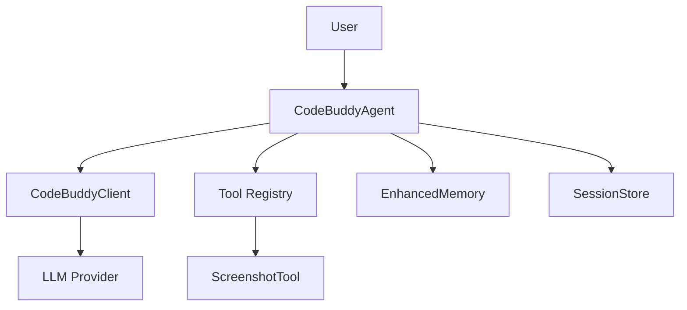

# @phuetz/code-buddy v0.5.0

`@phuetz/code-buddy` is a terminal-based AI coding agent designed to bridge the gap between local development environments and advanced LLM reasoning. It supports multiple LLM providers (Grok, Claude, ChatGPT, Gemini, Ollama, and LM Studio) with automatic failover and includes a library of 52+ tools. This documentation serves as the primary reference for developers looking to extend the agent's capabilities, integrate new messaging channels, or optimize the underlying reasoning engine.

## Key Capabilities

The agent operates as a persistent daemon, constantly monitoring inputs from various sources to provide context-aware assistance. By leveraging a multi-channel architecture, it ensures that developers can interact with their codebase from Slack, Discord, or the terminal itself without context switching.



- Multi-channel messaging (Telegram, Discord, Slack, WhatsApp, etc.)
- Background daemon with health monitoring
- Voice interaction with wake-word activation
- Sandboxed execution (Docker, OS-level)
- Advanced reasoning (Tree-of-Thought, [MCTS Reasoning](./2-architecture.md))
- Code graph analysis (49126 relationships)
- Automated program repair (fault localization + LLM)
- Agent-to-Agent protocol (Google [A2A Protocol](./9-api-reference.md)spec)
- Workflow engine with DAG execution
- Cloud deployment (Fly.io, Railway, Render, GCP)

Now that we have established the high-level capabilities of the agent, we must examine the structural complexity that makes this orchestration possible.

## Project Statistics

| Metric | Value |
|--------|-------|
| Version | 0.5.0 |
| Source Modules | 1077 |
| Classes | 907 |
| Code Relationships | 49 126 |
| Dependencies | 35 |
| Dev Dependencies | 23 |

Understanding the sheer volume of modules is critical for maintaining the system's stability. With over 1,000 modules, the project relies on strict dependency management to prevent circular references and ensure that the agent remains performant under load.

## Core Modules (by architectural importance)

Ranked by [PageRank](./4-metrics.md) — higher rank means more modules depend on this one:

| Module | PageRank | Importers | Functions | Description |
|--------|----------|-----------|-----------|-------------|
| `src/channels/dm-pairing` | 0.019 | 9 | 19 fns | Messaging channel integrations |
| `src/codebuddy/client` | 0.017 | 10 | 22 fns | Multi-provider LLM API client |
| `src/agent/codebuddy-agent` | 0.013 | 10 | 65 fns | Central agent orchestrator |
| `src/agent/extended-thinking` | 0.010 | 1 | 8 fns | Core agent system |
| `src/memory/enhanced-memory` | 0.009 | 2 | 28 fns | Memory and persistence |
| `src/persistence/session-store` | 0.008 | 6 | 44 fns | Session persistence and restore |
| `src/agent/repo-profiling/cartography` | 0.007 | 1 | 11 fns | Core agent system |
| `src/nodes/device-node` | 0.006 | 2 | 21 fns | Multi-device management |
| `src/codebuddy/tools` | 0.006 | 4 | 12 fns | Tool definitions and [RAG Tool Selector](./5-tools.md) |
| `src/tools/screenshot-tool` | 0.006 | 3 | 20 fns | Tool implementations |
| `src/agent/repo-profiler` | 0.005 | 3 | 13 fns | Core agent system |
| `src/deploy/cloud-configs` | 0.005 | 2 | 10 fns | Cloud deployment |
| `src/embeddings/embedding-provider` | 0.005 | 2 | 20 fns | Vector embedding generation |
| `src/utils/confirmation-service` | 0.005 | 3 | 21 fns | User approval gate for destructive ops |
| `src/prompts/prompt-manager` | 0.005 | 3 | 17 fns | System prompt construction |
| `src/agent/specialized/agent-registry` | 0.005 | 1 | 29 fns | Specialized agent registry (PDF, SQL, SWE...) |
| `src/agent/thinking/extended-thinking` | 0.005 | 1 | 30 fns | Core agent system |
| `src/memory/coding-style-analyzer` | 0.004 | 2 | 11 fns | Memory and persistence |
| `src/memory/decision-memory` | 0.004 | 1 | 10 fns | Memory and persistence |
| `src/utils/memory-monitor` | 0.004 | 1 | 23 fns | Shared utilities |

> **Key concept:** The PageRank metric identifies "keystone" modules. If a module like `src/agent/codebuddy-agent` is modified, it triggers a cascade of re-evaluations across the entire dependency tree, necessitating a full test suite run.

When the agent initializes, it relies on `CodeBuddyAgent.initializeAgentRegistry` to map available skills and tools. Similarly, `DMPairingManager.checkSender` acts as a gatekeeper for incoming messages, ensuring that only authorized channels can trigger agent actions.

> **Developer tip:** When modifying core modules, always check the `Importers` count. If you are refactoring a module with high PageRank, ensure you update all downstream consumers to prevent runtime type mismatches.

## Entry Points

Execution begins at specific entry points that bootstrap the environment. These entry points are responsible for dependency injection and setting up the global state required for the agent to function.

- **`src/server/index`** — HTTP/WebSocket server (Express)
- **`src/index`** — CLI entry point (Commander)

Before the agent can process a request, it must establish a valid session. This is handled by `SessionStore.createSession`, which initializes the persistence layer, ensuring that conversation history is preserved across restarts.

## Technology Stack

The stack is selected to balance developer ergonomics with high-performance execution. By utilizing TypeScript and Node.js, the project maintains type safety across the entire agent lifecycle.

| Category | Technologies |
|----------|-------------|
| CLI Framework | commander |
| Terminal UI | ink, react |
| LLM SDKs | openai, (multi-provider via OpenAI-compatible API) |
| HTTP Server | express, ws, cors |
| Database | better-sqlite3 |
| File Search | @vscode/ripgrep |
| Validation | zod |
| Browser Automation | playwright |
| MCP | @modelcontextprotocol/sdk |
| Testing | vitest |

## Getting Started

To begin working with the codebase, ensure you have the necessary dependencies installed. The build process compiles the TypeScript source into executable JavaScript, preparing the agent for deployment or local testing.

```bash
# Install
npm install

# Build
npm run build

# Development mode
npm run dev

# Run
npm start

# Verify
npm test
```

**See also:** [Architecture](./2-architecture.md) · [Subsystems](./3a-core-agent-system-cli-and-slash-commands.md) · [Tool System](./5-tools.md) · [Security](./6-security.md)

**Key source files:** `src/channels/dm-pairing.ts`, `src/codebuddy/client.ts`, `src/agent/codebuddy-agent.ts`, `src/agent/extended-thinking.ts`, `src/memory/enhanced-memory.ts`, `src/persistence/session-store.ts`, `src/agent/repo-profiling/cartography.ts`, `src/nodes/device-node.ts`