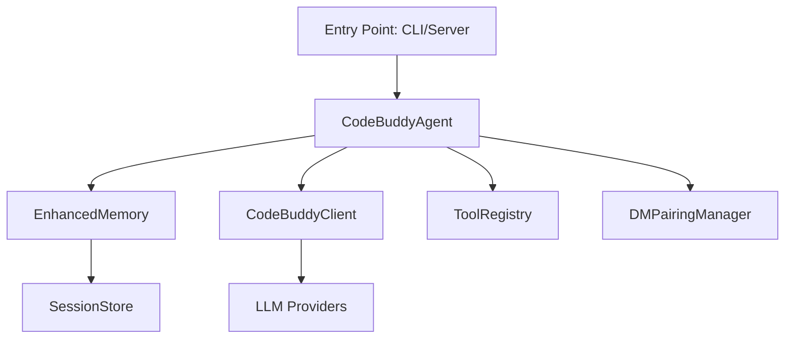

# @phuetz/code-buddy v0.5.0

@phuetz/code-buddy is a terminal-based AI coding agent designed for high-extensibility and multi-provider support within TypeScript/Node.js environments. This documentation provides an architectural overview of the system, intended for developers looking to integrate new tools, modify agent behavior, or contribute to the core codebase.

> Open-source multi-provider AI coding agent for the terminal. Supports Grok, Claude, ChatGPT, Gemini, Ollama and LM Studio with 52+ tools, multi-channel messaging, skills system, and OpenClaw-inspired architecture.

The system's versatility stems from its modular design, enabling seamless integration across various communication channels and execution environments.

## Key Capabilities

- Multi-channel messaging (Telegram, Discord, Slack, WhatsApp, etc.)
- Background daemon with health monitoring
- Voice interaction with wake-word activation
- Sandboxed execution (Docker, OS-level)
- Advanced reasoning (Tree-of-Thought, MCTS)
- Code graph analysis (49113 relationships)
- Automated program repair (fault localization + LLM)
- Agent-to-Agent protocol (Google A2A spec)
- Workflow engine with DAG execution
- Cloud deployment (Fly.io, Railway, Render, GCP)



The following metrics quantify the project's complexity and architectural footprint, reflecting the scale of the codebase and its dependency graph.

## Project Statistics

| Metric | Value |
|--------|-------|
| Version | 0.5.0 |
| Source Modules | 1077 |
| Classes | 907 |
| Code Relationships | 49 113 |
| Dependencies | 35 |
| Dev Dependencies | 23 |

The architecture relies on several high-rank modules that serve as the foundation for agent operations, memory management, and tool execution.

> **Key concept:** The architectural rank (PageRank) of a module indicates its dependency density. Modules like `src/agent/codebuddy-agent` are central to system stability; modifications here require rigorous testing as they impact nearly every other subsystem.

## Core Modules (by architectural importance)

Ranked by PageRank — higher rank means more modules depend on this one:

| Module | PageRank | Importers | Functions | Description |
|--------|----------|-----------|-----------|-------------|
| `src/channels/dm-pairing` | 0.019 | 9 | 19 fns | Messaging channel integrations |
| `src/codebuddy/client` | 0.017 | 10 | 22 fns | Multi-provider LLM API client |
| `src/agent/codebuddy-agent` | 0.013 | 10 | 65 fns | Central agent orchestrator |
| `src/agent/extended-thinking` | 0.010 | 1 | 8 fns | Core agent system |
| `src/memory/enhanced-memory` | 0.009 | 2 | 28 fns | Memory and persistence |
| `src/persistence/session-store` | 0.008 | 6 | 44 fns | Session persistence and restore |
| `src/agent/repo-profiling/cartography` | 0.007 | 1 | 11 fns | Core agent system |
| `src/nodes/device-node` | 0.006 | 2 | 21 fns | Multi-device management |
| `src/codebuddy/tools` | 0.006 | 4 | 12 fns | Tool definitions and RAG selection |
| `src/tools/screenshot-tool` | 0.006 | 3 | 20 fns | Tool implementations |
| `src/agent/repo-profiler` | 0.005 | 3 | 13 fns | Core agent system |
| `src/deploy/cloud-configs` | 0.005 | 2 | 10 fns | Cloud deployment |
| `src/embeddings/embedding-provider` | 0.005 | 2 | 20 fns | Vector embedding generation |
| `src/utils/confirmation-service` | 0.005 | 3 | 21 fns | User approval gate for destructive ops |
| `src/prompts/prompt-manager` | 0.005 | 3 | 17 fns | System prompt construction |
| `src/agent/specialized/agent-registry` | 0.005 | 1 | 29 fns | Specialized agent registry (PDF, SQL, SWE...) |
| `src/agent/thinking/extended-thinking` | 0.005 | 1 | 30 fns | Core agent system |
| `src/memory/coding-style-analyzer` | 0.004 | 2 | 11 fns | Memory and persistence |
| `src/memory/decision-memory` | 0.004 | 1 | 10 fns | Memory and persistence |
| `src/utils/memory-monitor` | 0.004 | 1 | 23 fns | Shared utilities |

The core modules implement specific logic to maintain system integrity. For instance, `src/channels/dm-pairing` handles secure communication and channel pairing logic. The `src/codebuddy/client` module abstracts LLM interactions, validating models and probing capabilities across various providers.

Furthermore, the `src/agent/codebuddy-agent` module orchestrates the agent lifecycle, managing memory initialization and skill loading. Data persistence is handled by `src/persistence/session-store`, which manages session creation and state recovery to ensure continuity.

Understanding the system's entry points is critical for debugging the initialization sequence and managing the lifecycle of the agent process.

## Entry Points

- **`src/server/index`** — HTTP/WebSocket server (Express)
- **`src/index`** — CLI entry point (Commander)

The stack is built on modern TypeScript standards, prioritizing type safety and asynchronous performance for real-time AI interactions.

## Technology Stack

| Category | Technologies |
|----------|-------------|
| CLI Framework | commander |
| Terminal UI | ink, react |
| LLM SDKs | openai, (multi-provider via OpenAI-compatible API) |
| HTTP Server | express, ws, cors |
| Database | better-sqlite3 |
| File Search | @vscode/ripgrep |
| Validation | zod |
| Browser Automation | playwright |
| MCP | @modelcontextprotocol/sdk |
| Testing | vitest |

Developers can initialize the development environment using standard Node.js workflows to begin contributing or testing local changes.

## Getting Started

```bash
# Install
npm install

# Build
npm run build

# Development mode
npm run dev

# Run
npm start

# Verify
npm test
```

---

**See also:** [Architecture](./2-architecture.md) · [Subsystems](./3a-core-agent-system-cli-and-slash-commands.md) · [Tool System](./5-tools.md) · [Security](./6-security.md)

**Key source files:** `src/channels/dm-pairing.ts`, `src/codebuddy/client.ts`, `src/agent/codebuddy-agent.ts`, `src/agent/extended-thinking.ts`, `src/memory/enhanced-memory.ts`, `src/persistence/session-store.ts`, `src/agent/repo-profiling/cartography.ts`, `src/nodes/device-node.ts`