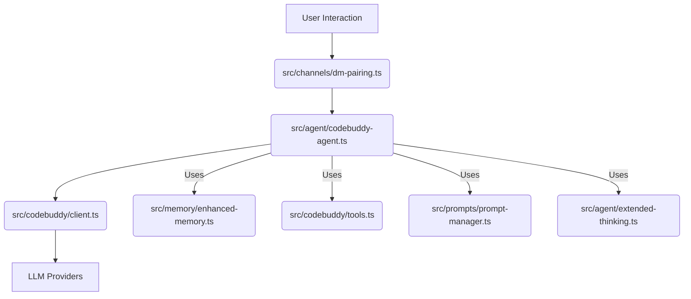

# @phuetz/code-buddy v0.5.0

This document provides a comprehensive overview of `@phuetz/code-buddy`, an open-source, multi-provider AI coding agent designed for terminal use. It outlines the project's core functionalities, architectural components, and underlying technologies, serving as a foundational guide for developers and contributors.

> Open-source multi-provider AI coding agent for the terminal. Supports Grok, Claude, ChatGPT, Gemini, Ollama and LM Studio with 52+ tools, multi-channel messaging, skills system, and OpenClaw-inspired architecture.

@phuetz/code-buddy is a terminal-based AI coding agent built in TypeScript/Node.js. It supports multiple LLM providers (Grok, Claude, ChatGPT, Gemini, Ollama, LM Studio) with automatic failover. The codebase contains 1076 source modules and 905 classes.

## Key Capabilities

This section highlights the core functionalities that make Code Buddy a powerful and versatile AI agent, demonstrating its breadth of features from user interaction to advanced reasoning and deployment.

- Multi-channel messaging (Telegram, Discord, Slack, WhatsApp, etc.)
- Background daemon with health monitoring
- Voice interaction with wake-word activation
- Sandboxed execution (Docker, OS-level)
- Advanced reasoning (Tree-of-Thought, MCTS)
- Code graph analysis (49096 relationships)
- Automated program repair (fault localization + LLM)
- Agent-to-Agent protocol (Google A2A spec)
- Workflow engine with DAG execution
- Cloud deployment (Fly.io, Railway, Render, GCP)

## Project Statistics

These statistics provide a high-level overview of the `@phuetz/code-buddy` project's scale and complexity, offering insights into its current state and development footprint. Understanding these metrics can help gauge the project's maturity and resource requirements.

| Metric | Value |
|--------|-------|
| Version | 0.5.0 |
| Source Modules | 1076 |
| Classes | 905 |
| Code Relationships | 49 096 |
| Dependencies | 35 |
| Dev Dependencies | 23 |

## Core Modules (by architectural importance)

This section identifies the most central and interconnected modules within the `@phuetz/code-buddy` architecture, ranked by their PageRank score. Modules with higher PageRank are critical as many other components depend on them, making them key areas for understanding system flow and potential impact of changes.

The `src/agent/codebuddy-agent.ts` acts as the central orchestrator, interacting with the `src/codebuddy/client.ts` for LLM communication and `src/channels/dm-pairing.ts` for user interaction.

**Key Methods for Core Components:**

| Module | Method | Purpose |
|---|---|---|
| `src/agent/codebuddy-agent.ts` | `handleUserMessage(message: string, context: AgentContext)` | Processes incoming user messages, orchestrates reasoning, tool selection, and response generation. |
| | `orchestrateTask(task: AgentTask)` | Manages the execution flow of complex tasks, including planning, sub-task delegation, and result synthesis. |
| `src/codebuddy/client.ts` | `queryLLM(prompt: string, options: LLMCallOptions)` | Sends requests to the configured LLM provider and handles responses, including provider failover. |
| | `selectProvider(preference?: string)` | Dynamically selects the optimal LLM provider based on configuration, availability, and task requirements. |
| `src/channels/dm-pairing.ts` | `registerChannel(channelConfig: ChannelConfig)` | Initializes and registers a new messaging channel (e.g., Telegram, Discord) for communication. |
| | `receiveMessage(message: ChannelMessage)` | Processes incoming messages from registered channels, translating them for the agent. |

Ranked by PageRank — higher rank means more modules depend on this one:

| Module | PageRank | Importers | Description |
|--------|----------|-----------|-------------|
| `src/channels/dm-pairing` | 0.019 | 9 | Messaging channel integrations |
| `src/codebuddy/client` | 0.017 | 10 | Multi-provider LLM API client |
| `src/agent/codebuddy-agent` | 0.013 | 10 | Central agent orchestrator |
| `src/optimization/cache-breakpoints` | 0.010 | 2 | Performance optimization |
| `src/agent/extended-thinking` | 0.010 | 1 | Core agent system |
| `src/memory/enhanced-memory` | 0.009 | 2 | Memory and persistence |
| `src/persistence/session-store` | 0.008 | 6 | Session persistence and restore |
| `src/agent/repo-profiling/cartography` | 0.007 | 1 | Core agent system |
| `src/nodes/device-node` | 0.006 | 2 | Multi-device management |
| `src/codebuddy/tools` | 0.006 | 4 | Tool definitions and RAG selection |
| `src/tools/screenshot-tool` | 0.006 | 3 | Tool implementations |
| `src/agent/repo-profiler` | 0.005 | 3 | Core agent system |
| `src/deploy/cloud-configs` | 0.005 | 2 | Cloud deployment |
| `src/embeddings/embedding-provider` | 0.005 | 2 | Vector embedding generation |
| `src/utils/confirmation-service` | 0.005 | 3 | User approval gate for destructive ops |
| `src/prompts/prompt-manager` | 0.005 | 3 | System prompt construction |
| `src/commands/dev/workflows` | 0.005 | 2 | CLI and slash commands |
| `src/agent/specialized/agent-registry` | 0.005 | 1 | Specialized agent registry (PDF, SQL, SWE...) |
| `src/agent/thinking/extended-thinking` | 0.005 | 1 | Core agent system |
| `src/knowledge/path` | 0.005 | 1 | Code analysis and knowledge graph |

## Entry Points

These entry points define the primary ways users or other systems interact with `@phuetz/code-buddy`, making them essential for understanding how to start, operate, and integrate the application.

- **`src/server/index.ts`** — HTTP/WebSocket server (Express)
- **`src/index.ts`** — CLI entry point (Commander)

## Technology Stack

This section outlines the foundational technologies and libraries used in `@phuetz/code-buddy`, providing insight into the project's technical choices and dependencies. Understanding the stack is crucial for development, debugging, and contributing to the project.

| Category | Technologies |
|----------|-------------|
| CLI Framework | commander |
| Terminal UI | ink, react |
| LLM SDKs | openai, (multi-provider via OpenAI-compatible API) |
| HTTP Server | express, ws, cors |
| Database | better-sqlite3 |
| File Search | @vscode/ripgrep |
| Validation | zod |
| Browser Automation | playwright |
| MCP | @modelcontextprotocol/sdk |
| Testing | vitest |

---

**See also:** [Architecture](./2-architecture.md) · [Subsystems](./3-subsystems.md) · [Tool System](./5-tools.md) · [Security](./6-security.md)

**Key source files:** `src/channels/dm-pairing.ts`, `src/codebuddy/client.ts`, `src/agent/codebuddy-agent.ts`, `src/optimization/cache-breakpoints.ts`, `src/agent/extended-thinking.ts`, `src/memory/enhanced-memory.ts`, `src/persistence/session-store.ts`, `src/agent/repo-profiling/cartography.ts`