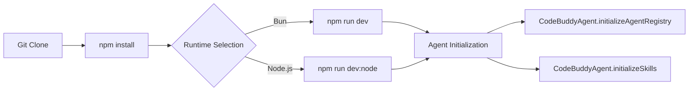
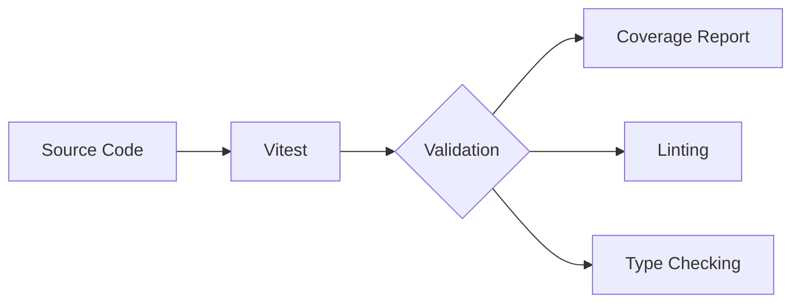
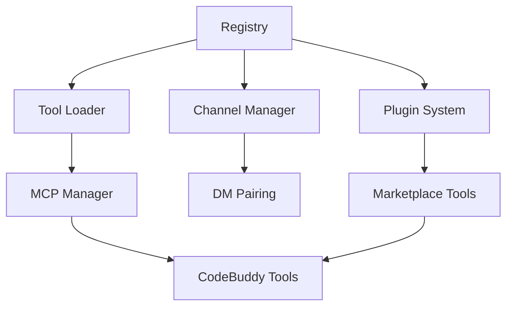

# Development Guide


# Getting Started

This section outlines the prerequisites and commands required to bootstrap the Grok CLI development environment. Developers must follow these steps to ensure the local runtime is correctly configured for either Bun or Node.js execution, which is critical for maintaining parity between development and production environments.

```bash
git clone <repo-url>
cd grok-cli
npm install
npm run dev          # Development mode (Bun)
npm run dev:node     # Development mode (tsx/Node.js)
```

> **Key concept:** The project supports dual-runtime execution. While `npm run dev` leverages Bun for high-performance execution, `npm run dev:node` provides a compatibility layer using `tsx` for standard Node.js environments.

Once the environment is bootstrapped, the system proceeds to load the agentic framework and memory providers. The initialization sequence is critical, as it ensures that the agent registry and skill sets are correctly mapped before any tool execution occurs.



During the startup phase, the system invokes several core methods to prepare the agent's state. Specifically, the application calls `CodeBuddyAgent.initializeAgentRegistry` and `CodeBuddyAgent.initializeSkills` to populate the available toolset. Following this, the system configures the operational context by executing `CodeBuddyAgent.initializeMemory` and `CodeBuddyAgent.initializeAgentSystemPrompt` to ensure the agent is ready to process user requests.

# Build & Development Commands

This section outlines the standard build, test, and maintenance scripts required to manage the project lifecycle. Developers should familiarize themselves with these commands to ensure environment consistency, as CI/CD pipelines rely on these specific entry points for validation and deployment.

| Command | Description |
|---------|-------------|
| `npm run build` | `tsc` |
| `npm run build:bun` | `bun run tsc` |
| `npm run build:watch` | `tsc --watch` |
| `npm run clean` | `rm -rf dist coverage .nyc_output *.tsbuildinfo` |
| `npm run dev` | `bun run src/index.ts` |
| `npm run dev:node` | `tsx src/index.ts` |
| `npm run start` | `node dist/index.js` |
| `npm run start:bun` | `bun run dist/index.js` |
| `npm run test` | `vitest run` |
| `npm run test:watch` | `vitest` |
| `npm run test:coverage` | `vitest run --coverage` |
| `npm run lint` | `eslint . --ext .js,.jsx,.ts,.tsx` |
| `npm run lint:fix` | `eslint . --ext .js,.jsx,.ts,.tsx --fix` |
| `npm run format` | `prettier --write "src/**/*.{ts,tsx,js,jsx,json,md}"` |
| `npm run format:check` | `prettier --check "src/**/*.{ts,tsx,js,jsx,json,md}"` |
| `npm run typecheck` | `tsc --noEmit` |
| `npm run typecheck:watch` | `tsc --noEmit --watch` |
| `npm run check:circular` | `npx tsx scripts/check-circular-deps.ts` |
| `npm run validate` | `npm run lint && npm run typecheck && npm test` |
| `npm run install:bun` | `bun install` |

> **Key concept:** The `npm run validate` command acts as the primary gatekeeper for pull requests, executing linting, type checking, and unit tests sequentially to prevent regression in core modules like `src/agent/codebuddy-agent`.

The build system is tightly coupled with the project's architectural modules. When executing `npm run build`, the TypeScript compiler processes the entire dependency graph, including critical modules such as `src/channels/dm-pairing` and `src/agent/codebuddy-agent`. Ensuring that `CodeBuddyAgent.initializeAgentRegistry()` and `DMPairingManager.checkSender()` remain type-safe is critical, as these modules form the backbone of the agent's runtime behavior.

The following diagram illustrates the standard development lifecycle, from source modification to artifact validation:


Before deploying, developers must ensure that the `src/codebuddy/client` is correctly configured. The `CodeBuddyClient.validateModel()` method is often invoked during initialization, and build-time type checking ensures that these model validation paths are strictly enforced. 

Beyond compilation, maintaining code quality requires strict adherence to linting and formatting standards. The `npm run lint` and `npm run format` commands facilitate the automated enforcement of these standards across the repository, ensuring that modules like `src/persistence/session-store` maintain consistent structure, particularly when `SessionStore.convertChatEntryToMessage()` is modified.

# Project Structure

The `src/` directory serves as the central repository for the application's core logic, infrastructure, and integration layers. Understanding this hierarchy is critical for developers navigating the codebase, as it dictates the boundaries between agent orchestration, tool execution, and persistence layers.

```mermaid
graph TD
    Agent[src/agent] --> Tools[src/tools]
    Agent --> Memory[src/memory]
    Agent --> Channels[src/channels]
    Memory --> Persistence[src/persistence]
    Tools --> Client[src/codebuddy/client]
    
    subgraph Core
    Agent
    end
    
    subgraph Persistence
    Memory
    Persistence
    end
```

> **Key concept:** The modular architecture separates the `agent/` core from `tools/` and `channels/`, enabling independent scaling of LLM inference capabilities and external integration points.

The codebase is organized by functional domain, separating core agent logic from peripheral services. The `src/agent/` directory contains the primary orchestration logic; developers interacting with the agent lifecycle should utilize `CodeBuddyAgent.initializeAgentRegistry` and `CodeBuddyAgent.initializeSkills` to configure the runtime environment.

Beyond the agent core, the `src/codebuddy/` and `src/tools/` directories manage external interactions and tool definitions. When implementing new tool support, developers should reference `CodeBuddyClient.probeToolSupport` to verify model compatibility, while specific visual tasks rely on `ScreenshotTool.capture` to interface with the host environment.

Data integrity and state management are centralized within `src/memory/` and `src/persistence/`. The `SessionStore.saveSession` and `EnhancedMemory.store` methods serve as the primary entry points for persisting state across agent restarts, ensuring that context is maintained. Finally, the `src/channels/` directory handles messaging protocols, where `DMPairingManager.approve` is essential for managing secure communication channels between the agent and external entities.

```
src/
├── acp                  # Acp (1 files)
├── advanced             # Advanced (8 files)
├── agent                # Core agent system (167 files)
├── agents               # Agents (1 files)
├── analytics            # Usage analytics and cost tracking (12 files)
├── api                  # Api (2 files)
├── app                  # App (3 files)
├── auth                 # Auth (5 files)
├── automation           # Automation (2 files)
├── benchmarks           # Benchmarks (1 files)
├── browser              # Browser (4 files)
├── browser-automation   # Browser automation (7 files)
├── cache                # Cache (8 files)
├── canvas               # Canvas (9 files)
├── channels             # Messaging channel integrations (60 files)
├── checkpoints          # Undo and snapshots (5 files)
├── cli                  # Cli (5 files)
├── cloud                # Cloud (1 files)
├── codebuddy            # LLM client and tool definitions (15 files)
├── collaboration        # Collaboration (4 files)
├── commands             # CLI and slash commands (76 files)
├── concurrency          # Concurrency (3 files)
├── config               # Configuration management (22 files)
├── context              # Context window management (54 files)
├── copilot              # Copilot (1 files)
├── daemon               # Background daemon service (8 files)
├── database             # Database management (11 files)
├── deploy               # Cloud deployment (2 files)
├── desktop              # Desktop (1 files)
├── desktop-automation   # Desktop automation (12 files)
├── docs                 # Documentation generation (4 files)
├── doctor               # Doctor (1 files)
├── elevated-mode        # Elevated mode (1 files)
├── email                # Email (4 files)
├── embeddings           # Embeddings (2 files)
├── encoding             # Encoding (4 files)
├── errors               # Error handling (7 files)
├── events               # Events (6 files)
├── export               # Export (1 files)
├── extensions           # Extensions (1 files)
├── fcs                  # Fcs (9 files)
├── features             # Features (1 files)
├── gateway              # Gateway (4 files)
├── git                  # Git (1 files)
├── hardware             # Hardware (2 files)
├── hooks                # Execution hooks (22 files)
├── ide                  # Ide (2 files)
├── identity             # Identity (1 files)
├── inference            # Inference (3 files)
├── infrastructure       # Infrastructure (5 files)
├── input                # Input (8 files)
├── integrations         # External service integrations (28 files)
├── intelligence         # Intelligence (6 files)
├── interpreter          # Interpreter (9 files)
├── knowledge            # Code analysis and knowledge graph (26 files)
├── learning             # Learning (2 files)
├── location             # Location (1 files)
├── logging              # Logging (2 files)
├── lsp                  # Lsp (3 files)
├── mcp                  # Model Context Protocol servers (14 files)
├── media                # Media (1 files)
├── memory               # Memory and persistence (15 files)
├── metrics              # Metrics (2 files)
├── middleware           # Middleware pipeline (4 files)
├── models               # Models (2 files)
├── modes                # Modes (2 files)
├── networking           # Networking (3 files)
├── nodes                # Multi-device management (7 files)
├── observability        # Logging, metrics, tracing (6 files)
├── offline              # Offline (2 files)
├── openclaw             # Openclaw (1 files)
├── optimization         # Performance optimization (7 files)
├── orchestration        # Orchestration (5 files)
├── output               # Output (1 files)
├── performance          # Performance (6 files)
├── permissions          # Permissions (0 files)
├── persistence          # Persistence (6 files)
├── personas             # Personas (2 files)
├── plugins              # Plugin system (12 files)
├── presence             # Presence (1 files)
├── prompts              # Prompts (5 files)
├── protocols            # Agent protocols (A2A) (1 files)
├── providers            # LLM provider adapters (12 files)
├── queue                # Queue (5 files)
├── registry             # Registry (0 files)
├── renderers            # Output rendering (18 files)
├── rules                # Rules (1 files)
├── sandbox              # Execution sandboxing (7 files)
├── scheduler            # Scheduler (4 files)
├── screen               # Screen (0 files)
├── screen-capture       # Screen capture (3 files)
├── scripting            # Scripting (9 files)
├── sdk                  # Sdk (1 files)
├── search               # Search and indexing (5 files)
├── security             # Security and validation (45 files)
├── server               # HTTP/WebSocket server (24 files)
├── services             # Services (10 files)
├── session-pruning      # Session pruning (3 files)
├── sidecar              # Sidecar (1 files)
├── skills               # Skill registry and marketplace (13 files)
├── skills-registry      # Skills registry (1 files)
├── streaming            # Streaming response handling (13 files)
├── sync                 # Sync (6 files)
├── talk-mode            # Talk mode (8 files)
├── tasks                # Tasks (2 files)
├── telemetry            # Telemetry (1 files)
├── templates            # Templates (5 files)
├── testing              # Testing (5 files)
├── themes               # Themes (5 files)
├── tools                # Tool implementations (128 files)
├── tracks               # Tracks (4 files)
├── tts                  # Tts (0 files)
├── types                # TypeScript type definitions (8 files)
├── ui                   # Terminal UI components (24 files)
├── undo                 # Undo (2 files)
├── utils                # Shared utilities (84 files)
├── versioning           # Versioning (4 files)
├── voice                # Voice and TTS (5 files)
├── webhooks             # Webhooks (1 files)
├── wizard               # Wizard (1 files)
├── workflows            # Workflow DAG engine (8 files)
├── workspace            # Workspace (2 files)
└── index.ts            # Entry point
```

## Coding Conventions

- TypeScript strict mode
- Semicolons
- ESM modules (`"type": "module"`)


# Testing

The testing infrastructure ensures system reliability across the codebase, utilizing Vitest to validate core logic and integration points. This section outlines the standard testing workflow, coverage requirements, and validation procedures necessary for maintaining code quality during development.



The project employs a comprehensive testing strategy designed to catch regressions early in the development lifecycle. By leveraging `happy-dom`, the suite simulates browser-like environments, allowing for the testing of complex UI and interaction logic without requiring a full browser instance.

- Framework: **Vitest** with happy-dom
- Tests in `tests/` and co-located `src/**/*.test.ts`
- Run: `npm test` (all), `npm run test:watch` (dev)
- Coverage: `npm run test:coverage`
- Validate: `npm run validate` (lint + typecheck + test)

> **Key concept:** The `npm run validate` command acts as the final gatekeeper for CI/CD pipelines, combining linting, type checking, and unit testing to prevent regressions in critical modules like `RepoProfiler` or `SessionStore`.

When writing tests for the persistence layer, developers must ensure that file system interactions are properly mocked or isolated. For instance, when testing session management, verify that `SessionStore.createSession` and `SessionStore.saveSession` handle directory initialization correctly using `SessionStore.ensureSessionsDirectory` before attempting to write data.

Furthermore, testing agent-based features requires careful setup of the agent registry. Ensure that `CodeBuddyAgent.initializeAgentRegistry` and `CodeBuddyAgent.initializeSkills` are correctly invoked during test setup to avoid side effects or missing dependencies when executing agent-related logic. For modules involving complex state, such as `EnhancedMemory`, ensure that `EnhancedMemory.initialize` is called to populate the necessary memory structures before running assertions on `EnhancedMemory.store` or `EnhancedMemory.calculateImportance`.

# Extension Points

This section details the architectural extension points available for customizing and expanding the agent's capabilities. Developers should consult these guidelines when integrating new tools, communication channels, or plugins to ensure compatibility with the core system registry and maintain architectural integrity.

The system architecture relies on a modular registry pattern to manage extensions. When extending the toolset, developers must interact with the registry to ensure proper initialization and normalization of external capabilities.



### Tooling and Registry
Tool integration is managed primarily via `src/codebuddy/tools`. Developers should utilize `initializeToolRegistry()` to register new capabilities and `getMCPManager()` to handle Model Context Protocol (MCP) server connections.

- Add new tools in `src/tools/`
- Register tools in `src/tools/registry/`
- Add metadata in `src/tools/metadata.ts`

> **Key concept:** The tool registry acts as the central orchestrator for all capabilities, ensuring that MCP servers and marketplace plugins are normalized into a unified interface before execution.

Beyond standard tool registration, the system supports dynamic conversion of external plugins. Functions such as `convertPluginToolToCodeBuddyTool()` and `convertMarketplaceToolToPluginTool()` are critical for maintaining type safety and interface consistency across the plugin ecosystem.

### Channels and Communication
For communication channels, the `src/channels/dm-pairing` module handles security and authorization. When implementing new channels, ensure that `DMPairingManager.requiresPairing()` is correctly configured to maintain secure communication boundaries between the agent and the user.

- Add channels in `src/channels/`

The channel architecture ensures that all direct messaging interactions are validated before execution. By leveraging the existing `DMPairingManager` methods, developers can ensure that new channels adhere to the established security protocols.

### Plugin Architecture
Plugins are integrated into the core workflow through the `src/plugins/` directory. This layer allows for the extension of agent behavior without modifying core logic, provided the plugins adhere to the expected tool conversion signatures.

- Add plugins in `src/plugins/`

---

**See also:** [Overview](./1-overview.md) · [Architecture](./2-architecture.md) · [Subsystems](./3a-core-agent-system-cli-and-slash-commands.md) · [Tool System](./5-tools.md)

**Key source files:** `src/tools/.ts`, `src/tools/registry/.ts`, `src/tools/metadata.ts`, `src/channels/.ts`, `src/plugins/.ts`