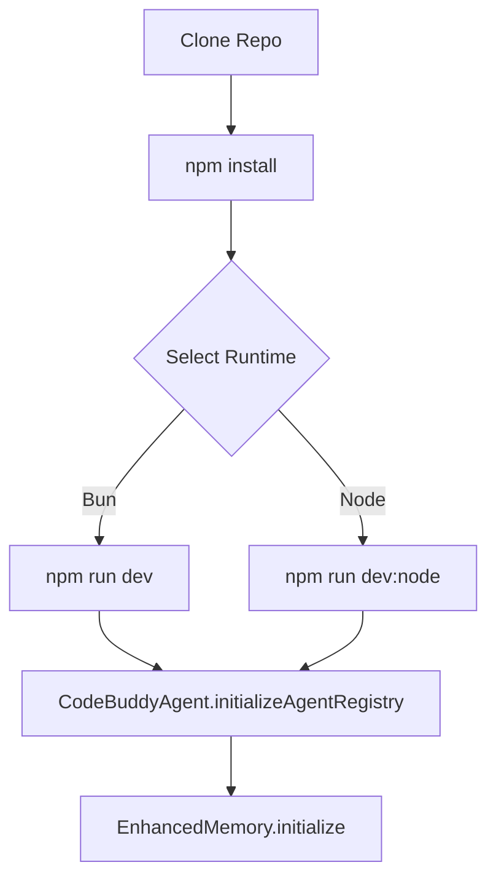
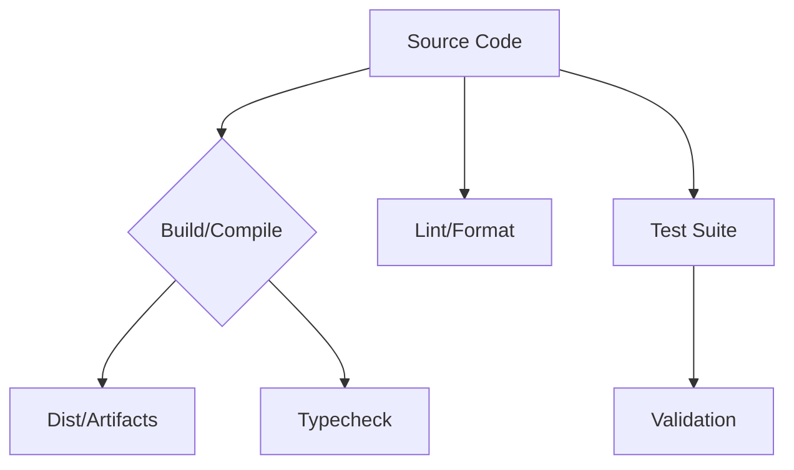
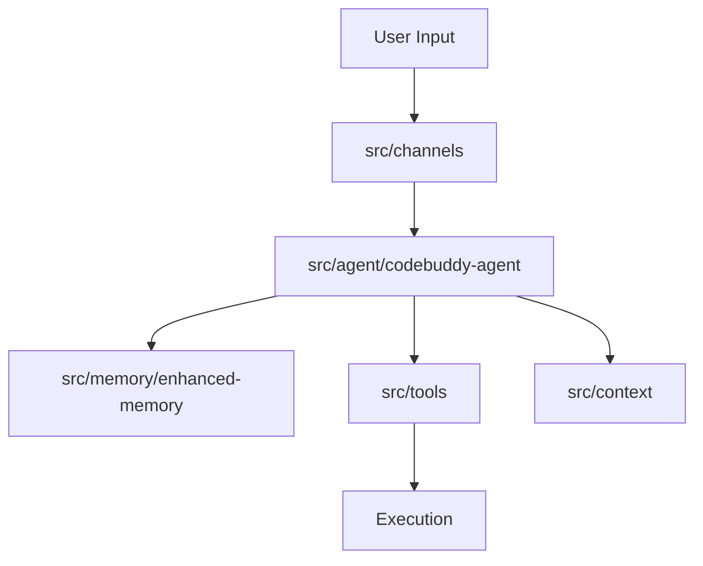
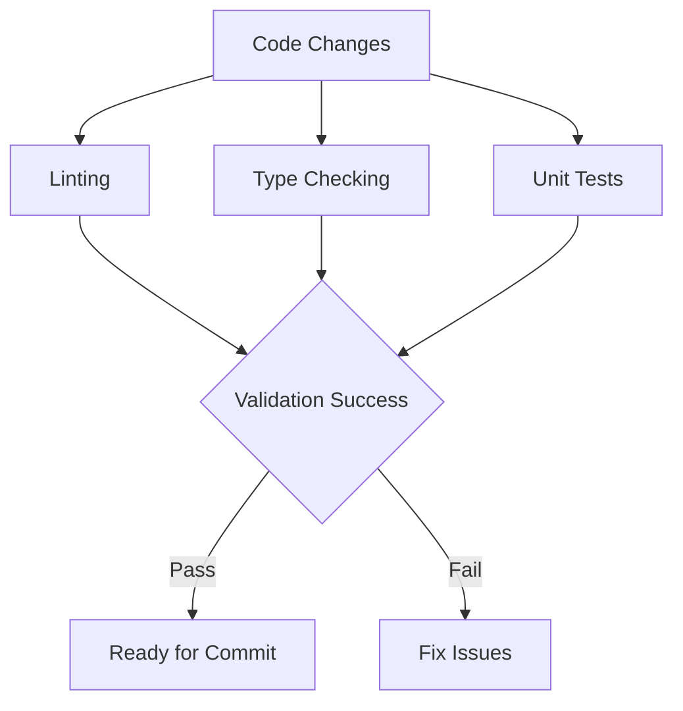
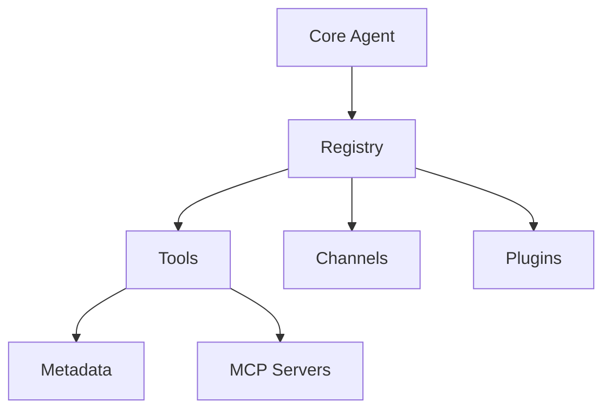

# Development Guide


## Getting Started

This guide serves as the entry point for developers looking to contribute to or extend the Grok CLI environment. By walking through the initial setup, you will establish the local development environment required to interface with the core agentic systems, such as `CodeBuddyAgent` and `EnhancedMemory`. Whether you are a core contributor or an integration engineer, these steps ensure your local environment mirrors the production architecture.

Before you can interact with the agent's decision-making loops, you must clone the repository and prepare the runtime. The project supports multiple execution environments to accommodate different development workflows, ranging from high-performance Bun execution to standard Node.js compatibility. This flexibility is essential because the agent's performance characteristics change based on the underlying runtime, particularly when handling complex tool calls.

```bash
git clone <repo-url>
cd grok-cli
npm install
npm run dev          # Development mode (Bun)
npm run dev:node     # Development mode (tsx/Node.js)
```

With the dependencies installed and the runtime configured, the system is ready to bootstrap its internal services. The next phase involves initializing the agent registry and memory providers, which are critical for the agent to maintain context across sessions.



> **Key concept:** The choice between Bun and Node.js runtimes affects how `CodeBuddyAgent` handles asynchronous tool execution. Bun provides native performance optimizations for the agent's event loop, while Node.js ensures maximum compatibility with legacy plugins.

> **Developer tip:** Always verify your `PATH` includes the correct version of Bun before running `npm run dev`. If the agent fails to load `EnhancedMemory` during startup, it is often due to a mismatch between the expected runtime version and the environment configuration.

## Build & Development Commands

This section serves as the command-line reference for the Code Buddy ecosystem. Developers and contributors use these scripts to manage the lifecycle of the project, from initial compilation to rigorous testing and linting. Understanding these commands is essential for maintaining the integrity of the codebase as you integrate new features or modify existing agent logic.

Managing a project with 1077 modules requires a disciplined approach to compilation and runtime execution. When you execute `npm run build`, you aren't just transpiling code; you are invoking the TypeScript compiler to validate the entire dependency graph. This ensures that the architectural constraints defined in the source are respected before any code hits the runtime environment.

| Command | Description |
|---------|-------------|
| `npm run build` | `tsc` |
| `npm run build:bun` | `bun run tsc` |
| `npm run build:watch` | `tsc --watch` |
| `npm run clean` | `rm -rf dist coverage .nyc_output *.tsbuildinfo` |
| `npm run dev` | `bun run src/index.ts` |
| `npm run dev:node` | `tsx src/index.ts` |
| `npm run start` | `node dist/index.js` |
| `npm run start:bun` | `bun run dist/index.js` |
| `npm run test` | `vitest run` |
| `npm run test:watch` | `vitest` |
| `npm run test:coverage` | `vitest run --coverage` |
| `npm run lint` | `eslint . --ext .js,.jsx,.ts,.tsx` |
| `npm run lint:fix` | `eslint . --ext .js,.jsx,.ts,.tsx --fix` |
| `npm run format` | `prettier --write "src/**/*.{ts,tsx,js,jsx,json,md}"` |
| `npm run format:check` | `prettier --check "src/**/*.{ts,tsx,js,jsx,json,md}"` |
| `npm run typecheck` | `tsc --noEmit` |
| `npm run typecheck:watch` | `tsc --noEmit --watch` |
| `npm run check:circular` | `npx tsx scripts/check-circular-deps.ts` |
| `npm run validate` | `npm run lint && npm run typecheck && npm test` |
| `npm run install:bun` | `bun install` |

The build pipeline is designed to catch errors early, preventing runtime failures in critical systems. For instance, when you run `npm run test`, you are triggering the test suite that validates critical components like `SessionStore.saveSession()` and `CodeBuddyAgent.initializeAgentSystemPrompt()`. Ensuring these pass is non-negotiable before pushing changes to the repository.



> **Key concept:** The `typecheck` command utilizes `tsc --noEmit` to perform static analysis without generating artifacts. This is significantly faster than a full build and should be your primary tool for verifying architectural integrity during iterative development.

Having established the foundational commands for building and validating the project, we must now consider how these tools interact with the agent's internal systems during active development. The development workflow relies on these scripts to maintain the state of the agent registry and memory providers.

> **Developer tip:** While the project supports both Node.js and Bun, always prefer `bun` for development tasks like `npm run dev` or `npm run install:bun` to leverage its faster startup times and native TypeScript execution.

## Project Structure

Understanding the codebase architecture is the first step for any contributor. This directory tree serves as the blueprint for the system, mapping out how the agent's intelligence, memory, and tool-use capabilities are physically organized within the repository. Whether you are debugging a specific integration or extending the agent's core logic, this guide helps you navigate the modular design.

```
src/
├── acp                  # Acp (1 files)
├── advanced             # Advanced (8 files)
├── agent                # Core agent system (167 files)
├── agents               # Agents (1 files)
├── analytics            # Usage analytics and cost tracking (12 files)
├── api                  # Api (2 files)
├── app                  # App (3 files)
├── auth                 # Auth (5 files)
├── automation           # Automation (2 files)
├── benchmarks           # Benchmarks (1 files)
├── browser              # Browser (4 files)
├── browser-automation   # Browser automation (7 files)
├── cache                # Cache (8 files)
├── canvas               # Canvas (9 files)
├── channels             # Messaging channel integrations (60 files)
├── checkpoints          # Undo and snapshots (5 files)
├── cli                  # Cli (5 files)
├── cloud                # Cloud (1 files)
├── codebuddy            # LLM client and tool definitions (15 files)
├── collaboration        # Collaboration (4 files)
├── commands             # CLI and slash commands (76 files)
├── concurrency          # Concurrency (3 files)
├── config               # Configuration management (22 files)
├── context              # [Context Management](./7-context-memory.md) management (54 files)
├── copilot              # Copilot (1 files)
├── daemon               # Background daemon service (8 files)
├── database             # Database management (11 files)
├── deploy               # Cloud deployment (2 files)
├── desktop              # Desktop (1 files)
├── desktop-automation   # Desktop automation (12 files)
├── docs                 # Documentation generation (4 files)
├── doctor               # Doctor (1 files)
├── elevated-mode        # Elevated mode (1 files)
├── email                # Email (4 files)
├── embeddings           # Embeddings (2 files)
├── encoding             # Encoding (4 files)
├── errors               # Error handling (7 files)
├── events               # Events (6 files)
├── export               # Export (1 files)
├── extensions           # Extensions (1 files)
├── fcs                  # Fcs (9 files)
├── features             # Features (1 files)
├── gateway              # Gateway (4 files)
├── git                  # Git (1 files)
├── hardware             # Hardware (2 files)
├── hooks                # Execution hooks (22 files)
├── ide                  # Ide (2 files)
├── identity             # Identity (1 files)
├── inference            # Inference (3 files)
├── infrastructure       # Infrastructure (5 files)
├── input                # Input (8 files)
├── integrations         # External service integrations (28 files)
├── intelligence         # Intelligence (6 files)
├── interpreter          # Interpreter (9 files)
├── knowledge            # Code analysis and [Knowledge Graph](./3h-code-analysis-and-knowledge-graph.md) (26 files)
├── learning             # Learning (2 files)
├── location             # Location (1 files)
├── logging              # Logging (2 files)
├── lsp                  # Lsp (3 files)
├── mcp                  # Model Context Protocol servers (14 files)
├── media                # Media (1 files)
├── memory               # Memory and persistence (15 files)
├── metrics              # Metrics (2 files)
├── middleware           # Middleware pipeline (4 files)
├── models               # Models (2 files)
├── modes                # Modes (2 files)
├── networking           # Networking (3 files)
├── nodes                # Multi-device management (7 files)
├── observability        # Logging, metrics, tracing (6 files)
├── offline              # Offline (2 files)
├── openclaw             # Openclaw (1 files)
├── optimization         # Performance optimization (7 files)
├── orchestration        # Orchestration (5 files)
├── output               # Output (1 files)
├── performance          # Performance (6 files)
├── permissions          # Permissions (0 files)
├── persistence          # Persistence (6 files)
├── personas             # Personas (2 files)
├── plugins              # Plugin system (12 files)
├── presence             # Presence (1 files)
├── prompts              # Prompts (5 files)
├── protocols            # Agent protocols (A2A) (1 files)
├── providers            # LLM provider adapters (12 files)
├── queue                # Queue (5 files)
├── registry             # Registry (0 files)
├── renderers            # Output rendering (18 files)
├── rules                # Rules (1 files)
├── sandbox              # Execution sandboxing (7 files)
├── scheduler            # Scheduler (4 files)
├── screen               # Screen (0 files)
├── screen-capture       # Screen capture (3 files)
├── scripting            # Scripting (9 files)
├── sdk                  # Sdk (1 files)
├── search               # Search and indexing (5 files)
├── security             # Security and validation (45 files)
├── server               # HTTP/WebSocket server (24 files)
├── services             # Services (10 files)
├── session-pruning      # Session pruning (3 files)
├── sidecar              # Sidecar (1 files)
├── skills               # Skill registry and marketplace (13 files)
├── skills-registry      # Skills registry (1 files)
├── streaming            # Streaming response handling (13 files)
├── sync                 # Sync (6 files)
├── talk-mode            # Talk mode (8 files)
├── tasks                # Tasks (2 files)
├── telemetry            # Telemetry (1 files)
├── templates            # Templates (5 files)
├── testing              # Testing (5 files)
├── themes               # Themes (5 files)
├── tools                # Tool implementations (128 files)
├── tracks               # Tracks (4 files)
├── tts                  # Tts (0 files)
├── types                # TypeScript type definitions (8 files)
├── ui                   # Terminal UI components (24 files)
├── undo                 # Undo (2 files)
├── utils                # Shared utilities (84 files)
├── versioning           # Versioning (4 files)
├── voice                # Voice and TTS (5 files)
├── webhooks             # Webhooks (1 files)
├── wizard               # Wizard (1 files)
├── workflows            # Workflow DAG engine (8 files)
├── workspace            # Workspace (2 files)
└── index.ts            # Entry point
```

While the file tree provides a bird's-eye view, the actual runtime behavior is governed by the interaction between these modules. To visualize how data flows from the entry point to the agent's decision-making core, consider the following architecture.



> **Key concept:** The project utilizes a domain-driven modular architecture. By isolating concerns like `src/memory` (state) from `src/tools` (action), the system achieves a separation of concerns that allows for independent scaling of agent capabilities and persistence layers.

At the heart of the system lies the `src/agent` directory, which houses the primary orchestration logic. When the system initializes, `CodeBuddyAgent.initializeAgentSystemPrompt()` sets the behavioral constraints, while `CodeBuddyAgent.initializeSkills()` registers the capabilities available to the LLM. This modularity ensures that the agent remains extensible without bloating the core execution loop.

> **Developer tip:** When adding new functionality, always check the `src/` directory structure first. Avoid placing logic in the root; if your feature involves state, place it in `src/memory`; if it involves external interaction, place it in `src/tools` or `src/channels`.

Persistence and state management are handled by the `src/persistence` and `src/memory` modules. For instance, when a user resumes a conversation, `SessionStore.loadSession()` retrieves the historical context, and `EnhancedMemory.loadMemories()` populates the agent's long-term recall. This separation allows the agent to maintain continuity across sessions without coupling storage logic to the inference engine.

Finally, the `src/channels` and `src/tools` directories define the boundaries of the agent's interaction with the outside world. The `DMPairingManager.checkSender()` function validates incoming requests, ensuring secure communication, while `ScreenshotTool.capture()` provides the agent with visual context. By isolating these integrations, the system can support new platforms or tools simply by adding a new module rather than refactoring existing code.

## Coding Conventions

- TypeScript strict mode
- Semicolons
- ESM modules (`"type": "module"`)


## Testing

This section outlines the testing strategy for the Code Buddy ecosystem. Robust testing is essential for maintaining the stability of complex agentic workflows, particularly when dealing with non-deterministic LLM outputs. Developers contributing to the codebase or modifying core logic should familiarize themselves with these standards to ensure code quality and prevent regressions.

At the heart of our quality assurance strategy lies Vitest, chosen for its speed and seamless integration with our TypeScript environment. By pairing it with `happy-dom`, we simulate browser-like environments without the overhead of a full headless browser, allowing us to test UI-adjacent logic and DOM interactions rapidly.

### Execution and Workflow

Now that we have established the framework, we must look at how these tests are organized and executed within the development lifecycle. The following commands provide the interface for our testing suite:

- Framework: **Vitest** with happy-dom
- Tests in `tests/` and co-located `src/**/*.test.ts`
- Run: `npm test` (all), `npm run test:watch` (dev)
- Coverage: `npm run test:coverage`
- Validate: `npm run validate` (lint + typecheck + test)



> **Key concept:** The `npm run validate` command acts as a gatekeeper for the repository. It aggregates linting, type checking, and unit testing into a single atomic operation, ensuring that no code enters the main branch without meeting our strict architectural standards.

### Best Practices for Agentic Testing

Running tests effectively requires understanding the distinction between iterative development and final verification. While `npm run test:watch` provides immediate feedback during the coding process, the full suite should always be executed before submitting a pull request to ensure that changes in one module do not inadvertently break downstream dependencies.

> **Developer tip:** We prefer co-located tests (`src/**/*.test.ts`) over a centralized `tests/` directory for unit-level logic. This keeps the test context physically close to the implementation, making it easier to verify changes in modules like `SessionStore` or `DMPairingManager` without context switching.

When we test components like `CodeBuddyAgent.initializeAgentSystemPrompt` or `EnhancedMemory.calculateImportance`, we aren't just checking for syntax errors; we are verifying the agent's decision-making logic. Because these systems rely on external LLM providers, our tests must mock these interactions to ensure deterministic results, preventing the test suite from becoming flaky due to external API latency or model behavior changes.

## Extension Points

This section serves as the blueprint for developers looking to extend the capabilities of the Code Buddy agent. Whether you are integrating a new external service, adding a specialized tool, or creating a new communication channel, understanding these extension points is critical for maintaining system stability. This guide is intended for contributors and plugin developers who need to hook into the core agent lifecycle.

Code Buddy is designed as a decoupled architecture where the core agent doesn't need to know the implementation details of every feature. Instead, it relies on a registry pattern to discover and load functionality at runtime. By adhering to these specific directory structures, you ensure that the agent's initialization sequence can correctly identify and mount your code.



> **Key concept:** The registry pattern acts as a central nervous system for the agent. By decoupling tool definitions from the execution logic, the system can dynamically load or unload capabilities without requiring a full application restart.

### Core Extension Areas

When you need to expand the agent's reach, you must place your code in the designated directories so the system can locate them during startup.

- Add new tools in `src/tools/`
- Register tools in `src/tools/registry/`
- Add metadata in `src/tools/metadata.ts`
- Add channels in `src/channels/`
- Add plugins in `src/plugins/`

Beyond simple file placement, the agent requires explicit registration to make these components available to the LLM. For instance, when you add a tool, the system invokes `initializeToolRegistry()` to scan the directory. If you are integrating external MCP servers, the system utilizes `initializeMCPServers()` to establish connections before the agent begins processing user requests.

> **Developer tip:** When adding a new tool, always register it in both `metadata.ts` and `tools.ts` — missing either causes silent failures during the `initializeToolRegistry` phase.

### Handling Channels and Plugins

Communication channels, such as the `DMPairingManager` used for secure pairing, operate on a different lifecycle than standard tools. These channels are responsible for managing stateful connections and must be registered within the channel index to be recognized by the agent's transport layer.

Similarly, the plugin system allows for third-party extensions to be injected into the runtime. When a plugin is loaded, the system uses `convertPluginToolToCodeBuddyTool()` to normalize the plugin's interface into a format the agent understands. This ensures that even external code adheres to the strict type safety and execution constraints required by the core system.

Now that we have established the structural requirements for extending the system, we must look at how these components interact with the agent's memory and state management.

---

**See also:** [Overview](./1-overview.md) · [Architecture](./2-architecture.md) · [Subsystems](./3a-core-agent-system-cli-and-slash-commands.md) · [Tool System](./5-tools.md)

**Key source files:** `src/tools/.ts`, `src/tools/registry/.ts`, `src/tools/metadata.ts`, `src/channels/.ts`, `src/plugins/.ts`