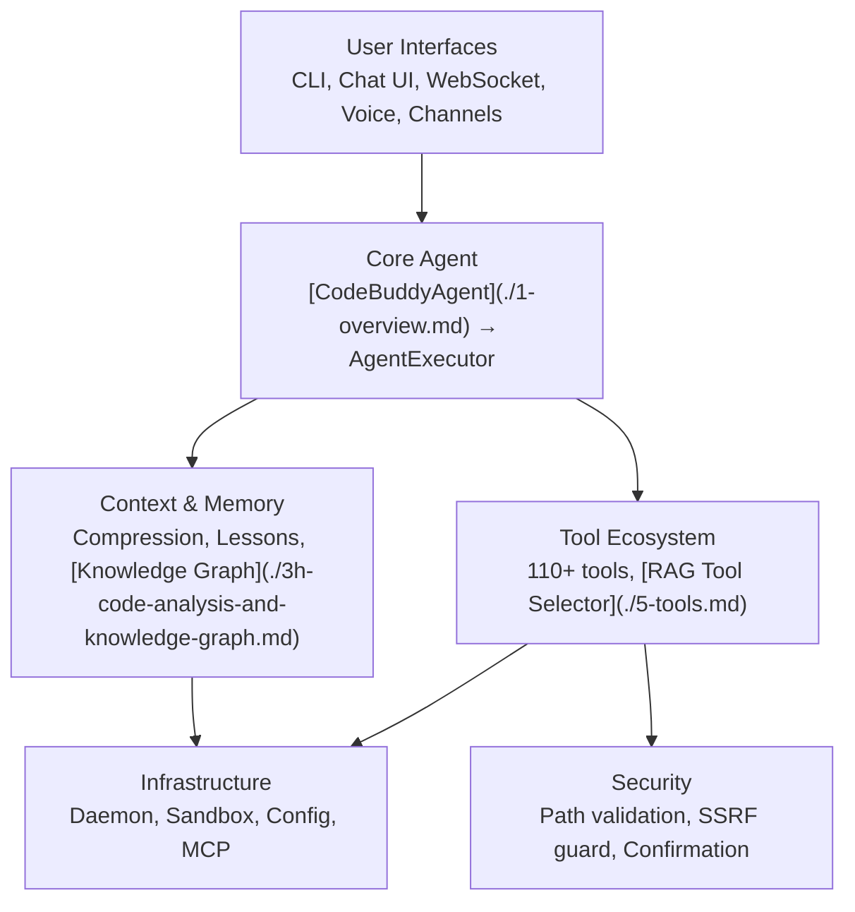
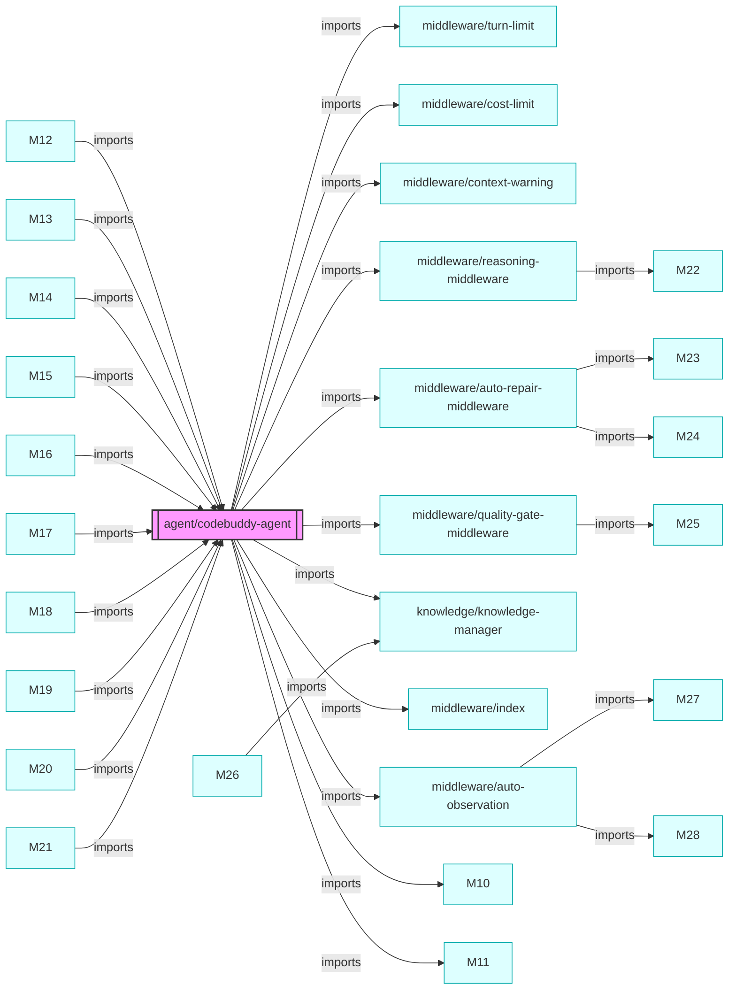
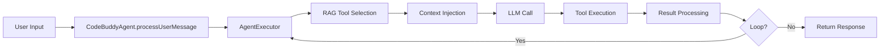

# Architecture

This document serves as the architectural blueprint for the CodeBuddy ecosystem. It is designed for system architects and core contributors who need to understand the structural relationships between the agent orchestrator, tool ecosystem, and memory subsystems.

## System Layers

The project utilizes a layered architecture to isolate concerns, ensuring that the core agent orchestrator remains decoupled from specific infrastructure implementations. By separating the user interface from the execution logic, we allow for modular expansion without destabilizing the core ReAct loop.

> **Developer tip:** When extending the system, always ensure new infrastructure components are registered within the `src/agent/` layer to maintain the integrity of the dependency injection chain.

With the high-level layers established, we must now examine the specific dependency graph that dictates how these modules interact at runtime.

## Core Module Dependencies (top 10)

At the heart of the dependency graph lies the `CodeBuddyAgent`, which acts as the central hub for all system operations. When the system initializes, `CodeBuddyAgent.initializeAgentRegistry()` and `CodeBuddyAgent.initializeSkills()` are invoked to wire together the various middleware and utility modules, ensuring that the agent has access to the necessary capabilities before processing any user input.

> **Legend:** 🟣 Critical path ([PageRank](./4-metrics.md) > 0.01) · 🟡 High importance · 🔵 Standard module · 🟢 Entry point

> **Key concept:** The dependency graph reveals that `CodeBuddyAgent` is the most imported module in the system, serving as the primary entry point for all agentic operations and middleware orchestration.

> **Developer tip:** When modifying core dependencies, always verify the impact on the `CodeBuddyAgent` initialization sequence to prevent circular dependency errors.

Understanding the dependency graph provides a static view of the system, but the true complexity lies in how these modules are distributed across the file system.

## Layer Breakdown

The codebase is organized into distinct functional domains to facilitate maintainability and scalability. This structure allows developers to isolate changes within specific domains, such as `src/agent/` or `src/tools/`, without impacting unrelated subsystems.

| Layer | Modules | Description |
|-------|---------|-------------|
| `src/agent/` | 127 | Core agent system |
| `src/tools/` | 117 | Tool implementations |
| `src/utils/` | 74 | Shared utilities |
| `src/commands/` | 72 | CLI and slash commands |
| `src/ui/` | 63 | Terminal UI components |
| `src/channels/` | 47 | Messaging channel integrations |
| `src/context/` | 45 | [Context Management](./7-context-memory.md) management |
| `src/security/` | 40 | Security and validation |
| `src/knowledge/` | 27 | Code analysis and knowledge graph |
| `src/integrations/` | 22 | External service integrations |
| `src/config/` | 19 | Configuration management |
| `src/server/` | 19 | HTTP/WebSocket server |
| `src/hooks/` | 18 | Execution hooks |
| `src/renderers/` | 16 | Output rendering |
| `src/memory/` | 14 | Memory and persistence |
| `src/mcp/` | 12 | Model Context Protocol servers |
| `src/streaming/` | 12 | Streaming response handling |
| `src/analytics/` | 11 | Usage analytics and cost tracking |
| `src/desktop-automation/` | 11 | Desktop automation |
| `src/plugins/` | 11 | Plugin system |
| `src/skills/` | 11 | Skill registry and marketplace |
| `src/providers/` | 10 | LLM provider adapters |
| `src/database/` | 9 | Database management |
| `src/advanced/` | 8 | Advanced |
| `src/daemon/` | 8 | Background daemon service |

> **Developer tip:** Avoid cross-layer imports that violate the established hierarchy; if a utility in `src/utils/` needs to access `src/agent/`, consider refactoring the logic into a shared service or middleware.

Now that we have categorized the codebase, we can trace the lifecycle of a user request as it traverses these layers.

## Core Agent Flow

When a user submits a prompt, the system initiates a complex orchestration process managed by `CodeBuddyAgent.processUserMessage()`. This method triggers the ReAct loop, where the agent evaluates the input, selects appropriate tools, and manages context injection before executing the final response.

> **Key concept:** The RAG tool selector reduces prompt size from 110+ tools to ~15, saving approximately 8,000 tokens per LLM call.

**Flow Summary:**
User Input → CLI/Chat/Voice/Channel
  → CodeBuddyAgent.processUserMessage()
    → AgentExecutor (ReAct loop)
      1. RAG Tool Selection (~15 from 110+)
      2. Context Injection (lessons, decisions, graph)
      3. Middleware Before-Turn (cost, turn limit, reasoning)
      4. LLM Call (multi-provider)
      5. Tool Execution (parallel read / serial write)
      6. Result Processing (masking, TTL, compaction)
      7. Middleware After-Turn (auto-repair, metrics)
      8. Loop or Return

> **Developer tip:** When debugging the agent flow, use `SessionStore.addMessageToCurrentSession()` to inspect the state of the conversation history before and after the tool execution phase.

---

**See also:** [Overview](./1-overview.md) · [Subsystems](./3a-core-agent-system-cli-and-slash-commands.md) · [Tool System](./5-tools.md) · [Security](./6-security.md)

**Key source files:** `src/agent/.ts`, `src/tools/.ts`, `src/utils/.ts`, `src/commands/.ts`, `src/ui/.ts`, `src/channels/.ts`, `src/context/.ts`, `src/security/.ts`