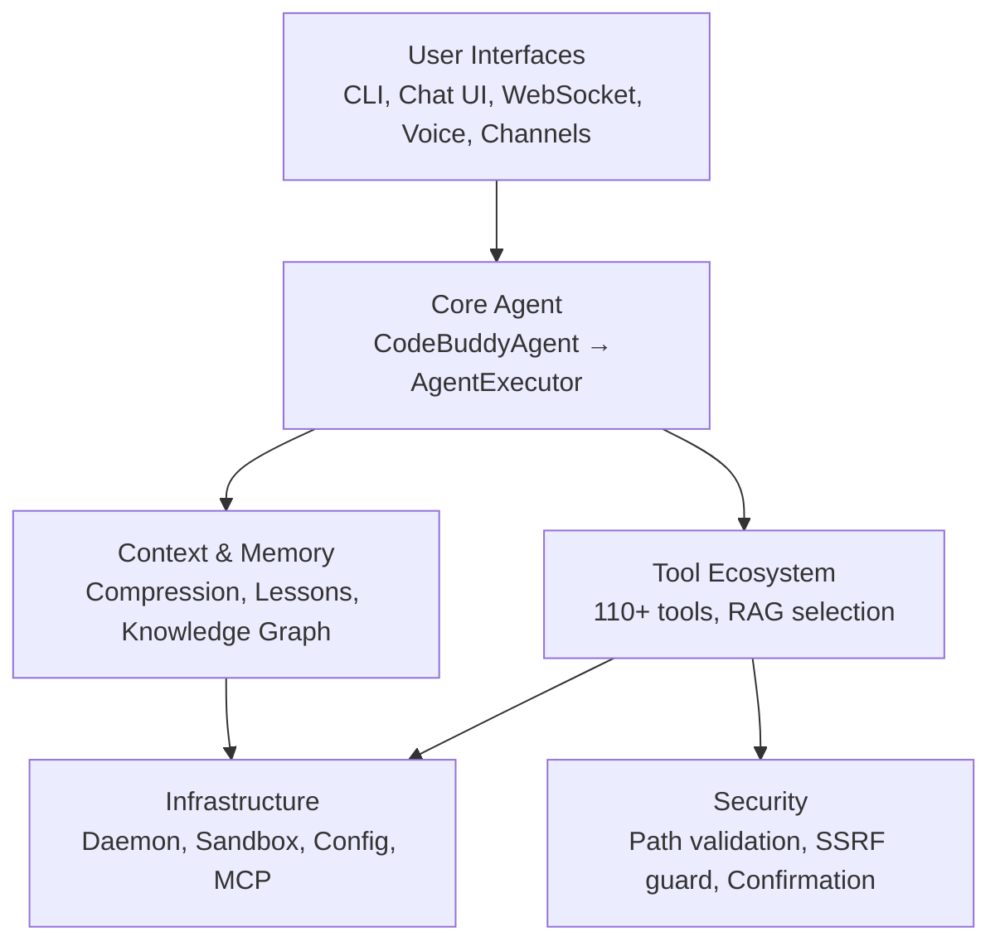
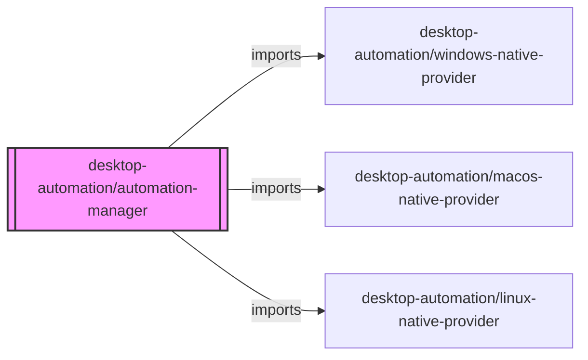

# Architecture

The project follows a layered architecture with a central agent orchestrator coordinating all interactions between user interfaces, LLM providers, tools, and infrastructure services.

## System Layers



## Core Module Dependencies



## Layer Breakdown

| Layer | Modules | Description |
|-------|---------|-------------|
| `src/agent/` | 127 | Core agent system — orchestrator, executor, middleware, reasoning, multi-agent coordination |
| `src/tools/` | 117 | Tool implementations — file editing, bash, search, web, planning, media |
| `src/utils/` | 74 | utils |
| `src/commands/` | 72 | Command system — CLI commands, slash commands, dev workflows |
| `src/ui/` | 63 | Terminal UI — Ink/React components, themes, chat interface |
| `src/channels/` | 47 | Messaging channels — Telegram, Discord, Slack, WhatsApp, 15+ platforms |
| `src/context/` | 45 | Context management — compression, sliding window, JIT discovery, tool masking |
| `src/security/` | 40 | Security layer — path validation, SSRF guard, shell policy, guardian agent |
| `src/knowledge/` | 27 | Knowledge graph — code analysis, PageRank, community detection, impact analysis |
| `src/integrations/` | 22 | integrations |
| `src/config/` | 19 | Configuration — TOML config, model settings, hot-reload |
| `src/server/` | 19 | HTTP/WebSocket server — REST API, real-time streaming, authentication |
| `src/hooks/` | 18 | hooks |
| `src/renderers/` | 16 | renderers |
| `src/memory/` | 14 | Memory — persistent memory, ICM bridge, decision memory, consolidation |
| `src/mcp/` | 12 | mcp |
| `src/streaming/` | 12 | streaming |
| `src/analytics/` | 11 | analytics |
| `src/desktop-automation/` | 11 | desktop automation |
| `src/plugins/` | 11 | plugins |
| `src/skills/` | 11 | Skills — registry, marketplace, SKILL.md loading |
| `src/providers/` | 10 | providers |
| `src/database/` | 9 | database |
| `src/advanced/` | 8 | advanced |
| `src/daemon/` | 8 | Background daemon — health monitoring, cron, heartbeat |

## Core Agent Flow

```
User Input → CLI/Chat/Voice/Channel
  → CodeBuddyAgent.processUserMessage()
    → AgentExecutor (ReAct loop)
      1. RAG Tool Selection (~15 from 110+)
      2. Context Injection (lessons, decisions, graph)
      3. Middleware Before-Turn (cost, turn limit, reasoning)
      4. LLM Call (multi-provider)
      5. Tool Execution (parallel read / serial write)
      6. Result Processing (masking, TTL, compaction)
      7. Middleware After-Turn (auto-repair, metrics)
      8. Loop or Return
```
