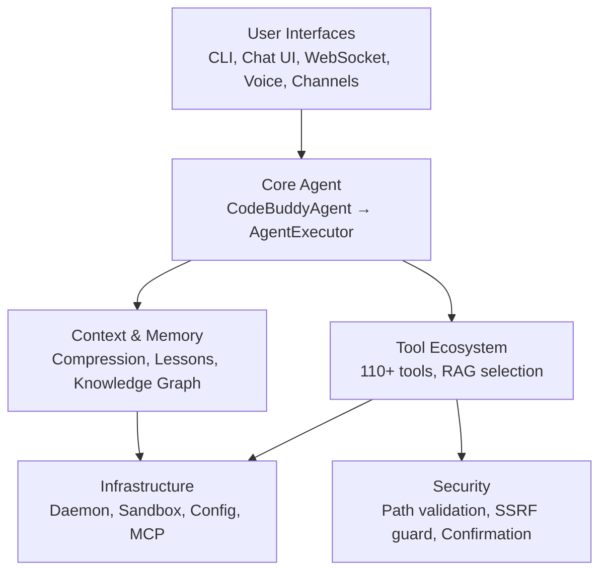

# Architecture

This document outlines the high-level architecture of the project, detailing its layered structure, core components, and the flow of execution. Understanding this architecture is crucial for comprehending how the system processes user requests, interacts with various services, and maintains robustness and extensibility.

## System Layers

The system is organized into distinct layers, each responsible for a specific set of functionalities. This layered approach promotes modularity, separation of concerns, and easier maintenance and scalability. The following diagram illustrates the primary interaction pathways between these high-level components.

The `User Interfaces` layer (`UI`) encompasses all external interaction points, from command-line interfaces to chat UIs and voice channels. These interfaces communicate directly with the `Core Agent` layer, which is the brain of the system, primarily embodied by the `CodeBuddyAgent` and its `AgentExecutor`. The `Core Agent` orchestrates interactions with the `Tool Ecosystem` for executing actions, and the `Context & Memory` layer for managing conversational state and knowledge. Both `Tools` and `Context` rely on the `Infrastructure` layer for underlying services and the `Security` layer for ensuring safe operations.

## Core Module Dependencies

Delving deeper into the `Core Agent` layer, this section visualizes the intricate dependencies between key modules, particularly those centered around the `src/agent/codebuddy-agent.ts` module. This detailed view helps in understanding the internal structure and interconnections of the agent's core logic and its extensive middleware ecosystem.

The diagram highlights `src/agent/codebuddy-agent.ts` (M0) as the central orchestrator, importing various middleware modules (`src/middleware/`) for pre- and post-processing, `src/knowledge/knowledge-manager.ts` for accessing knowledge, and `src/planner/` components for strategic decision-making. Other modules, such as `src/dev/index.ts` and `src/handlers/channel-handlers.ts`, also depend on the core agent, demonstrating its pervasive role across the system. This complex web of dependencies underscores the agent's central position in managing diverse functionalities.

```mermaid
graph LR
    M0[["agent/codebuddy-agent"]]
    M1["middleware/turn-limit"]
    M2["middleware/cost-limit"]
    M3["middleware/context-warning"]
    M4["middleware/reasoning-middleware"]
    M5["middleware/auto-repair-middleware"]
    M6["middleware/quality-gate-middleware"]
    M7["knowledge/knowledge-manager"]
    M8["middleware/index"]
    M9["middleware/auto-observation"]
    M10["planner/index"]
    M11["planner/progress-tracker"]
    M12["agent/wide-research"]
    M13["dev/index"]
    M14["handlers/channel-handlers"]
    M15["daemon/cron-agent-bridge"]
    M16["daemon/heartbeat"]
    M17["mcp/mcp-server"]
    M18["scripting/builtins"]
    M19["routes/chat"]
    M20["routes/tools"]
    M21["websocket/handler"]
    M22["thinking/extended-thinking"]
    M23["repair/repair-engine"]
    M24["repair/fault-localization"]
    M25["specialized/agent-registry"]
    M26["services/prompt-builder"]
    M27["desktop-automation/index"]
    M28["browser-automation/index"]
    M29["codebuddy/client"]
    M0 -->|imports| M1
    M0 -->|imports| M2
    M0 -->|imports| M3
    M0 -->|imports| M4
    M0 -->|imports| M5
    M0 -->|imports| M6
    M0 -->|imports| M7
    M0 -->|imports| M8
    M0 -->|imports| M9
    M0 -->|imports| M10
    M0 -->|imports| M11
    M12 -->|imports| M0
    M13 -->|imports| M0
    M14 -->|imports| M0
    M15 -->|imports| M0
    M16 -->|imports| M0
    M17 -->|imports| M0
    M18 -->|imports| M0
    M19 -->|imports| M0
    M20 -->|imports| M0
    M21 -->|imports| M0
    M4 -->|imports| M22
    M5 -->|imports| M23
    M5 -->|imports| M24
    M6 -->|imports| M25
    M26 -->|imports| M7
    M9 -->|imports| M27
    M9 -->|imports| M28
    M12 -->|imports| M29
    M30 -->|imports| M12
    M13 -->|imports| M31
    M13 -->|imports| M32
    M13 -->|imports| M33
    M34 -->|imports| M13
    M14 -->|imports| M35
    M14 -->|imports| M36
    M14 -->|imports| M37
    M14 -->|imports| M38
    M14 -->|imports| M39
    M14 -->|imports| M40
    M14 -->|imports| M41
    M14 -->|imports| M42
    M14 -->|imports| M43
    M14 -->|imports| M44
    M14 -->|imports| M45
    M14 -->|imports| M46
    M14 -->|imports| M47
    M14 -->|imports| M48
    M14 -->|imports| M49
    M14 -->|imports| M50
    M14 -->|imports| M51
    M34 -->|imports| M14
    M15 -->|imports| M35
    M52 -->|imports| M15
    M53 -->|imports| M16
    M54 -->|imports| M16
    M17 -->|imports| M55
    M34 -->|imports| M17
    M19 -->|imports| M35
    M20 -->|imports| M56
    M21 -->|imports| M35
    M26 -->|imports| M57
    M26 -->|imports| M58
    M26 -->|imports| M59
    M26 -->|imports| M60
    M26 -->|imports| M61
    M26 -->|imports| M62
    M26 -->|imports| M63
    M26 -->|imports| M64
    M26 -->|imports| M65
    M66 -->|imports| M28
    M29 -->|imports| M65
    M29 -->|imports| M67
    M68 -->|imports| M29
    M69 -->|imports| M29
    M70 -->|imports| M29
    M71 -->|imports| M29
    M72 -->|imports| M29
    M73 -->|imports| M29
    M74 -->|imports| M29
    M75 -->|imports| M29
    M76 -->|imports| M29
    style M0 fill:#f9f,stroke:#333,stroke-width:2px
```

## Layer Breakdown

This table provides a quantitative breakdown of the project's codebase by logical layer, indicating the number of modules within each primary directory. This overview helps identify areas of significant development, core functionalities, and potential areas for further modularization or optimization. The `src/agent/` and `src/tools/` directories, for instance, represent the core intelligence and action capabilities of the system.

| Layer | Modules | Description |
|-------|---------|-------------|
| `src/agent/` | 127 | Core agent system |
| `src/tools/` | 117 | Tool implementations |
| `src/utils/` | 74 | Shared utilities |
| `src/commands/` | 72 | CLI and slash commands |
| `src/ui/` | 63 | Terminal UI components |
| `src/channels/` | 47 | Messaging channel integrations |
| `src/context/` | 45 | Context window management |
| `src/security/` | 40 | Security and validation |
| `src/knowledge/` | 27 | Code analysis and knowledge graph |
| `src/integrations/` | 22 | External service integrations |
| `src/config/` | 19 | Configuration management |
| `src/server/` | 19 | HTTP/WebSocket server |
| `src/hooks/` | 18 | Execution hooks |
| `src/renderers/` | 16 | Output rendering |
| `src/memory/` | 14 | Memory and persistence |
| `src/mcp/` | 12 | Model Context Protocol servers |
| `src/streaming/` | 12 | Streaming response handling |
| `src/analytics/` | 11 | Usage analytics and cost tracking |
| `src/desktop-automation/` | 11 | Desktop automation |
| `src/plugins/` | 11 | Plugin system |
| `src/skills/` | 11 | Skill registry and marketplace |
| `src/providers/` | 10 | LLM provider adapters |
| `src/database/` | 9 | Database management |
| `src/advanced/` | 8 | Advanced |
| `src/daemon/` | 8 | Background daemon service |

### Key Methods for Core Agent (`src/agent/`)

The `src/agent/` directory houses the core logic for the `CodeBuddyAgent` and its `AgentExecutor`. These methods are fundamental to how the agent processes requests, makes decisions, and interacts with the environment.

| Method | Purpose |
|---|---|
| `CodeBuddyAgent.processUserMessage(message: string, context: AgentContext)` | Initiates the agent's response to a user message, orchestrating the entire ReAct loop from input parsing to final output. |
| `AgentExecutor.execute(plan: AgentPlan, tools: Tool[])` | Manages the iterative execution of agent steps, including tool selection, context injection, LLM calls, and result processing. |
| `AgentExecutor.selectTools(query: string)` | Dynamically selects the most relevant tools from the available `src/tools/` ecosystem based on the current user query and conversational context. |
| `AgentExecutor.injectContext(context: AgentContext)` | Incorporates relevant historical context, learned lessons, and knowledge graph data from `src/context/` and `src/knowledge/` into the current prompt for the LLM