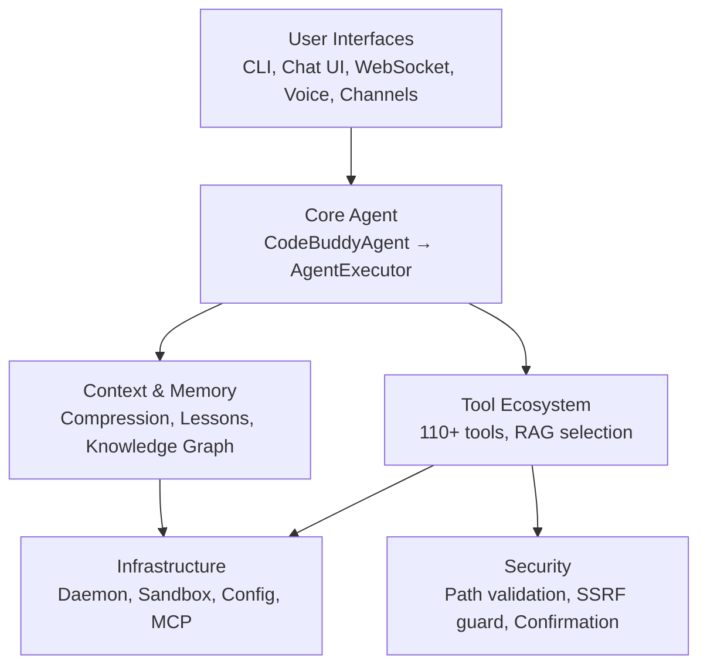
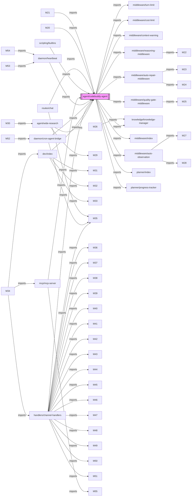
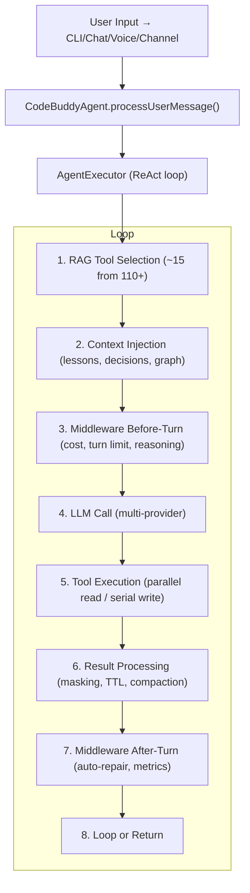

# Architecture

The project follows a layered architecture with a central agent orchestrator coordinating all interactions between user interfaces, LLM providers, tools, and infrastructure services. This documentation provides a high-level overview of the system's structural design, intended for contributors and system architects who need to understand how components integrate and communicate within the codebase.

## System Layers

The system utilizes a modular, layered architecture to decouple user interfaces from core agent logic. This separation ensures that infrastructure services, such as security and memory management, can evolve independently of the interface layer.

To understand the internal connectivity of these layers, we must examine the dependency graph of the core agent.

## Core Module Dependencies

The dependency graph highlights the central role of `src/agent/codebuddy-agent`. It acts as the primary hub, importing various middleware and utility modules to facilitate complex agent operations.

The following table categorizes the codebase into functional domains, providing a high-level overview of the project's modular organization.

## Layer Breakdown

| Layer | Modules | Description |
|-------|---------|-------------|
| `src/agent/` | 127 | Core agent system |
| `src/tools/` | 117 | Tool implementations |
| `src/utils/` | 74 | Shared utilities |
| `src/commands/` | 72 | CLI and slash commands |
| `src/ui/` | 63 | Terminal UI components |
| `src/channels/` | 47 | Messaging channel integrations |
| `src/context/` | 45 | Context window management |
| `src/security/` | 40 | Security and validation |
| `src/knowledge/` | 27 | Code analysis and knowledge graph |
| `src/integrations/` | 22 | External service integrations |
| `src/config/` | 19 | Configuration management |
| `src/server/` | 19 | HTTP/WebSocket server |
| `src/hooks/` | 18 | Execution hooks |
| `src/renderers/` | 16 | Output rendering |
| `src/memory/` | 14 | Memory and persistence |
| `src/mcp/` | 12 | Model Context Protocol servers |
| `src/streaming/` | 12 | Streaming response handling |
| `src/analytics/` | 11 | Usage analytics and cost tracking |
| `src/desktop-automation/` | 11 | Desktop automation |
| `src/plugins/` | 11 | Plugin system |
| `src/skills/` | 11 | Skill registry and marketplace |
| `src/providers/` | 10 | LLM provider adapters |
| `src/database/` | 9 | Database management |
| `src/advanced/` | 8 | Advanced |
| `src/daemon/` | 8 | Background daemon service |

With the architectural structure established, we can examine the lifecycle of a user request as it traverses the agent system.

## Core Agent Flow

The execution flow begins with input ingestion and proceeds through a series of middleware and execution steps. The system performs initialization tasks to prepare the agent for task execution and maintains state consistency across turns.

> **Key concept:** The RAG tool selector reduces prompt size from 110+ tools to ~15, saving approximately 8,000 tokens per LLM call.

**See also:** [Overview](./1-overview.md) · [Subsystems](./3a-core-agent-system-cli-and-slash-commands.md) · [Tool System](./5-tools.md) · [Security](./6-security.md)

**Key source files:** `src/agent/.ts`, `src/tools/.ts`, `src/utils/.ts`, `src/commands/.ts`, `src/ui/.ts`, `src/channels/.ts`, `src/context/.ts`, `src/security/.ts`