# Subsystems

Detected **44** architectural subsystems (modularity: 0.741)

## src (16 modules)

- **src/utils/memory-monitor** (rank: 0.004, 23 functions)
- **src/optimization/model-routing** (rank: 0.003, 13 functions)
- **src/optimization/latency-optimizer** (rank: 0.003, 23 functions)
- **src/mcp/mcp-client** (rank: 0.003, 29 functions)
- **src/security/sandbox** (rank: 0.002, 12 functions)
- **src/agent/agent-mode** (rank: 0.002, 9 functions)
- **src/agent/execution/repair-coordinator** (rank: 0.002, 24 functions)
- **src/context/context-manager-v2** (rank: 0.002, 39 functions)
- **src/hooks/lifecycle-hooks** (rank: 0.002, 17 functions)
- **src/hooks/moltbot-hooks** (rank: 0.002, 0 functions)
- ... and 6 more

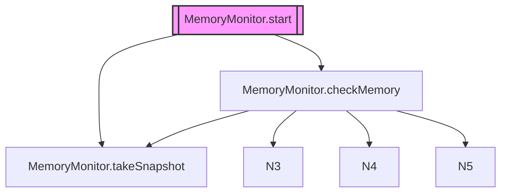

## src (51 modules)

- **src/agent/codebuddy-agent** (rank: 0.013, 65 functions)
- **src/channels/index** (rank: 0.007, 0 functions)
- **src/utils/confirmation-service** (rank: 0.005, 21 functions)
- **src/agent/specialized/agent-registry** (rank: 0.005, 29 functions)
- **src/agent/thinking/extended-thinking** (rank: 0.005, 30 functions)
- **src/tools/registry** (rank: 0.004, 10 functions)
- **src/skills/hub** (rank: 0.004, 27 functions)
- **src/skills/registry** (rank: 0.004, 27 functions)
- **src/analytics/tool-analytics** (rank: 0.003, 23 functions)
- **src/agent/repair/fault-localization** (rank: 0.003, 17 functions)
- ... and 41 more

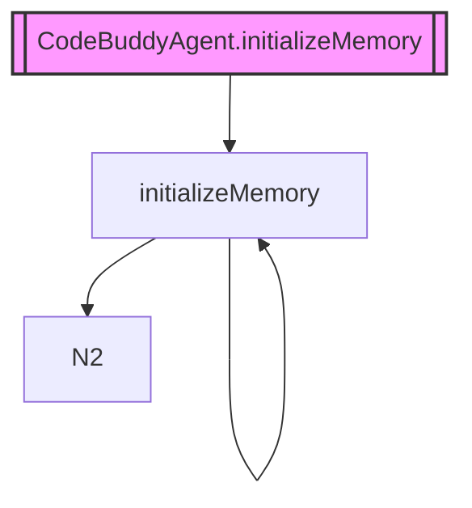

## src (4 modules)

- **src/prompts/prompt-manager** (rank: 0.005, 17 functions)
- **src/agent/custom/custom-agent-loader** (rank: 0.003, 15 functions)
- **src/cli/list-commands** (rank: 0.002, 3 functions)
- **src/commands/slash/prompt-commands** (rank: 0.002, 2 functions)

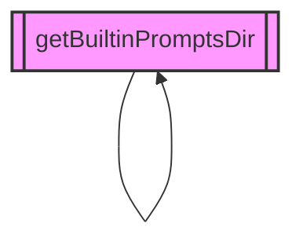

## src (7 modules)

- **src/context/jit-context** (rank: 0.002, 2 functions)
- **src/context/tool-output-masking** (rank: 0.002, 3 functions)
- **src/context/workspace-context** (rank: 0.002, 4 functions)
- **src/knowledge/code-graph-context-provider** (rank: 0.002, 9 functions)
- **src/knowledge/graph-updater** (rank: 0.002, 1 functions)
- **src/observability/tool-metrics** (rank: 0.002, 9 functions)
- **src/agent/execution/agent-executor** (rank: 0.002, 25 functions)

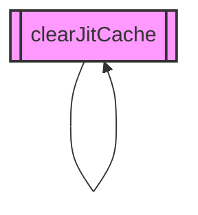

## src (14 modules)

- **src/codebuddy/client** (rank: 0.017, 22 functions)
- **src/optimization/cache-breakpoints** (rank: 0.010, 3 functions)
- **src/agent/extended-thinking** (rank: 0.010, 8 functions)
- **src/interpreter/computer/browser** (rank: 0.003, 15 functions)
- **src/interpreter/computer/files** (rank: 0.003, 33 functions)
- **src/interpreter/computer/os** (rank: 0.003, 9 functions)
- **src/commands/research/index** (rank: 0.002, 3 functions)
- **src/agent/prompt-suggestions** (rank: 0.002, 10 functions)
- **src/hooks/advanced-hooks** (rank: 0.002, 18 functions)
- **src/hooks/smart-hooks** (rank: 0.002, 10 functions)
- ... and 4 more

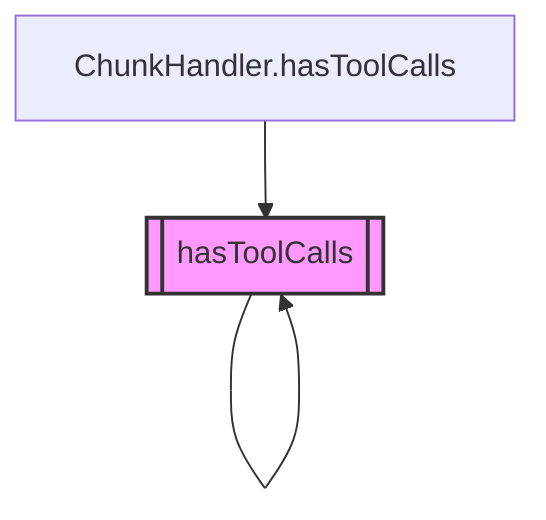

## src (2 modules)

- **src/agent/flow/planning-flow** (rank: 0.003, 12 functions)
- **src/commands/flow** (rank: 0.002, 2 functions)

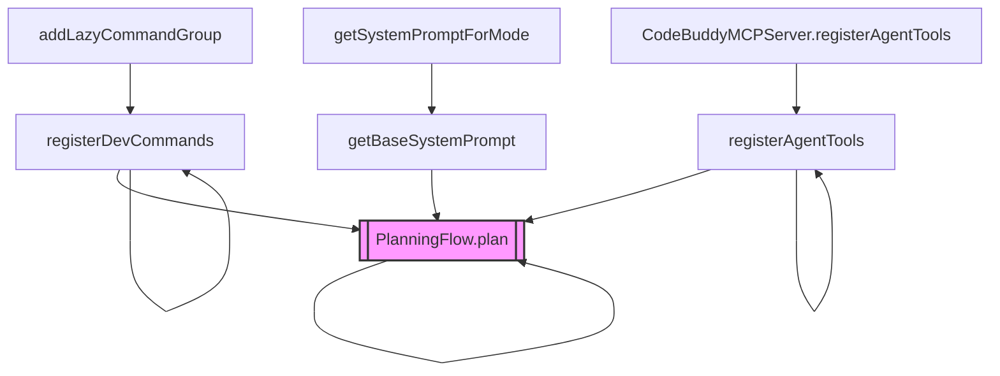

## src (12 modules)

- **src/tools/screenshot-tool** (rank: 0.006, 20 functions)
- **src/deploy/cloud-configs** (rank: 0.005, 10 functions)
- **src/browser-automation/index** (rank: 0.004, 0 functions)
- **src/desktop-automation/index** (rank: 0.003, 0 functions)
- **src/tools/ocr-tool** (rank: 0.003, 12 functions)
- **src/agent/middleware/auto-observation** (rank: 0.003, 6 functions)
- **src/deploy/nix-config** (rank: 0.003, 3 functions)
- **src/tools/computer-control-tool** (rank: 0.003, 78 functions)
- **src/tools/deploy-tool** (rank: 0.003, 8 functions)
- **src/tools/registry/misc-tools** (rank: 0.002, 51 functions)
- ... and 2 more

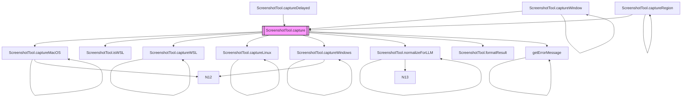

## src (20 modules)

- **src/tools/registry/index** (rank: 0.004, 1 functions)
- **src/tools/registry/attention-tools** (rank: 0.002, 11 functions)
- **src/tools/registry/bash-tools** (rank: 0.002, 10 functions)
- **src/tools/registry/browser-tools** (rank: 0.002, 18 functions)
- **src/tools/registry/control-tools** (rank: 0.002, 6 functions)
- **src/tools/registry/docker-tools** (rank: 0.002, 10 functions)
- **src/tools/registry/git-tools** (rank: 0.002, 10 functions)
- **src/tools/registry/knowledge-tools** (rank: 0.002, 21 functions)
- **src/tools/registry/kubernetes-tools** (rank: 0.002, 10 functions)
- **src/tools/registry/memory-tools** (rank: 0.002, 16 functions)
- ... and 10 more

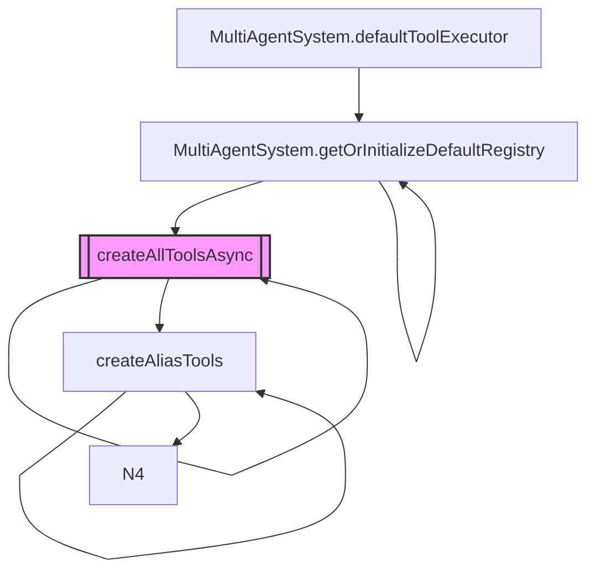

## src (4 modules)

- **src/agent/observer/event-trigger** (rank: 0.003, 11 functions)
- **src/agent/observer/observer-coordinator** (rank: 0.003, 8 functions)
- **src/agent/observer/screen-observer** (rank: 0.003, 9 functions)
- **src/daemon/daemon-lifecycle** (rank: 0.002, 10 functions)

## src (21 modules)

- **src/memory/enhanced-memory** (rank: 0.009, 28 functions)
- **src/memory/coding-style-analyzer** (rank: 0.004, 11 functions)
- **src/memory/decision-memory** (rank: 0.004, 10 functions)
- **src/personas/persona-manager** (rank: 0.003, 22 functions)
- **src/utils/settings-manager** (rank: 0.003, 32 functions)
- **src/agent/operating-modes** (rank: 0.002, 27 functions)
- **src/config/model-tools** (rank: 0.002, 3 functions)
- **src/context/bootstrap-loader** (rank: 0.002, 7 functions)
- **src/context/precompaction-flush** (rank: 0.002, 6 functions)
- **src/memory/auto-capture** (rank: 0.002, 15 functions)
- ... and 11 more

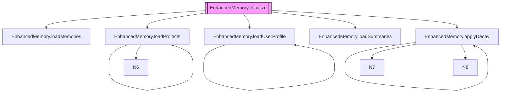

## src (5 modules)

- **src/agent/repo-profiling/cartography** (rank: 0.007, 11 functions)
- **src/agent/repo-profiler** (rank: 0.005, 13 functions)
- **src/observability/run-store** (rank: 0.003, 21 functions)
- **src/utils/init-project** (rank: 0.002, 7 functions)
- **src/tools/registry/lessons-tools** (rank: 0.002, 22 functions)

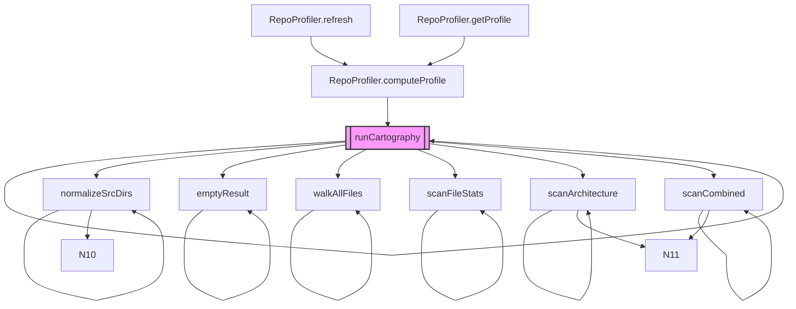

## src/agent/specialized/swe-agent (2 modules)

- **src/agent/specialized/swe-agent** (rank: 0.004, 8 functions)
- **src/agent/specialized/swe-agent-adapter** (rank: 0.002, 7 functions)

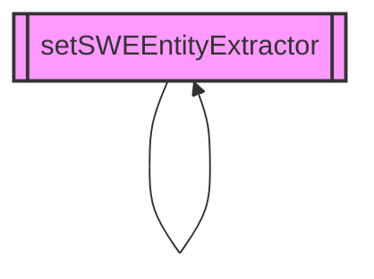

## src (6 modules)

- **src/agent/subagents** (rank: 0.002, 20 functions)
- **src/context/codebase-map** (rank: 0.002, 12 functions)
- **src/knowledge/code-graph-persistence** (rank: 0.002, 3 functions)
- **src/tools/js-repl** (rank: 0.002, 12 functions)
- **src/tools/multi-edit** (rank: 0.002, 4 functions)
- **src/tools/registry/advanced-tools** (rank: 0.002, 33 functions)

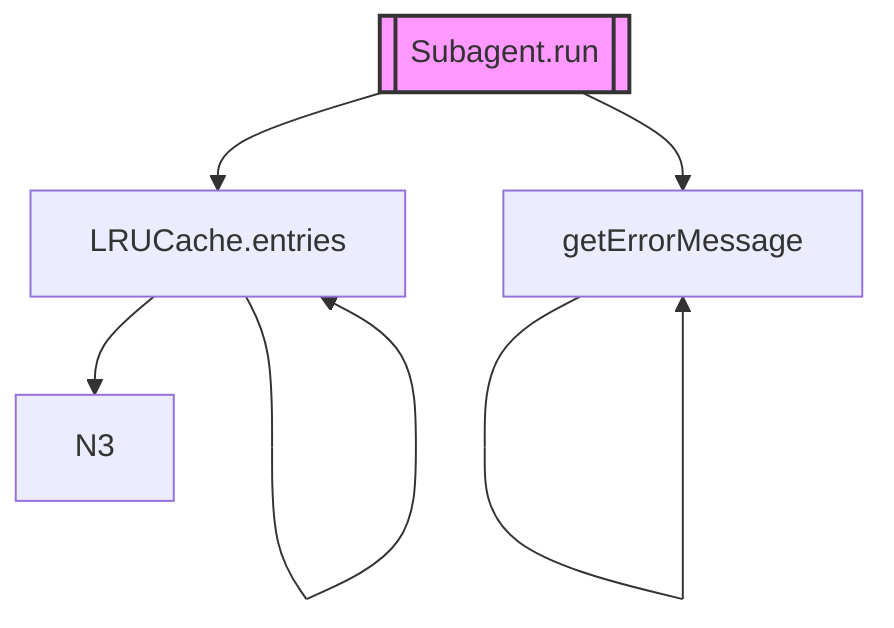

## src/browser-automation (4 modules)

- **src/browser-automation/profile-manager** (rank: 0.003, 4 functions)
- **src/browser-automation/route-interceptor** (rank: 0.003, 4 functions)
- **src/browser-automation/screenshot-annotator** (rank: 0.003, 1 functions)
- **src/browser-automation/browser-manager** (rank: 0.002, 70 functions)

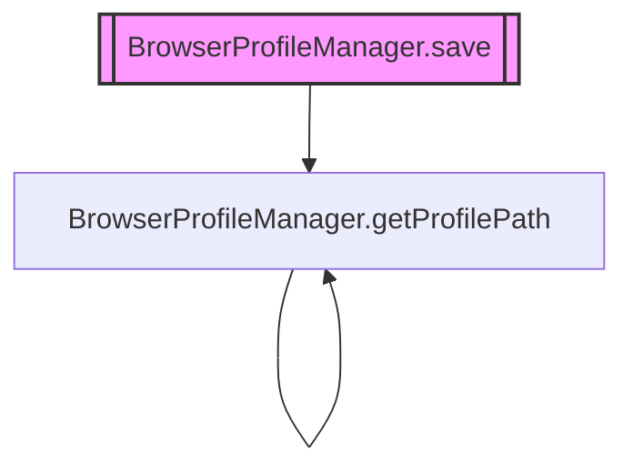

## src (2 modules)

- **src/cache/embedding-cache** (rank: 0.004, 23 functions)
- **src/context/codebase-rag/embeddings** (rank: 0.002, 31 functions)

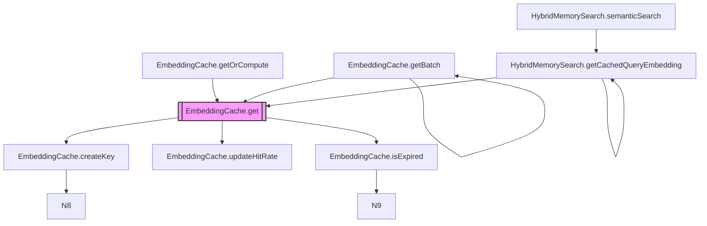

## src (3 modules)

- **src/canvas/a2ui-tool** (rank: 0.003, 22 functions)
- **src/canvas/visual-workspace** (rank: 0.003, 20 functions)
- **src/tools/registry/canvas-tools** (rank: 0.002, 14 functions)

```mermaid
graph TD
    N0[["A2UITool.execute"]]
    N1["A2UITool.createSurface"]
    N2["A2UITool.deleteSurface"]
    N3["A2UITool.addComponent"]
    N4["A2UITool.addComponents"]
    N5["A2UITool.updateData"]
    N6["A2UITool.beginRendering"]
    N7["A2UITool.renderTerminal"]
    N8["A2UITool.renderHTML"]
    N9["A2UITool.getSurface"]
    N10["A2UITool.listSurfaces"]
    N11["A2UITool.startServer"]
    N12["A2UITool.stopServer"]
    N13["A2UITool.serverStatus"]
    N14["A2UITool.getData"]
    N0 --> N1
    N0 --> N2
    N0 --> N3
    N0 --> N4
    N0 --> N5
    N0 --> N6
    N0 --> N7
    N0 --> N8
    N0 --> N9
    N0 --> N10
    N0 --> N11
    N0 --> N12
    N0 --> N13
    N0 --> N14
    N0 --> N15
    N0 --> N16
    N2 --> N2
    N3 --> N3
    N3 --> N17
    N4 --> N4
    N4 --> N17
    N6 --> N6
    N7 --> N7
    N8 --> N8
    N10 --> N10
    N11 --> N18
    N11 --> N19
    N12 --> N20
    N13 --> N13
    style N0 fill:#f9f,stroke:#333,stroke-width:2px
```

## src/channels (10 modules)

- **src/channels/dm-pairing** (rank: 0.019, 19 functions)
- **src/channels/google-chat/index** (rank: 0.002, 16 functions)
- **src/channels/matrix/index** (rank: 0.002, 23 functions)
- **src/channels/signal/index** (rank: 0.002, 19 functions)
- **src/channels/teams/index** (rank: 0.002, 18 functions)
- **src/channels/webchat/index** (rank: 0.002, 21 functions)
- **src/channels/whatsapp/index** (rank: 0.002, 20 functions)
- **src/channels/discord/client** (rank: 0.002, 35 functions)
- **src/channels/slack/client** (rank: 0.002, 31 functions)
- **src/channels/telegram/client** (rank: 0.002, 37 functions)

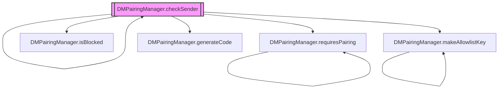

## src (11 modules)

- **src/channels/discord/index** (rank: 0.002, 0 functions)
- **src/channels/imessage/index** (rank: 0.002, 20 functions)
- **src/channels/line/index** (rank: 0.002, 11 functions)
- **src/channels/mattermost/index** (rank: 0.002, 10 functions)
- **src/channels/nextcloud-talk/index** (rank: 0.002, 11 functions)
- **src/channels/nostr/index** (rank: 0.002, 20 functions)
- **src/channels/slack/index** (rank: 0.002, 0 functions)
- **src/channels/telegram/index** (rank: 0.002, 0 functions)
- **src/channels/twilio-voice/index** (rank: 0.002, 12 functions)
- **src/channels/zalo/index** (rank: 0.002, 10 functions)
- ... and 1 more

## src (2 modules)

- **src/checkpoints/persistent-checkpoint-manager** (rank: 0.004, 30 functions)
- **src/commands/handlers/extra-handlers** (rank: 0.002, 12 functions)

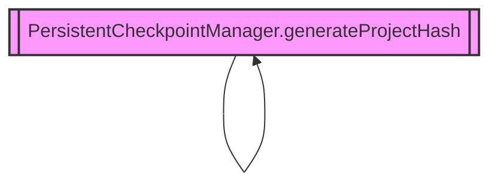

## src (3 modules)

- **src/persistence/session-store** (rank: 0.008, 44 functions)
- **src/cli/session-commands** (rank: 0.002, 3 functions)
- **src/server/routes/sessions** (rank: 0.002, 2 functions)

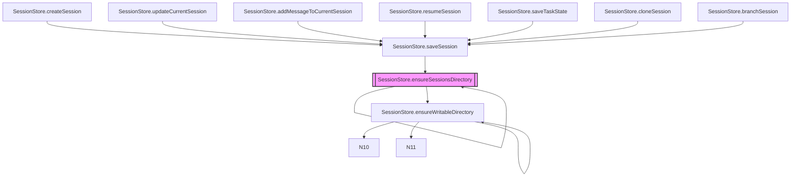

## src (7 modules)

- **src/codebuddy/index** (rank: 0.003, 0 functions)
- **src/scripting/index** (rank: 0.003, 16 functions)
- **src/scripting/lexer** (rank: 0.003, 23 functions)
- **src/scripting/parser** (rank: 0.003, 12 functions)
- **src/scripting/runtime** (rank: 0.003, 37 functions)
- **src/integrations/json-rpc/server** (rank: 0.002, 26 functions)
- **src/integrations/mcp/mcp-server** (rank: 0.002, 26 functions)

## src (5 modules)

- **src/codebuddy/tools** (rank: 0.006, 12 functions)
- **src/tools/web-search** (rank: 0.003, 28 functions)
- **src/tools/metadata** (rank: 0.003, 0 functions)
- **src/tools/tools-md-generator** (rank: 0.002, 6 functions)
- **src/mcp/mcp-session-tools** (rank: 0.002, 1 functions)

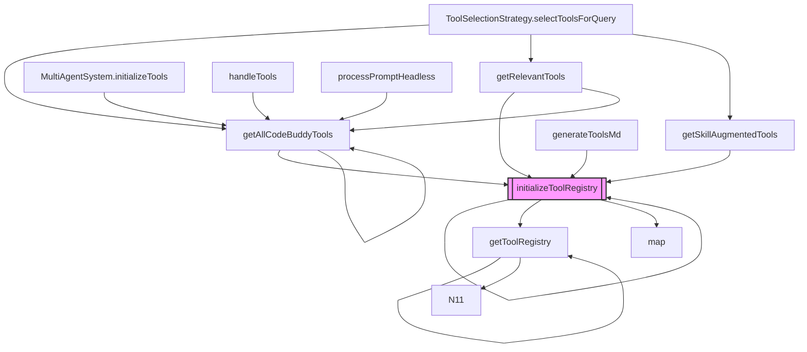

## src (29 modules)

- **src/nodes/index** (rank: 0.004, 19 functions)
- **src/observability/run-viewer** (rank: 0.004, 11 functions)
- **src/talk-mode/providers/audioreader-tts** (rank: 0.004, 7 functions)
- **src/utils/session-enhancements** (rank: 0.004, 22 functions)
- **src/commands/cli/approvals-command** (rank: 0.002, 9 functions)
- **src/commands/cli/device-commands** (rank: 0.002, 1 functions)
- **src/commands/cli/node-commands** (rank: 0.002, 1 functions)
- **src/commands/cli/secrets-command** (rank: 0.002, 7 functions)
- **src/commands/cli/speak-command** (rank: 0.002, 1 functions)
- **src/commands/execpolicy** (rank: 0.002, 1 functions)
- ... and 19 more

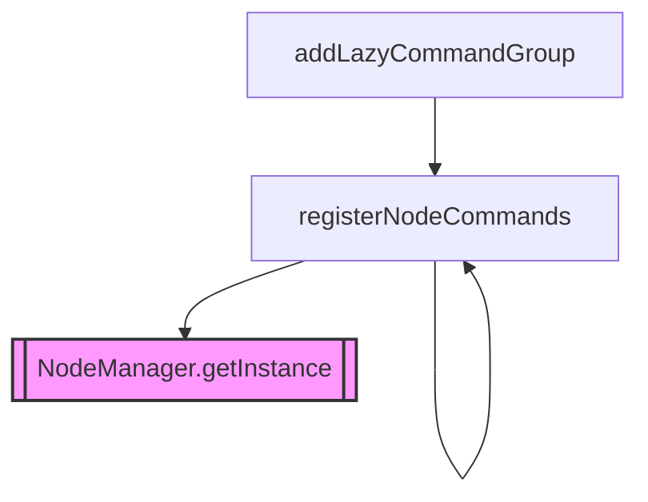

## src (2 modules)

- **src/config/env-schema** (rank: 0.004, 4 functions)
- **src/commands/cli/config-command** (rank: 0.002, 1 functions)

```mermaid
graph TD
    N0[["getEnvDef"]]
    N1["registerConfigCommand"]
    N2["addLazyCommandGroup"]
    N0 --> N0
    N1 --> N0
    N1 --> N1
    N2 --> N1
    style N0 fill:#f9f,stroke:#333,stroke-width:2px
```

## src (4 modules)

- **src/doctor/index** (rank: 0.003, 9 functions)
- **src/security/security-audit** (rank: 0.003, 18 functions)
- **src/wizard/onboarding** (rank: 0.003, 4 functions)
- **src/commands/cli/utility-commands** (rank: 0.002, 1 functions)

```mermaid
graph TD
    N0[["commandExists"]]
    N1["SubagentManager.spawn"]
    N2["checkDependencies"]
    N3["checkTtsProviders"]
    N4["checkGit"]
    N5["VoiceInput.commandExists"]
    N6["ConfirmationService.openInVSCode"]
    N7["ExtensionLoader.checkDependencies"]
    N8["runDoctorChecks"]
    N9["VoiceInput.isAvailable"]
    N0 --> N0
    N0 --> N1
    N1 --> N1
    N1 --> N10
    N2 --> N0
    N3 --> N0
    N4 --> N0
    N5 --> N0
    N6 --> N0
    N2 --> N2
    N7 --> N2
    N3 --> N3
    N4 --> N4
    N8 --> N4
    N9 --> N5
    style N0 fill:#f9f,stroke:#333,stroke-width:2px
```

## src/commands/dev (3 modules)

- **src/commands/dev/workflows** (rank: 0.005, 3 functions)
- **src/commands/dev/issue-pipeline** (rank: 0.003, 4 functions)
- **src/commands/dev/index** (rank: 0.002, 2 functions)

```mermaid
graph TD
    N0[["waitForConfirmation"]]
    N1["runWorkflow"]
    N2["MultiAgentSystem.runWorkflow"]
    N3["registerDevCommands"]
    N4["runIssuePipeline"]
    N0 --> N0
    N1 --> N0
    N2 --> N1
    N3 --> N1
    N4 --> N1
    style N0 fill:#f9f,stroke:#333,stroke-width:2px
```

## src (5 modules)

- **src/utils/interactive-setup** (rank: 0.002, 10 functions)
- **src/utils/tool-filter** (rank: 0.002, 11 functions)
- **src/commands/slash-commands** (rank: 0.002, 12 functions)
- **src/utils/config-validator** (rank: 0.002, 0 functions)
- **src/commands/handlers/vibe-handlers** (rank: 0.002, 6 functions)

```mermaid
graph TD
    N0[["createInterface"]]
    N1["createKnowledgeCommand"]
    N2["SidecarBridge.start"]
    N3["runSetup"]
    N4["addLazyCommandGroup"]
    N5["SidecarBridge.call"]
    N6["processPromptHeadless"]
    N0 --> N0
    N1 --> N0
    N2 --> N0
    N3 --> N0
    N1 --> N1
    N4 --> N1
    N5 --> N2
    N6 --> N3
    N3 --> N3
    style N0 fill:#f9f,stroke:#333,stroke-width:2px
```

## src (3 modules)

- **src/workflows/index** (rank: 0.003, 0 functions)
- **src/workflows/pipeline** (rank: 0.003, 24 functions)
- **src/commands/pipeline** (rank: 0.002, 3 functions)

## src (2 modules)

- **src/providers/provider-manager** (rank: 0.004, 14 functions)
- **src/commands/provider** (rank: 0.002, 6 functions)

```mermaid
graph TD
    N0[["ProviderManager.registerProvider"]]
    N1["ProviderManager.createProvider"]
    N0 --> N1
    style N0 fill:#f9f,stroke:#333,stroke-width:2px
```

## src (14 modules)

- **src/knowledge/path** (rank: 0.005, 0 functions)
- **src/knowledge/community-detection** (rank: 0.004, 5 functions)
- **src/knowledge/graph-analytics** (rank: 0.004, 4 functions)
- **src/knowledge/knowledge-graph** (rank: 0.004, 25 functions)
- **src/knowledge/mermaid-generator** (rank: 0.003, 7 functions)
- **src/knowledge/code-graph-deep-populator** (rank: 0.003, 8 functions)
- **src/docs/docs-generator** (rank: 0.003, 18 functions)
- **src/docs/llm-enricher** (rank: 0.003, 1 functions)
- **src/tools/registry/code-graph-tools** (rank: 0.002, 7 functions)
- **src/knowledge/graph-drift** (rank: 0.002, 5 functions)
- ... and 4 more

## src (5 modules)

- **src/memory/persistent-memory** (rank: 0.004, 19 functions)
- **src/memory/semantic-memory-search** (rank: 0.003, 22 functions)
- **src/context/context-files** (rank: 0.003, 6 functions)
- **src/mcp/mcp-memory-tools** (rank: 0.002, 1 functions)
- **src/mcp/mcp-resources** (rank: 0.002, 1 functions)

```mermaid
graph TD
    N0[["PersistentMemoryManager.initialize"]]
    N1["PersistentMemoryManager.ensureMemoryFiles"]
    N2["PersistentMemoryManager.loadMemories"]
    N0 --> N1
    N0 --> N2
    N1 --> N1
    N2 --> N3
    style N0 fill:#f9f,stroke:#333,stroke-width:2px
```

## src (2 modules)

- **src/context/context-manager-v3** (rank: 0.004, 6 functions)
- **src/server/routes/memory** (rank: 0.002, 1 functions)

```mermaid
graph TD
    N0[["ContextManagerV3.updateConfig"]]
    N1["createTokenCounter"]
    N0 --> N1
    N1 --> N1
    style N0 fill:#f9f,stroke:#333,stroke-width:2px
```

## src (3 modules)

- **src/database/database-manager** (rank: 0.003, 18 functions)
- **src/errors/crash-handler** (rank: 0.003, 14 functions)
- **src/utils/graceful-shutdown** (rank: 0.002, 24 functions)

```mermaid
graph TD
    N0[["DatabaseManager.emitWithLegacy"]]
    N1["DatabaseManager.initialize"]
    N2["DatabaseManager.runMigrations"]
    N3["DatabaseManager.vacuum"]
    N4["DatabaseManager.backup"]
    N5["DatabaseManager.close"]
    N6["DatabaseManager.clearAll"]
    N1 --> N0
    N2 --> N0
    N3 --> N0
    N4 --> N0
    N5 --> N0
    N6 --> N0
    N1 --> N2
    N3 --> N3
    style N0 fill:#f9f,stroke:#333,stroke-width:2px
```

## src/desktop-automation (4 modules)

- **src/desktop-automation/linux-native-provider** (rank: 0.003, 35 functions)
- **src/desktop-automation/macos-native-provider** (rank: 0.003, 40 functions)
- **src/desktop-automation/windows-native-provider** (rank: 0.003, 0 functions)
- **src/desktop-automation/automation-manager** (rank: 0.002, 90 functions)

```mermaid
graph TD
    N0[["buttonNumber"]]
    N1["LinuxNativeProvider.click"]
    N2["LinuxNativeProvider.doubleClick"]
    N0 --> N0
    N1 --> N0
    N2 --> N0
    style N0 fill:#f9f,stroke:#333,stroke-width:2px
```

## src (4 modules)

- **src/embeddings/embedding-provider** (rank: 0.005, 20 functions)
- **src/search/usearch-index** (rank: 0.003, 33 functions)
- **src/knowledge/graph-embeddings** (rank: 0.002, 4 functions)
- **src/memory/hybrid-search** (rank: 0.002, 20 functions)

```mermaid
graph TD
    N0[["EmbeddingProvider.initialize"]]
    N1["EmbeddingProvider.doInitialize"]
    N2["EmbeddingProvider.embed"]
    N3["EmbeddingProvider.embedBatch"]
    N0 --> N1
    N1 --> N1
    N1 --> N4
    N2 --> N0
    N3 --> N0
    style N0 fill:#f9f,stroke:#333,stroke-width:2px
```

## src (3 modules)

- **src/voice/voice-activity** (rank: 0.003, 13 functions)
- **src/voice/wake-word** (rank: 0.003, 18 functions)
- **src/input/voice-input** (rank: 0.002, 17 functions)

```mermaid
graph TD
    N0[["VoiceActivityDetector.processFrame"]]
    N1["VoiceActivityDetector.calculateEnergy"]
    N2["VoiceActivityDetector.updateEnergyHistory"]
    N3["VoiceActivityDetector.calculateSpeechProbability"]
    N0 --> N1
    N0 --> N2
    N0 --> N3
    N1 --> N1
    N2 --> N2
    N3 --> N3
    style N0 fill:#f9f,stroke:#333,stroke-width:2px
```

## src/knowledge/scanners (3 modules)

- **src/knowledge/scanners/py-tree-sitter** (rank: 0.003, 0 functions)
- **src/knowledge/scanners/ts-tree-sitter** (rank: 0.003, 1 functions)
- **src/knowledge/scanners/index** (rank: 0.002, 4 functions)

## src/mcp (2 modules)

- **src/mcp/config** (rank: 0.004, 11 functions)
- **src/mcp/client** (rank: 0.002, 13 functions)

```mermaid
graph TD
    N0[["resolveEnvVars"]]
    N1["resolveServerEnv"]
    N2["loadMCPConfig"]
    N0 --> N0
    N1 --> N0
    N1 --> N1
    N2 --> N1
    style N0 fill:#f9f,stroke:#333,stroke-width:2px
```

## src (5 modules)

- **src/nodes/device-node** (rank: 0.006, 21 functions)
- **src/nodes/transports/adb-transport** (rank: 0.004, 10 functions)
- **src/nodes/transports/local-transport** (rank: 0.004, 8 functions)
- **src/nodes/transports/ssh-transport** (rank: 0.004, 13 functions)
- **src/tools/device-tool** (rank: 0.002, 1 functions)

```mermaid
graph TD
    N0[["DeviceNodeManager.getInstance"]]
    N1["registerDeviceCommands"]
    N2["DeviceTool.execute"]
    N3["addLazyCommandGroup"]
    N1 --> N0
    N2 --> N0
    N1 --> N1
    N3 --> N1
    style N0 fill:#f9f,stroke:#333,stroke-width:2px
```

## src/plugins (2 modules)

- **src/plugins/git-pinned-marketplace** (rank: 0.004, 15 functions)
- **src/plugins/plugin-system** (rank: 0.002, 17 functions)

```mermaid
graph TD
    N0[["GitPinnedMarketplace.getInstance"]]
    N1["getGitPinnedMarketplace"]
    N2["PluginManager.loadAllPlugins"]
    N1 --> N0
    N1 --> N1
    N2 --> N1
    style N0 fill:#f9f,stroke:#333,stroke-width:2px
```

## src (3 modules)

- **src/sandbox/auto-sandbox** (rank: 0.003, 7 functions)
- **src/sandbox/docker-sandbox** (rank: 0.003, 11 functions)
- **src/tools/bash/bash-tool** (rank: 0.002, 18 functions)

```mermaid
graph TD
    N0[["AutoSandboxRouter.shouldSandbox"]]
    N1["parseBashCommand"]
    N0 --> N0
    N0 --> N1
    N1 --> N1
    N1 --> N2
    N1 --> N3
    style N0 fill:#f9f,stroke:#333,stroke-width:2px
```

## src (3 modules)

- **src/workflows/aflow-optimizer** (rank: 0.003, 15 functions)
- **src/workflows/lobster-engine** (rank: 0.003, 17 functions)
- **src/server/routes/workflow-builder** (rank: 0.002, 42 functions)

```mermaid
graph TD
    N0[["AFlowOptimizer.getInstance"]]
    N1["getAFlowOptimizer"]
    N1 --> N0
    N1 --> N1
    style N0 fill:#f9f,stroke:#333,stroke-width:2px
```

## src/tools (10 modules)

- **src/tools/archive-tool** (rank: 0.002, 21 functions)
- **src/tools/audio-tool** (rank: 0.002, 12 functions)
- **src/tools/clipboard-tool** (rank: 0.002, 6 functions)
- **src/tools/diagram-tool** (rank: 0.002, 11 functions)
- **src/tools/document-tool** (rank: 0.002, 19 functions)
- **src/tools/export-tool** (rank: 0.002, 14 functions)
- **src/tools/pdf-tool** (rank: 0.002, 11 functions)
- **src/tools/qr-tool** (rank: 0.002, 14 functions)
- **src/tools/video-tool** (rank: 0.002, 15 functions)
- **src/tools/registry/multimodal-tools** (rank: 0.002, 59 functions)

```mermaid
graph TD
    N0[["getArchivePassword"]]
    N1["ArchiveTool.extract7z"]
    N2["ArchiveTool.extractRar"]
    N3["ArchiveTool.extract"]
    N0 --> N0
    N1 --> N0
    N2 --> N0
    N3 --> N1
    N1 --> N1
    N3 --> N2
    N2 --> N2
    style N0 fill:#f9f,stroke:#333,stroke-width:2px
```

## src/tools (2 modules)

- **src/tools/process-tool** (rank: 0.004, 11 functions)
- **src/tools/registry/process-tools** (rank: 0.002, 8 functions)

## Community Interactions

```mermaid
graph LR
  subgraph C15["src (51 modules)"]
    N0["agent/codebuddy-agent"]
    N1["middleware/auto-repair-middleware"]
    N2["middleware/context-warning"]
    N3["middleware/cost-limit"]
    N4["middleware/index"]
    N5["middleware/quality-gate-middleware"]
    more_15["+45 more"]
  end
  subgraph C186["src (29 modules)"]
    N6["cli/approvals-command"]
    more_186["+28 more"]
  end
  C186 -->|"7 imports"| C15
  C147 -->|"6 imports"| C146
  C19 -->|"3 imports"| C59
  C102 -->|"3 imports"| C230
  C147 -->|"2 imports"| C15
  C186 -->|"2 imports"| C223
  C186 -->|"2 imports"| C17
  C186 -->|"2 imports"| C182
  C59 -->|"2 imports"| C15
  C15 -->|"1 imports"| C42
```


---

**See also:** [Overview](./1-overview.md) · [Architecture](./2-architecture.md) · [Tool System](./5-tools.md) · [Security](./6-security.md)
