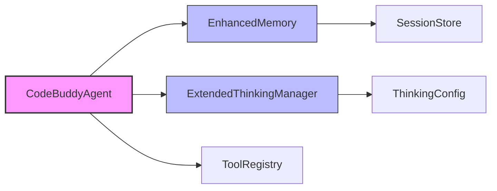

# Subsystems

This section provides an architectural overview of the 42 identified subsystems within the codebase, categorized by their functional domain. Developers should consult this documentation to understand module boundaries, dependency hierarchies, and the orchestration logic required when implementing new features or debugging cross-module interactions.

## Core Agent System & CLI And Slash Commands (32 modules)

The core agent system serves as the primary orchestration layer for all user interactions, command parsing, and tool execution. It manages the lifecycle of the agent, including memory initialization and skill registration, ensuring that the environment is fully prepared before any user input is processed.

> **Key concept:** The `CodeBuddyAgent` acts as the central orchestrator. By invoking `CodeBuddyAgent.initializeAgentRegistry` and `CodeBuddyAgent.initializeSkills` during startup, the system ensures that all available capabilities are registered and ready for inference, while `CodeBuddyAgent.initializeMemory` establishes the necessary state persistence.

- **src/agent/codebuddy-agent** (rank: 0.013, 65 functions)
- **src/channels/index** (rank: 0.007, 0 functions)
- **src/utils/confirmation-service** (rank: 0.005, 21 functions)
- **src/commands/dev/workflows** (rank: 0.005, 3 functions)
- **src/agent/specialized/agent-registry** (rank: 0.005, 29 functions)
- **src/agent/thinking/extended-thinking** (rank: 0.005, 30 functions)
- **src/tools/registry** (rank: 0.004, 10 functions)
- **src/analytics/tool-analytics** (rank: 0.003, 23 functions)
- **src/agent/repair/fault-localization** (rank: 0.003, 17 functions)
- **src/agent/repair/repair-engine** (rank: 0.003, 25 functions)
- ... and 22 more

Beyond the core agent orchestration, the system relies on specialized modules to manage complex reasoning, persistent state across sessions, and external tool integration. The following diagram illustrates the high-level relationship between the agent, its memory providers, and the extended thinking capabilities.

---

**See also:** [Architecture](./2-architecture.md) · [Tool System](./5-tools.md) · [Context & Memory](./7-context-memory.md) · [API Reference](./9-api-reference.md)