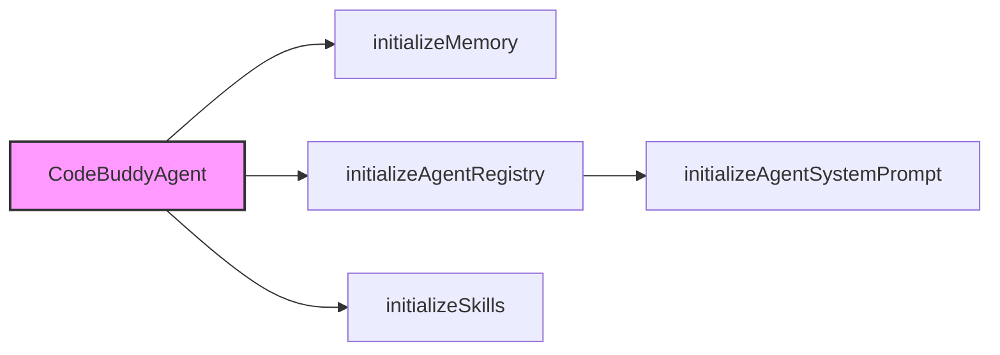

# Subsystems Architecture

The CodeBuddy architecture is built on a foundation of 42 distinct subsystems, each designed to encapsulate specific logic and minimize cross-module coupling. This document provides a high-level overview of these components, intended for engineers who need to navigate the codebase, debug integration points, or extend the agent's capabilities.

## Core Agent System

At the center of this architecture lies the `CodeBuddyAgent`. When the system boots, it doesn't simply start; it orchestrates a complex sequence of initialization routines to ensure the agent is context-aware and ready for interaction. This process begins with `CodeBuddyAgent.initializeMemory()`, which sets up the storage layer, followed by `CodeBuddyAgent.initializeAgentRegistry()` to catalog available tools and skills.

By separating these concerns, the system ensures that if the memory provider fails, the agent registry remains intact, allowing for graceful degradation. The initialization flow is strictly ordered to prevent race conditions during the setup of the system prompt via `CodeBuddyAgent.initializeAgentSystemPrompt()`.

> **Key concept:** The modularity score of 0.758 indicates a highly decoupled system. This allows developers to swap out the `EnhancedMemory` provider or modify `DMPairingManager` logic without triggering cascading failures across the core agent loop.

> **Developer tip:** When modifying the initialization sequence, ensure that `CodeBuddyAgent.ensureDecisionMemoryProvider()` is called before any tool execution, as missing decision context will cause the agent to hallucinate tool parameters.

Now that we have established the core initialization sequence, we can examine the broader subsystem inventory that supports these operations and provides the necessary infrastructure for the agent to function.

## Subsystem Inventory

The project is organized into 42 architectural subsystems. These modules are categorized by their responsibility, ranging from communication channels to specialized repair engines.

Detected **42** architectural subsystems (modularity: 0.758)

### Core Agent System & CLI And Slash Commands (32 modules)

- **src/agent/codebuddy-agent** (rank: 0.013, 65 functions)
- **src/channels/index** (rank: 0.007, 0 functions)
- **src/utils/confirmation-service** (rank: 0.005, 21 functions)
- **src/commands/dev/workflows** (rank: 0.005, 3 functions)
- **src/agent/specialized/agent-registry** (rank: 0.005, 29 functions)
- **src/agent/thinking/extended-thinking** (rank: 0.005, 30 functions)
- **src/tools/registry** (rank: 0.004, 10 functions)
- **src/analytics/tool-analytics** (rank: 0.003, 23 functions)
- **src/agent/repair/fault-localization** (rank: 0.003, 17 functions)
- **src/agent/repair/repair-engine** (rank: 0.003, 25 functions)
- ... and 22 more

## Specialized Subsystems

Beyond the core agent, the system relies on specialized modules to handle external interactions and state persistence. For instance, the `DMPairingManager` handles secure communication handshakes. When the agent receives a request, `DMPairingManager.checkSender()` is invoked to validate the origin before any processing occurs. This ensures that unauthorized entities cannot trigger agent actions.

Similarly, state management is offloaded to the `SessionStore`. This module is responsible for the lifecycle of a conversation, utilizing `SessionStore.createSession()` to initialize new contexts and `SessionStore.saveSession()` to persist them to disk. By isolating these concerns, the system maintains a clean separation between the "brain" (the agent) and the "memory" (the session store).

> **Developer tip:** When debugging session issues, always check `SessionStore.ensureWritableDirectory()` first. If the process lacks filesystem permissions, the agent will fail to save state, leading to "amnesia" between restarts.

---

**See also:** [Architecture](./2-architecture.md) · [Tool System](./5-tools.md) · [Context & Memory](./7-context-memory.md) · [API Reference](./9-api-reference.md)