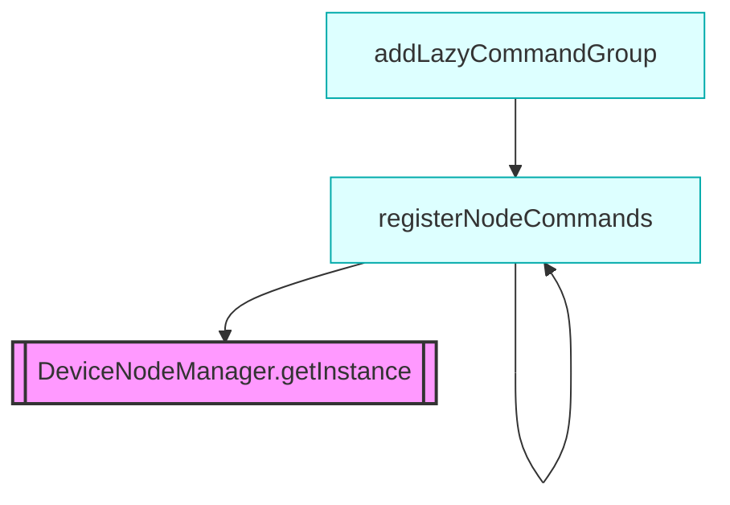

# Subsystems: CLI, Slash Commands, and Shared Utilities

This section documents the peripheral subsystems that bridge the gap between the core agent logic and user interaction. Developers working on command-line interfaces, session management, or node-based device communication should read this to understand how user intent is translated into system actions and how state is persisted across execution boundaries.

## Command Architecture and Lazy Loading

The command-line interface serves as the primary gateway for user interaction. When a user invokes a command, the system must resolve the input to a specific handler without loading the entire codebase into memory. This is why we employ a lazy-loading architecture for command groups; it minimizes the initial memory footprint while keeping the command registry extensible.

> **Developer tip:** When implementing new CLI commands, ensure they are registered in the appropriate command group to avoid namespace collisions and ensure they are discoverable by the help system.

By decoupling the command definition from the execution logic, we allow developers to add new capabilities—such as `src/commands/cli/secrets-command` or `src/commands/cli/approvals-command`—without modifying the core CLI entry point. This modularity is essential for maintaining a clean separation of concerns as the project scales.

## Node Management and Device Communication

Managing hardware devices requires a stable singleton instance to track state across the application lifecycle. By utilizing `DeviceNodeManager.getInstance()`, the system ensures that transport layers are initialized exactly once, preventing race conditions during pairing operations like `DeviceNodeManager.pairDevice()`.

> **Key concept:** The `DeviceNodeManager` acts as a central registry for all connected hardware, abstracting the complexity of transport protocols (USB, Bluetooth, etc.) away from the business logic.

Having covered device connectivity, we must now address how these interactions are persisted. The system relies on a robust session layer to maintain context between disparate CLI invocations.

## Session Persistence and Utilities

Persistence is critical for long-running agent sessions. When the agent needs to recall previous interactions, it relies on `SessionStore.loadSession()` to hydrate the memory state, ensuring continuity between CLI invocations. Before any data is written to disk, the system validates the environment using `SessionStore.ensureWritableDirectory()` to prevent I/O failures.

> **Developer tip:** Always verify the session directory exists using `SessionStore.ensureWritableDirectory()` before attempting to save a new session to prevent silent failures in restricted environments.

The following modules represent the current landscape of CLI, node, and utility subsystems:

- **src/nodes/index** (rank: 0.004, 19 functions)
- **src/utils/session-enhancements** (rank: 0.004, 22 functions)
- **src/workflows/index** (rank: 0.003, 0 functions)
- **src/workflows/pipeline** (rank: 0.003, 24 functions)
- **src/commands/cli/approvals-command** (rank: 0.002, 9 functions)
- **src/commands/cli/device-commands** (rank: 0.002, 1 functions)
- **src/commands/cli/node-commands** (rank: 0.002, 1 functions)
- **src/commands/cli/secrets-command** (rank: 0.002, 7 functions)
- **src/commands/execpolicy** (rank: 0.002, 1 functions)
- **src/commands/knowledge** (rank: 0.002, 1 functions)
- ... and 18 more

---

**See also:** [Architecture](./2-architecture.md) · [Subsystems](./3a-core-agent-system-cli-and-slash-commands.md) · [API Reference](./9-api-reference.md)