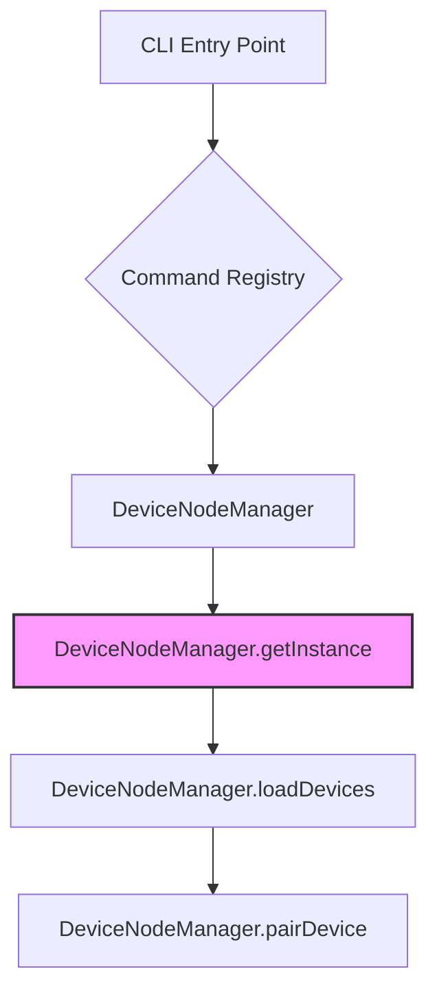

# Subsystems (continued)

## CLI And Slash Commands & Shared Utilities (28 modules)

This section details the CLI interface, slash command infrastructure, and shared utility modules that facilitate inter-process communication and command execution. These components are critical for developers extending the system's interface, managing device states, or integrating new command-line workflows.

- **src/nodes/index** (rank: 0.004, 19 functions)
- **src/utils/session-enhancements** (rank: 0.004, 22 functions)
- **src/workflows/index** (rank: 0.003, 0 functions)
- **src/workflows/pipeline** (rank: 0.003, 24 functions)
- **src/commands/cli/approvals-command** (rank: 0.002, 9 functions)
- **src/commands/cli/device-commands** (rank: 0.002, 1 functions)
- **src/commands/cli/node-commands** (rank: 0.002, 1 functions)
- **src/commands/cli/secrets-command** (rank: 0.002, 7 functions)
- **src/commands/execpolicy** (rank: 0.002, 1 functions)
- **src/commands/knowledge** (rank: 0.002, 1 functions)
- ... and 18 more

The command architecture relies heavily on centralized node management to handle device registration and state persistence. The following diagram illustrates the initialization flow for node-based command groups and the retrieval of the singleton manager.

> **Key concept:** The `DeviceNodeManager` acts as a singleton registry for all connected hardware and virtual nodes. By utilizing `DeviceNodeManager.getInstance()`, command modules ensure that execution contexts remain consistent across disparate CLI sessions, preventing race conditions during device pairing.

### Node and Session Management

The integration between CLI commands and the underlying node infrastructure is managed through specific lifecycle hooks. When a user invokes a device-related command, the system utilizes `DeviceNodeManager.loadDevices()` to populate the current environment state. If a new connection is required, `DeviceNodeManager.pairDevice()` is triggered to establish the transport layer.

Beyond device management, the system provides robust session handling through the `src/utils/session-enhancements` module. This module interacts directly with the persistence layer to ensure that command history and state are preserved. Developers should utilize `SessionStore.createSession()` when initializing new command contexts to ensure that all subsequent operations are correctly logged and recoverable.

---

**See also:** [Architecture](./2-architecture.md) · [Subsystems](./3a-core-agent-system-cli-and-slash-commands.md) · [API Reference](./9-api-reference.md)

--- END ---