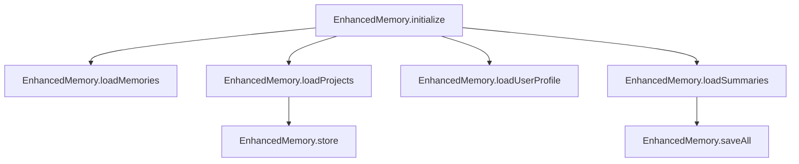

# Subsystems (continued)

This section covers the shared utility modules and context window management systems, which are responsible for maintaining agent state, user preferences, and operational context. These modules are essential for developers working on persistence, memory retrieval, or model-specific configuration, as they directly influence how the agent maintains continuity across sessions.

## Shared Utilities & Context Window Management (23 modules)

The following modules constitute the foundational utility layer. These components are responsible for managing the agent's internal state, handling memory persistence, and ensuring that context windows remain optimized for LLM interactions.

- **src/memory/enhanced-memory** (rank: 0.009, 28 functions)
- **src/memory/coding-style-analyzer** (rank: 0.004, 11 functions)
- **src/memory/decision-memory** (rank: 0.004, 10 functions)
- **src/personas/persona-manager** (rank: 0.003, 22 functions)
- **src/utils/settings-manager** (rank: 0.003, 32 functions)
- **src/agent/operating-modes** (rank: 0.002, 27 functions)
- **src/config/model-tools** (rank: 0.002, 3 functions)
- **src/context/jit-context** (rank: 0.002, 2 functions)
- **src/context/precompaction-flush** (rank: 0.002, 6 functions)
- **src/context/tool-output-masking** (rank: 0.002, 3 functions)
- ... and 13 more

The core of this subsystem is the memory management layer, which handles the lifecycle of persistent data. The following diagram outlines the initialization flow for the `EnhancedMemory` component, which is critical for restoring agent state upon startup.

> **Key concept:** The `EnhancedMemory` system utilizes a tiered loading strategy. By invoking `EnhancedMemory.initialize()`, the system orchestrates the sequential loading of project data, user profiles, and summaries, ensuring that the context window is populated with relevant state before the agent begins processing.

### Memory and Session Persistence

Beyond the initial loading sequence, the system relies on robust persistence mechanisms to ensure that session data is not lost between agent runs. The `EnhancedMemory` module provides granular control over data retention, specifically through `EnhancedMemory.calculateImportance()`, which determines which memories are prioritized for inclusion in the context window.

When managing active conversations, the system integrates with the `SessionStore` module. This allows the agent to perform operations such as `SessionStore.loadSession()` to retrieve historical context or `SessionStore.saveSession()` to persist the current state of the conversation. These methods ensure that the agent maintains a consistent persona and operational history, regardless of the underlying model's stateless nature.

---

**See also:** [Overview](./1-overview.md) · [Architecture](./2-architecture.md) · [Subsystems](./3a-core-agent-system-cli-and-slash-commands.md) · [Tool System](./5-tools.md)

--- END ---