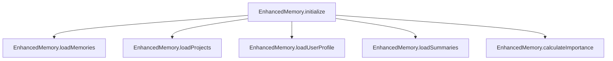

# Subsystems (continued)

This section documents the foundational memory and context management subsystems that allow Code Buddy to maintain state across sessions. Developers working on persistence, user-specific configurations, or long-term memory retrieval should focus on these modules to understand how the agent retains knowledge and adapts to specific coding environments.

## Shared Utilities & [Context Management](./7-context-memory.md) Management (23 modules)

At the heart of Code Buddy's ability to maintain continuity lies the memory subsystem. When the agent interacts with a user, it doesn't simply process a single prompt in isolation; it builds a narrative arc. This is achieved through the `src/memory/enhanced-memory` module, which acts as the primary interface for stateful information. By centralizing these utilities, the system ensures that context—ranging from user preferences to project-specific coding styles—is consistently available regardless of the active session.

The initialization process is critical for performance. When `EnhancedMemory.initialize()` is invoked, the system orchestrates a series of asynchronous calls to hydrate the agent's state. This ensures that the agent is not just "smart," but "aware" of the specific constraints and history of the current workspace.

> **Key concept:** The `EnhancedMemory` system uses a tiered loading strategy. By separating `EnhancedMemory.loadProjects()` from `EnhancedMemory.loadUserProfile()`, the agent can lazily initialize context, reducing startup latency by loading only the necessary metadata for the current workspace.

The following modules represent the core utility layer responsible for maintaining the agent's state and configuration:

- **src/memory/enhanced-memory** (rank: 0.009, 28 functions)
- **src/memory/coding-style-analyzer** (rank: 0.004, 11 functions)
- **src/memory/decision-memory** (rank: 0.004, 10 functions)
- **src/personas/persona-manager** (rank: 0.003, 22 functions)
- **src/utils/settings-manager** (rank: 0.003, 32 functions)
- **src/agent/operating-modes** (rank: 0.002, 27 functions)
- **src/config/model-tools** (rank: 0.002, 3 functions)
- **src/context/jit-context** (rank: 0.002, 2 functions)
- **src/context/precompaction-flush** (rank: 0.002, 6 functions)
- **src/context/tool-output-masking** (rank: 0.002, 3 functions)
- ... and 13 more

Having established how the agent stores and retrieves its long-term knowledge, we must now look at the specific mechanisms used to ensure data integrity during shutdown and session transitions.

> **Developer tip:** When modifying `EnhancedMemory.initialize()`, ensure that `EnhancedMemory.saveAll()` is called during shutdown sequences to prevent data loss, as the memory state is often held in volatile buffers before persistence.

---

**See also:** [Overview](./1-overview.md) · [Architecture](./2-architecture.md) · [Subsystems](./3a-core-agent-system-cli-and-slash-commands.md) · [Tool System](./5-tools.md)