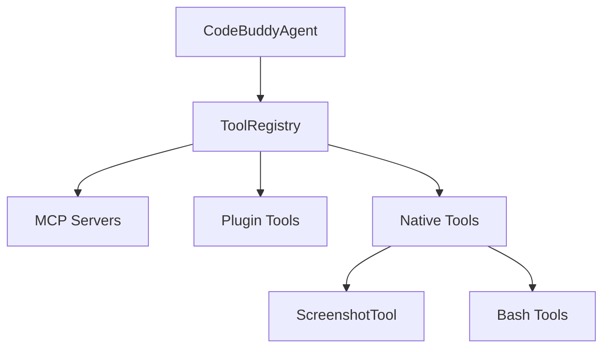

# Subsystems (continued)

This section provides a deep dive into the modular architecture of the Code Buddy tool ecosystem. It is intended for developers and system architects who need to understand how the agent extends its capabilities through isolated, specialized modules, ensuring that the core system remains lightweight while supporting a vast array of external functions.

## The Tool Registry Architecture

When Code Buddy needs to perform an action, it doesn't rely on a hardcoded list of capabilities. Instead, it utilizes a dynamic registry system that aggregates tools from various sources—including Model Context Protocol (MCP) servers, local plugins, and native implementations. The system orchestrates this via `src/codebuddy/tools`, which acts as the central nervous system for capability discovery.

By decoupling the tool definitions from the agent's core logic, the system allows for hot-swapping capabilities without requiring a full restart. When the agent initializes, it calls `initializeToolRegistry()` to build the available toolset, which then invokes `getMCPManager()` and `initializeMCPServers()` to fetch external definitions. This architecture ensures that adding a new capability is as simple as registering a new module, rather than modifying the core agent loop.

> **Key concept:** The tool registry pattern allows the agent to scale its capabilities horizontally. By using `convertMCPToolToCodeBuddyTool()` and `convertPluginToolToCodeBuddyTool()`, the system normalizes disparate tool interfaces into a unified schema, reducing the complexity of the agent's decision-making loop.

> **Developer tip:** When implementing a new tool, always ensure it is registered in the central registry. If you are adding a custom plugin, use `addPluginToolsToCodeBuddyTools()` to ensure the agent can discover and execute your new logic during the next inference cycle.

Now that we have established how the agent orchestrates and registers its capabilities, we can examine the specific implementation modules that populate the registry and provide the actual functional logic.

## Tool Implementations (22 modules)

The following list represents the current inventory of specialized tool modules. Each module is designed to handle a specific domain, such as `ScreenshotTool` for visual capture or `docker-tools` for container orchestration. These modules are imported and managed by the central registry, allowing the agent to selectively load only the tools required for the current session context.

- **src/tools/process-tool** (rank: 0.004, 11 functions)
- **src/tools/registry/index** (rank: 0.004, 1 functions)
- **src/tools/registry/attention-tools** (rank: 0.002, 11 functions)
- **src/tools/registry/bash-tools** (rank: 0.002, 10 functions)
- **src/tools/registry/browser-tools** (rank: 0.002, 18 functions)
- **src/tools/registry/control-tools** (rank: 0.002, 6 functions)
- **src/tools/registry/docker-tools** (rank: 0.002, 10 functions)
- **src/tools/registry/git-tools** (rank: 0.002, 10 functions)
- **src/tools/registry/knowledge-tools** (rank: 0.002, 21 functions)
- **src/tools/registry/kubernetes-tools** (rank: 0.002, 10 functions)
- ... and 12 more

> **Developer tip:** When working with native tools like `ScreenshotTool`, always verify the environment before execution. For instance, `ScreenshotTool.captureMacOS()` and `ScreenshotTool.captureLinux()` handle platform-specific dependencies; failing to check `ScreenshotTool.isWSL()` before execution can lead to unhandled exceptions in non-GUI environments.

---

**See also:** [Subsystems](./3a-core-agent-system-cli-and-slash-commands.md) · [Tool System](./5-tools.md)

--- END ---