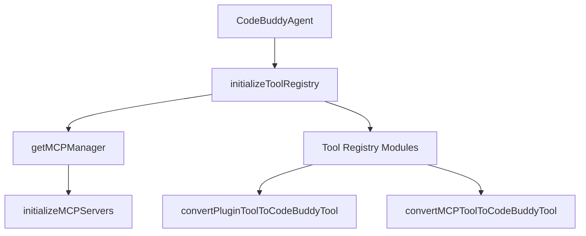

# Subsystems (continued)

This section details the modular architecture of the tool registry system, which manages the lifecycle, discovery, and execution of specialized agent capabilities. Understanding these modules is essential for developers extending agent functionality or integrating new external services, as these registries define the interface between the core agent and the execution environment.

The system architecture relies on a centralized registry to manage tool discovery and execution, ensuring that disparate tool sources—such as MCP servers, local plugins, and marketplace tools—are normalized into a consistent interface. The initialization process is orchestrated by `initializeToolRegistry`, which coordinates with `getMCPManager` to prepare the environment.

> **Key concept:** The tool registry utilizes a dynamic loading pattern, allowing the system to convert disparate plugin and MCP tools into a unified `CodeBuddyTool` format via `convertMCPToolToCodeBuddyTool` and `convertPluginToolToCodeBuddyTool` at runtime, ensuring consistent execution context regardless of the tool's origin.

The following modules represent the specific domain-logic registries that populate the tool registry. These modules are responsible for defining the capabilities available to the agent, ranging from low-level system operations to high-level knowledge retrieval.

## Tool Implementations (22 modules)

- **src/tools/process-tool** (rank: 0.004, 11 functions)
- **src/tools/registry/index** (rank: 0.004, 1 functions)
- **src/tools/registry/attention-tools** (rank: 0.002, 11 functions)
- **src/tools/registry/bash-tools** (rank: 0.002, 10 functions)
- **src/tools/registry/browser-tools** (rank: 0.002, 18 functions)
- **src/tools/registry/control-tools** (rank: 0.002, 6 functions)
- **src/tools/registry/docker-tools** (rank: 0.002, 10 functions)
- **src/tools/registry/git-tools** (rank: 0.002, 10 functions)
- **src/tools/registry/knowledge-tools** (rank: 0.002, 21 functions)
- **src/tools/registry/kubernetes-tools** (rank: 0.002, 10 functions)
- ... and 12 more

Beyond these registry modules, specific tools often require dedicated implementation logic to handle platform-specific constraints or complex execution flows. For instance, the `ScreenshotTool.capture` method provides a unified interface for cross-platform screen capture, abstracting the underlying differences between `ScreenshotTool.captureMacOS`, `ScreenshotTool.captureLinux`, and `ScreenshotTool.captureWindows`.

---

**See also:** [Subsystems](./3a-core-agent-system-cli-and-slash-commands.md) · [Tool System](./5-tools.md)

--- END ---