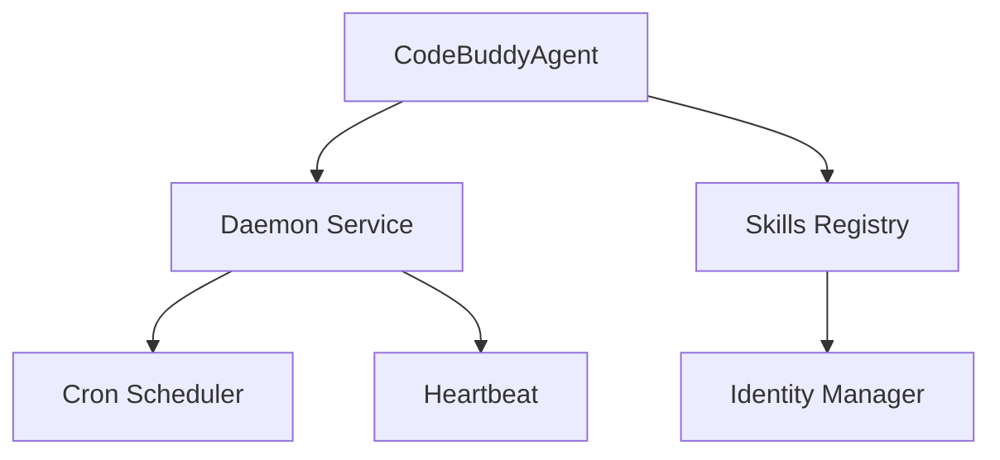

# Subsystems (continued)

This document serves as a reference for the background infrastructure and support subsystems that sustain the Code Buddy agent. Developers and system architects should consult this guide to understand how the agent maintains state, manages identity, and executes scheduled tasks outside of the primary interaction loop.

## Core Agent System & Background Daemon Service

When the Code Buddy agent initializes, it does not simply wait for user input; it spins up a suite of background services to ensure the environment remains responsive and synchronized. This architecture relies on a daemon-based approach, where critical tasks—such as heartbeat monitoring and cron scheduling—run independently of the main chat thread. By decoupling these processes, the system ensures that long-running operations do not block the user's interaction with the agent.

The initialization process is orchestrated through the `CodeBuddyAgent` class, which acts as the central nervous system. During startup, `CodeBuddyAgent.initializeAgentRegistry()` and `CodeBuddyAgent.initializeSkills()` are invoked to register available capabilities and establish the agent's operational boundaries. This setup ensures that when a user triggers a command, the agent already has a fully populated context, including identity verification and skill availability.

> **Key concept:** The daemon architecture separates the "thinking" layer from the "maintenance" layer. By offloading tasks like heartbeat monitoring and cron scheduling to background services, the agent maintains a consistent state even when the primary chat interface is idle.

> **Developer tip:** When modifying the `src/daemon/heartbeat` module, ensure that your changes do not introduce blocking I/O operations. The heartbeat must remain lightweight to prevent the agent from appearing unresponsive to the system monitor.

Now that we have established how the background services and core agent infrastructure operate, we can review the specific modules that comprise this support layer.

- **src/skills/hub** (rank: 0.004, 27 functions)
- **src/skills/registry** (rank: 0.004, 27 functions)
- **src/identity/identity-manager** (rank: 0.003, 12 functions)
- **src/agent/observer/trigger-registry** (rank: 0.003, 5 functions)
- **src/webhooks/webhook-manager** (rank: 0.003, 10 functions)
- **src/auth/profile-manager** (rank: 0.003, 22 functions)
- **src/channels/group-security** (rank: 0.003, 17 functions)
- **src/daemon/heartbeat** (rank: 0.003, 12 functions)
- **src/daemon/index** (rank: 0.003, 0 functions)
- **src/scheduler/cron-scheduler** (rank: 0.003, 27 functions)
- ... and 9 more

With the background services and core agent infrastructure defined, we can now look at how these components integrate with the broader ecosystem, including memory management and tool execution.

---

**See also:** [Architecture](./2-architecture.md) · [Subsystems](./3a-core-agent-system-cli-and-slash-commands.md) · [Tool System](./5-tools.md) · [Security](./6-security.md)