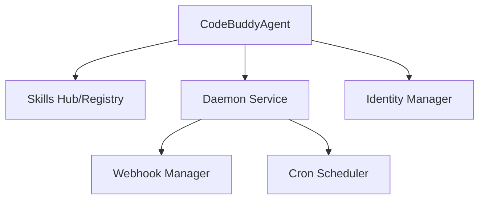

# Subsystems (continued)

This section details the auxiliary modules supporting the core agent system and background daemon services. These components manage identity, scheduling, and webhook event handling, ensuring the agent remains responsive and synchronized with external triggers.

## Core Agent System & Background Daemon Service (19 modules)

The core agent system relies on a distributed architecture where background daemons handle asynchronous tasks, such as webhook processing and cron-based scheduling. By decoupling these services from the primary execution loop, the system maintains high availability and responsiveness, allowing the agent to perform maintenance tasks without interrupting user interaction.

> **Key concept:** The background daemon architecture utilizes `CodeBuddyAgent.initializeAgentRegistry` to maintain state across asynchronous tasks, ensuring that skills registered via `CodeBuddyAgent.initializeSkills` remain accessible even during idle periods.

The following modules constitute the backbone of the background service layer:

- **src/skills/hub** (rank: 0.004, 27 functions)
- **src/skills/registry** (rank: 0.004, 27 functions)
- **src/identity/identity-manager** (rank: 0.003, 12 functions)
- **src/agent/observer/trigger-registry** (rank: 0.003, 5 functions)
- **src/webhooks/webhook-manager** (rank: 0.003, 10 functions)
- **src/auth/profile-manager** (rank: 0.003, 22 functions)
- **src/channels/group-security** (rank: 0.003, 17 functions)
- **src/daemon/heartbeat** (rank: 0.003, 12 functions)
- **src/daemon/index** (rank: 0.003, 0 functions)
- **src/scheduler/cron-scheduler** (rank: 0.003, 27 functions)
- ... and 9 more

The orchestration of these modules is visualized in the component relationship diagram below, highlighting how the agent interacts with the daemon and skill registries.

These modules interact closely with the primary agent loop to ensure consistent behavior. For instance, `CodeBuddyAgent.initializeAgentSystemPrompt` is invoked to configure the daemon's operational context, while `CodeBuddyAgent.initializeMemory` ensures that background processes have access to the necessary decision-making history required for long-running tasks.

Beyond the background daemon, these modules interface with the identity and security layers to validate incoming requests and maintain session integrity.

---

**See also:** [Architecture](./2-architecture.md) · [Subsystems](./3a-core-agent-system-cli-and-slash-commands.md) · [Tool System](./5-tools.md) · [Security](./6-security.md)

--- END ---