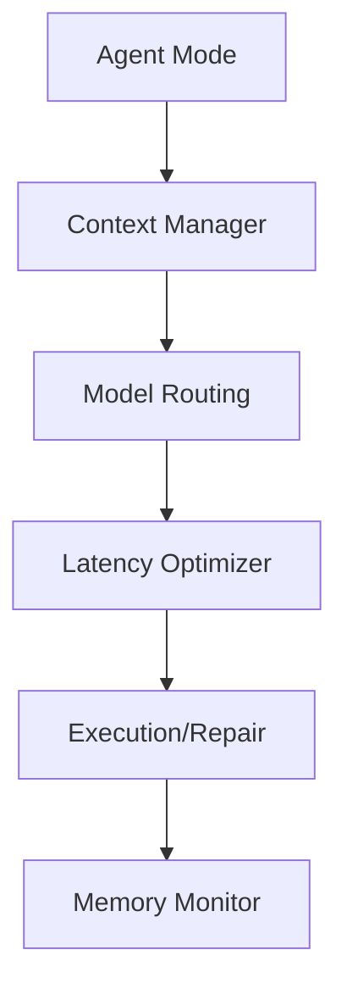

# Subsystems (continued)

This section details the performance optimization layer and core agent subsystems responsible for maintaining system responsiveness and operational integrity. Developers working on latency reduction, model routing, or agent lifecycle management should review these modules to understand how resource allocation and execution flow are governed.

## Performance Optimization & Core Agent System (16 modules)

This subsystem cluster manages the high-level orchestration of the agent, including model selection, memory state, and execution flow. By leveraging `CodeBuddyAgent.initializeMemory` and `EnhancedMemory.calculateImportance`, the system ensures that context is prioritized based on relevance rather than raw volume, which is critical for maintaining performance under heavy load.

> **Key concept:** The latency optimizer and cache-breakpoint modules work in tandem to reduce token overhead, specifically by using `injectAnthropicCacheBreakpoints` to identify stable dynamic splits in the prompt stream, thereby optimizing model response times.

The following modules constitute the primary performance and agent control plane:

- **src/utils/memory-monitor** (rank: 0.004, 23 functions)
- **src/optimization/model-routing** (rank: 0.003, 13 functions)
- **src/optimization/latency-optimizer** (rank: 0.003, 23 functions)
- **src/mcp/mcp-client** (rank: 0.003, 29 functions)
- **src/security/sandbox** (rank: 0.002, 12 functions)
- **src/agent/agent-mode** (rank: 0.002, 9 functions)
- **src/agent/execution/repair-coordinator** (rank: 0.002, 24 functions)
- **src/context/context-manager-v2** (rank: 0.002, 39 functions)
- **src/hooks/lifecycle-hooks** (rank: 0.002, 17 functions)
- **src/hooks/moltbot-hooks** (rank: 0.002, 0 functions)
- ... and 6 more

With the core agent and optimization layers defined, the following resources provide additional context on architectural boundaries and security protocols.

---

**See also:** [Architecture](./2-architecture.md) · [Subsystems](./3a-core-agent-system-cli-and-slash-commands.md) · [Security](./6-security.md) · [Context & Memory](./7-context-memory.md)

--- END ---