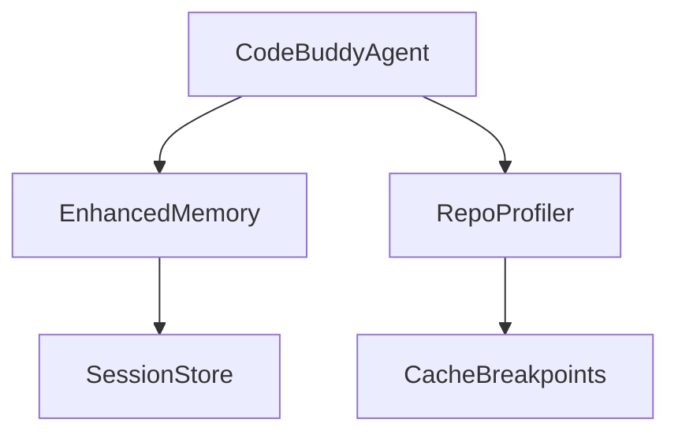

# Subsystems (continued)

This section explores the high-performance subsystems that govern the Code Buddy agent's operational efficiency and core decision-making loops. Developers and system architects should read this to understand how the agent maintains low latency, manages memory constraints, and orchestrates complex tool interactions within the runtime environment.

## Performance Optimization & Core Agent System

The agent doesn't simply "think" in a vacuum; it orchestrates a complex dance of data retrieval, model inference, and state management. To keep this process performant, we utilize specialized modules like `src/optimization/model-routing` and `src/optimization/latency-optimizer`. When `CodeBuddyAgent.initializeAgentSystemPrompt()` is invoked, it sets the stage for these systems to begin monitoring the environment, ensuring that the agent remains responsive even when processing large codebases.

Because performance is a critical bottleneck in LLM-based workflows, the system relies on a tight feedback loop between the profiler and the memory manager. `RepoProfiler.computeProfile()` generates the necessary context, which is then refined by `EnhancedMemory.calculateImportance()` to ensure only relevant data consumes the token budget.

> **Key concept:** The `RepoProfiler` and `EnhancedMemory` modules work in tandem to reduce context bloat. By utilizing `RepoProfiler.isCacheStale()`, the system avoids redundant processing, saving significant compute cycles during repeated agent interactions.

The following modules represent the backbone of our performance and execution layer:

- **src/utils/memory-monitor** (rank: 0.004, 23 functions)
- **src/optimization/model-routing** (rank: 0.003, 13 functions)
- **src/optimization/latency-optimizer** (rank: 0.003, 23 functions)
- **src/mcp/mcp-client** (rank: 0.003, 29 functions)
- **src/security/sandbox** (rank: 0.002, 12 functions)
- **src/agent/agent-mode** (rank: 0.002, 9 functions)
- **src/agent/execution/repair-coordinator** (rank: 0.002, 24 functions)
- **src/context/context-manager-v2** (rank: 0.002, 39 functions)
- **src/hooks/lifecycle-hooks** (rank: 0.002, 17 functions)
- **src/hooks/moltbot-hooks** (rank: 0.002, 0 functions)
- ... and 6 more

> **Developer tip:** When debugging performance regressions, always check `RepoProfiler.isCacheStale()` before assuming the LLM is hallucinating context; often, the agent is simply operating on an outdated code graph.

Having reviewed the foundational modules that drive agent performance, we must now turn our attention to the specific mechanisms that ensure these systems remain stable under load. The interaction between `SessionStore` and the agent's memory lifecycle is the next logical step in understanding how state persists across complex tasks.

---

**See also:** [Architecture](./2-architecture.md) · [Subsystems](./3a-core-agent-system-cli-and-slash-commands.md) · [Security](./6-security.md) · [Context & Memory](./7-context-memory.md)