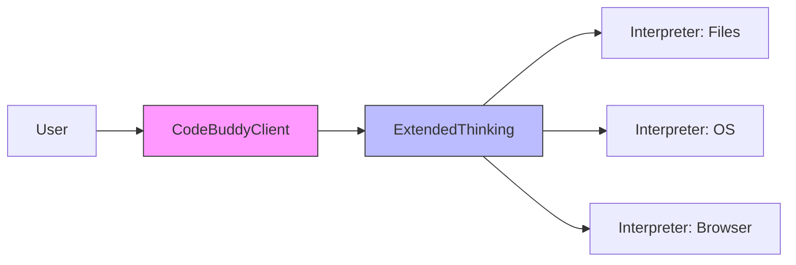

# Subsystems: Interpreter & Core Agent System

This section details the architectural backbone of the Code Buddy agent, focusing on the interpreter and core agent systems. Developers and system architects should read this to understand how the agent translates high-level intent into low-level system operations, ranging from file manipulation to browser interaction.

At the heart of Code Buddy lies the `src/codebuddy/client` module, which acts as the primary interface between the user's intent and the underlying LLM infrastructure. Before any task begins, `CodeBuddyClient.validateModel()` ensures the selected model is capable of the required reasoning depth, preventing runtime failures during complex operations. This validation step is critical because it determines whether the agent should attempt advanced function calling or fall back to standard inference.

When the agent encounters a problem requiring multi-step logic, it leverages `src/agent/extended-thinking`. By calling `ExtendedThinkingManager.toggle()`, the system can dynamically adjust its token budget, ensuring that complex architectural decisions are not cut short by strict output limits. This capability allows the agent to "think" before it acts, a necessary precursor to executing tasks that require deep context awareness.

Beyond the core reasoning loop, the system must optimize for performance. The `src/optimization/cache-breakpoints` module allows the agent to inject checkpoints into long-running LLM calls, significantly reducing latency for repeated tasks.

> **Key concept:** The `src/optimization/cache-breakpoints` module enables the agent to inject checkpoints into long-running LLM calls. By using `injectAnthropicCacheBreakpoints()`, the system can cache intermediate states, saving significant compute time on subsequent iterations.

Once the agent has formulated a plan, it must execute that plan against the host environment. This is where the interpreter modules, such as `src/interpreter/computer/files`, `src/interpreter/computer/os`, and `src/interpreter/computer/browser`, take control. These modules translate abstract agent commands into concrete system calls, effectively acting as the agent's hands.

> **Developer tip:** When interacting with the file system via `src/interpreter/computer/files`, always verify permissions before execution, as the agent operates with the user's current shell privileges.

The following list outlines the primary modules responsible for the interpreter and core agent logic:

- **src/codebuddy/client** (rank: 0.017, 22 functions)
- **src/optimization/cache-breakpoints** (rank: 0.010, 3 functions)
- **src/agent/extended-thinking** (rank: 0.010, 8 functions)
- **src/agent/flow/planning-flow** (rank: 0.003, 12 functions)
- **src/interpreter/computer/browser** (rank: 0.003, 15 functions)
- **src/interpreter/computer/files** (rank: 0.003, 33 functions)
- **src/interpreter/computer/os** (rank: 0.003, 9 functions)
- **src/commands/flow** (rank: 0.002, 2 functions)
- **src/commands/research/index** (rank: 0.002, 3 functions)
- **src/agent/prompt-suggestions** (rank: 0.002, 10 functions)
- ... and 6 more

These modules are tightly coupled to ensure that when `CodeBuddyClient.performToolProbe()` identifies a capability, the corresponding interpreter module is ready to handle the request. Understanding this relationship is vital for debugging agent behavior or extending the system with new toolsets.

---

**See also:** [Architecture](./2-architecture.md) · [Subsystems](./3a-core-agent-system-cli-and-slash-commands.md) · [API Reference](./9-api-reference.md)