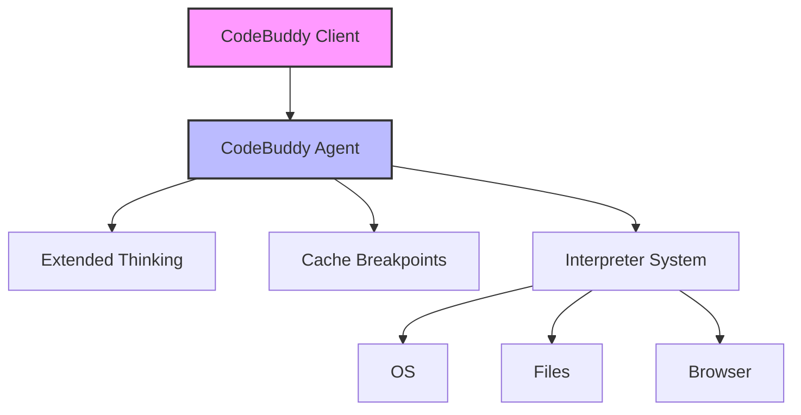

# Subsystems (continued)

The Interpreter and Core Agent System serves as the primary execution engine for CodeBuddy, orchestrating model interactions, tool invocation, and state management. This section details the architectural components responsible for translating user intent into actionable code and system operations, which is critical for developers extending agent capabilities or debugging execution flows.

## Interpreter & Core Agent System (16 modules)

The core of the system relies on the `src/codebuddy/client` module to manage model connectivity and validation. By utilizing `CodeBuddyClient.validateModel()` and `CodeBuddyClient.isGeminiModelName()`, the system ensures that only supported inference providers are utilized during the request lifecycle. Furthermore, the `src/agent/extended-thinking` module provides advanced reasoning capabilities, allowing developers to manage cognitive overhead via `ExtendedThinkingManager.setTokenBudget()` and `ExtendedThinkingManager.isEnabled()`.

> **Key concept:** The `CodeBuddyClient` acts as the central gateway for model validation, while `ExtendedThinkingManager` allows for dynamic token budget adjustments, significantly impacting the reasoning depth of the agent during complex tasks.

- **src/codebuddy/client** (rank: 0.017, 22 functions)
- **src/optimization/cache-breakpoints** (rank: 0.010, 3 functions)
- **src/agent/extended-thinking** (rank: 0.010, 8 functions)
- **src/agent/flow/planning-flow** (rank: 0.003, 12 functions)
- **src/interpreter/computer/browser** (rank: 0.003, 15 functions)
- **src/interpreter/computer/files** (rank: 0.003, 33 functions)
- **src/interpreter/computer/os** (rank: 0.003, 9 functions)
- **src/commands/flow** (rank: 0.002, 2 functions)
- **src/commands/research/index** (rank: 0.002, 3 functions)
- **src/agent/prompt-suggestions** (rank: 0.002, 10 functions)
- ... and 6 more

These modules collectively form the runtime environment for the agent. Developers should ensure that any modifications to these core paths maintain backward compatibility with existing session and memory management protocols.

---

**See also:** [Architecture](./2-architecture.md) · [Subsystems](./3a-core-agent-system-cli-and-slash-commands.md) · [API Reference](./9-api-reference.md)