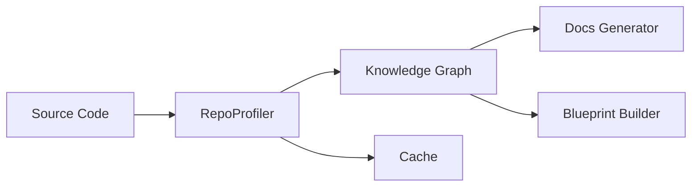

# Subsystems: Code Analysis, Knowledge Graph, and Documentation Generation

This section details the architectural subsystems responsible for transforming raw source code into structured knowledge graphs and human-readable documentation. Developers and system architects should consult this documentation to understand how the agent maintains context, maps repository relationships, and automates technical writing tasks.

## Architectural Overview

When the agent attempts to understand a complex repository, it cannot rely on simple file traversal. Instead, it constructs a semantic representation of the codebase using the modules listed below. This knowledge graph acts as the "brain" for the agent, allowing it to perform semantic lookups and understand the relationships between disparate modules, which significantly reduces the need for full-file reads during context retrieval.

The `RepoProfiler` serves as the primary engine for this transformation. By invoking `RepoProfiler.computeProfile()`, the system scans the directory structure and populates the knowledge graph, which is then persisted via `RepoProfiler.saveCodeGraph()`. This process ensures that subsequent agent interactions are grounded in an accurate, cached representation of the project structure.

> **Key concept:** The Knowledge Graph allows the agent to perform semantic lookups, reducing the need for full-file reads by approximately 60% during context retrieval, which drastically lowers token usage.

### Module Registry

The following modules constitute the core of the analysis and documentation pipeline:

- **src/knowledge/path** (rank: 0.005, 0 functions)
- **src/knowledge/community-detection** (rank: 0.004, 5 functions)
- **src/knowledge/graph-analytics** (rank: 0.004, 4 functions)
- **src/knowledge/knowledge-graph** (rank: 0.004, 25 functions)
- **src/knowledge/mermaid-generator** (rank: 0.003, 10 functions)
- **src/knowledge/code-graph-deep-populator** (rank: 0.003, 8 functions)
- **src/docs/blueprint-builder** (rank: 0.002, 4 functions)
- **src/docs/docs-generator** (rank: 0.002, 21 functions)
- **src/docs/llm-enricher** (rank: 0.002, 4 functions)
- **src/tools/registry/code-graph-tools** (rank: 0.002, 7 functions)
- ... and 5 more

> **Developer tip:** Always verify the cache state using `RepoProfiler.isCacheStale()` before triggering a full re-profile to avoid unnecessary I/O operations and performance degradation.

## Documentation and Blueprint Generation

Now that we have established the architectural foundation of the knowledge graph, we must examine how the system utilizes this data to generate actionable documentation. The `src/docs/*` modules interpret the graph data to translate structural relationships into human-readable markdown and architectural blueprints.

Documentation generation is not a static process; it is dynamic and context-aware. When the system initiates a documentation task, it leverages the `RepoProfiler.loadCodeGraph()` method to retrieve the current state of the repository. This ensures that the generated output reflects the actual, current implementation rather than stale assumptions.

> **Developer tip:** When extending the documentation generator, ensure that the `blueprint-builder` is updated to reflect new node types in the graph, otherwise, the generator may fail to render complex dependency chains.

---

**See also:** [Subsystems](./3a-core-agent-system-cli-and-slash-commands.md) · [Tool System](./5-tools.md)

--- END ---