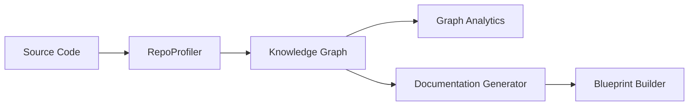

# Code Analysis, Knowledge Graph, and Documentation Generation

This section details the subsystems responsible for repository analysis, knowledge graph construction, and automated documentation generation. These modules are critical for maintaining context awareness and providing the LLM with a structured understanding of the codebase, enabling it to reason about complex architectural relationships. Developers working on repository indexing or documentation automation should review this section to understand how code state is persisted and queried.

The following modules constitute the core analysis and documentation pipeline. These components work in concert to transform raw source files into a navigable semantic structure:

- **src/knowledge/path** (rank: 0.005, 0 functions)
- **src/knowledge/community-detection** (rank: 0.004, 5 functions)
- **src/knowledge/graph-analytics** (rank: 0.004, 4 functions)
- **src/knowledge/graph-knowledge-graph** (rank: 0.004, 25 functions)
- **src/knowledge/mermaid-generator** (rank: 0.003, 7 functions)
- **src/knowledge/code-graph-deep-populator** (rank: 0.003, 8 functions)
- **src/docs/blueprint-builder** (rank: 0.002, 4 functions)
- **src/docs/docs-generator** (rank: 0.002, 20 functions)
- **src/docs/llm-enricher** (rank: 0.002, 4 functions)
- **src/tools/registry/code-graph-tools** (rank: 0.002, 7 functions)
- ... and 5 more

## Architectural Data Flow

The system relies on the `RepoProfiler` to ingest raw source data and transform it into a queryable graph. Specifically, `RepoProfiler.loadCodeGraph` and `RepoProfiler.buildContextPack` are essential for initializing the graph structures that the knowledge modules subsequently process.

> **Key concept:** The knowledge graph acts as a semantic layer, allowing the agent to traverse dependencies and structural relationships without performing full-text scans, significantly reducing latency in context retrieval.

Once the graph is populated, the documentation generator utilizes this data to synthesize technical blueprints and enrichment artifacts. This process ensures that the generated documentation remains synchronized with the actual state of the codebase, as managed by the `RepoProfiler.refresh` and `RepoProfiler.saveCodeGraph` methods.

## Persistence and State Synchronization

The integrity of the knowledge graph relies on efficient caching and state validation to prevent redundant processing. Before executing expensive analysis tasks, the system invokes `RepoProfiler.isCacheStale` to determine if the current graph requires an update. If the cache is invalid, `RepoProfiler.loadCache` is utilized to restore the previous state, minimizing the overhead of full repository re-indexing.

By leveraging these methods, the system ensures that the documentation pipeline remains performant even in large-scale repositories. When changes are detected, `RepoProfiler.computeProfile` is triggered to update the graph, ensuring that the documentation generator always operates on the most recent architectural snapshot.

---

**See also:** [Subsystems](./3a-core-agent-system-cli-and-slash-commands.md) · [Tool System](./5-tools.md)