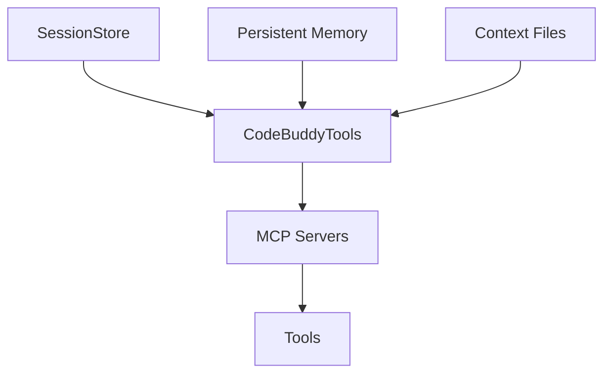

# Subsystems (continued)

This section details the subsystem architecture responsible for Model Context Protocol (MCP) integration and tool execution. It is intended for developers extending the agent's capabilities or integrating external data sources, as these modules define how the agent interacts with the environment and persistent state.

## Model Context Protocol Servers & Tool Implementations (13 modules)

The following modules constitute the core infrastructure for tool orchestration and session management. These components are responsible for normalizing external tool definitions and maintaining state across agent interactions.

- **src/persistence/session-store** (rank: 0.008, 44 functions)
- **src/codebuddy/tools** (rank: 0.006, 12 functions)
- **src/memory/persistent-memory** (rank: 0.004, 19 functions)
- **src/memory/semantic-memory-search** (rank: 0.003, 22 functions)
- **src/tools/web-search** (rank: 0.003, 28 functions)
- **src/tools/metadata** (rank: 0.003, 0 functions)
- **src/context/context-files** (rank: 0.003, 6 functions)
- **src/tools/tools-md-generator** (rank: 0.002, 6 functions)
- **src/cli/session-commands** (rank: 0.002, 3 functions)
- **src/mcp/mcp-memory-tools** (rank: 0.002, 1 functions)
- ... and 3 more

These modules facilitate the bridge between raw LLM inference and actionable environment manipulation. By standardizing tool registration and session persistence, the system ensures consistent state management across disparate tool implementations.

> **Key concept:** The `src/codebuddy/tools` module acts as the central registry for MCP servers, utilizing `initializeToolRegistry` and `initializeMCPServers` to dynamically map external capabilities into the agent's available toolset.

### Component Interaction and State Management

Effective integration requires a clear understanding of how state is persisted and how tools are registered. The `src/persistence/session-store` module is critical for stateful operations; developers interacting with this module should leverage `SessionStore.createSession` and `SessionStore.addMessageToCurrentSession` to maintain conversation history and ensure that session data is correctly serialized.

For tool orchestration, the system relies on the `src/codebuddy/tools` module to bridge the gap between plugin architectures and the agent's runtime. When extending functionality, developers should utilize `convertMCPToolToCodeBuddyTool` and `addPluginToolsToCodeBuddyTools` to ensure that third-party tools are correctly normalized and accessible to the agent's decision-making loop.

---

**See also:** [Subsystems](./3a-core-agent-system-cli-and-slash-commands.md) · [Tool System](./5-tools.md) · [Context & Memory](./7-context-memory.md) · [API Reference](./9-api-reference.md)

--- END ---