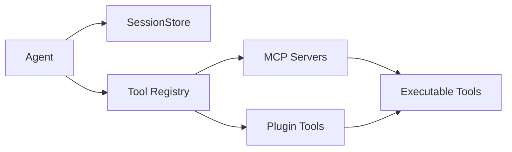

# Subsystems (continued)

This section explores the architectural backbone of Code Buddy’s extensibility: the Model Context Protocol (MCP) servers and the tool implementation layer. Developers and system architects should read this to understand how the agent bridges the gap between static codebases and dynamic, external capabilities.

## Model Context Protocol Servers & Tool Implementations (13 modules)

When Code Buddy needs to interact with the outside world, it doesn't rely on hard-coded logic for every possible action. Instead, it utilizes a modular registry system that dynamically loads capabilities. The process begins when the system calls `initializeToolRegistry`, which acts as the central nervous system for extensibility. This function orchestrates the loading of various providers, ensuring that the agent can communicate with external environments through `initializeMCPServers`.

By abstracting tool definitions, the system allows for seamless integration of new features without modifying the core agent logic. When an external MCP tool is discovered, the system invokes `convertMCPToolToCodeBuddyTool` to normalize the interface, making it compatible with the agent's internal execution loop. This decoupling ensures that the agent remains lightweight while the tool ecosystem grows independently.

Furthermore, the persistence of these interactions is managed by the session layer. Before any tool execution occurs, the system relies on `SessionStore.loadSession` to retrieve the current context, ensuring that the agent has the necessary state to make informed decisions. This tight integration between tool availability and session state is what allows the agent to maintain continuity across complex, multi-step tasks.

- **src/persistence/session-store** (rank: 0.008, 44 functions)
- **src/codebuddy/tools** (rank: 0.006, 12 functions)
- **src/memory/persistent-memory** (rank: 0.004, 19 functions)
- **src/memory/semantic-memory-search** (rank: 0.003, 22 functions)
- **src/tools/web-search** (rank: 0.003, 28 functions)
- **src/tools/metadata** (rank: 0.003, 0 functions)
- **src/context/context-files** (rank: 0.003, 6 functions)
- **src/tools/tools-md-generator** (rank: 0.002, 6 functions)
- **src/cli/session-commands** (rank: 0.002, 3 functions)
- **src/mcp/mcp-memory-tools** (rank: 0.002, 1 functions)
- ... and 3 more

> **Key concept:** The `initializeToolRegistry` function acts as the central nervous system for extensibility, dynamically converting external MCP definitions into executable agent tools via `convertMCPToolToCodeBuddyTool`, which significantly reduces the memory footprint of the agent's initial prompt.

> **Developer tip:** When debugging tool availability, verify that `initializeMCPServers` has completed successfully before checking the agent's capability list; otherwise, the agent will report missing tools despite correct configuration.

Now that we have established how the agent orchestrates tool calls and manages its external capabilities, we must examine the persistence layer that governs how these sessions are stored and retrieved to ensure long-term memory continuity.

---

**See also:** [Subsystems](./3a-core-agent-system-cli-and-slash-commands.md) · [Tool System](./5-tools.md) · [Context & Memory](./7-context-memory.md) · [API Reference](./9-api-reference.md)