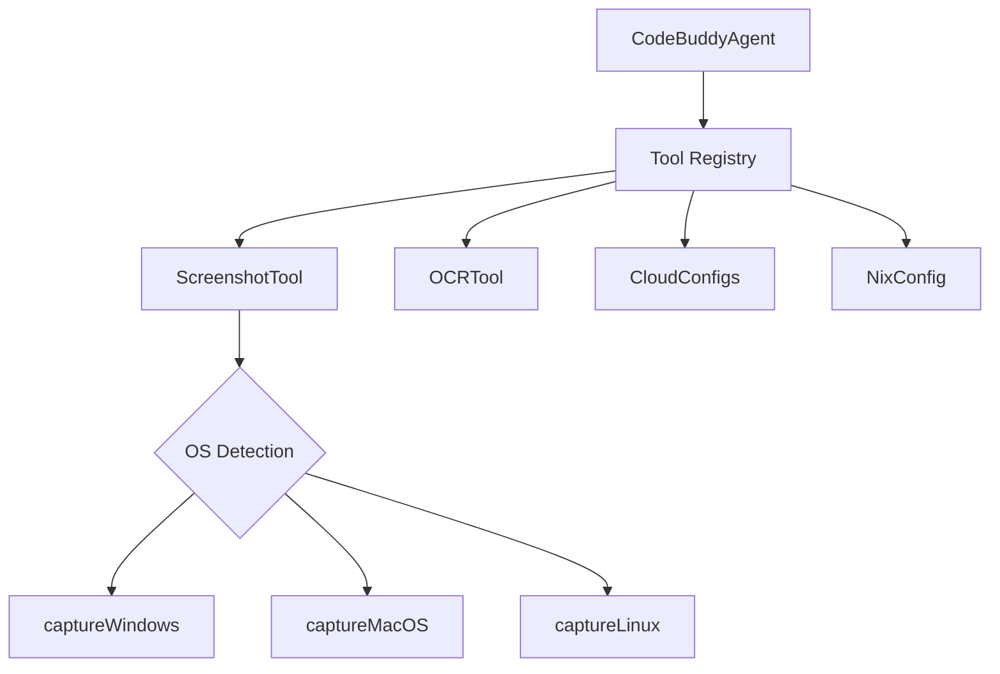

# Subsystems (continued)

This documentation covers the peripheral subsystems that extend the agent's capabilities beyond code analysis, specifically focusing on environmental interaction tools and deployment configurations. Developers working on cross-platform automation or cloud-native integration should read this to understand how the agent bridges the gap between local execution and external infrastructure.

## Tool Implementations & Cloud Deployment (12 modules)

When the agent requires visual feedback or environmental interaction, it invokes specialized tools rather than relying on raw code analysis. This separation of concerns allows the agent to maintain a clean core while offloading complex tasks like screen capture or OCR to dedicated modules.

The `ScreenshotTool` exemplifies this architecture. It does not implement a monolithic capture function; instead, it delegates to platform-specific methods such as `ScreenshotTool.captureMacOS()`, `ScreenshotTool.captureLinux()`, or `ScreenshotTool.captureWindows()` based on the host environment. This ensures that `ScreenshotTool.capture()` remains a clean, unified interface for the agent, regardless of the underlying operating system.

> **Key concept:** The tool abstraction layer decouples the agent's decision-making logic from the underlying OS-specific implementation, allowing the system to handle platform-specific logic transparently without polluting the core agent loop.

Below are the primary modules responsible for these capabilities:

- **src/tools/screenshot-tool** (rank: 0.006, 20 functions)
- **src/deploy/cloud-configs** (rank: 0.005, 10 functions)
- **src/browser-automation/index** (rank: 0.004, 0 functions)
- **src/desktop-automation/index** (rank: 0.003, 0 functions)
- **src/tools/ocr-tool** (rank: 0.003, 12 functions)
- **src/agent/middleware/auto-observation** (rank: 0.003, 6 functions)
- **src/deploy/nix-config** (rank: 0.003, 3 functions)
- **src/tools/computer-control-tool** (rank: 0.003, 78 functions)
- **src/tools/deploy-tool** (rank: 0.003, 8 functions)
- **src/tools/registry/misc-tools** (rank: 0.002, 51 functions)
- ... and 2 more

Having mapped the tool landscape, we turn our attention to the deployment configurations that ensure these tools function reliably across different infrastructure environments.

## Deployment and Configuration

Deployment modules ensure the agent maintains consistency across environments, whether running on a local workstation or a cloud-based container. By isolating configuration logic into `src/deploy/cloud-configs` and `src/deploy/nix-config`, the system avoids hardcoding environment variables or paths, which is essential for maintaining a portable codebase.

> **Developer tip:** When adding a new tool, always register it in both `metadata.ts` and `tools.ts` — missing either causes silent failures during the tool discovery phase.

These modules act as the bridge between the agent's requirements and the host's capabilities. By centralizing these configurations, we ensure that when the agent needs to scale or move to a new environment, the transition is handled by updating the configuration layer rather than refactoring the agent's core logic.

---

**See also:** [Architecture](./2-architecture.md) · [Subsystems](./3a-core-agent-system-cli-and-slash-commands.md) · [Tool System](./5-tools.md) · [Configuration](./8-configuration.md)

--- END ---