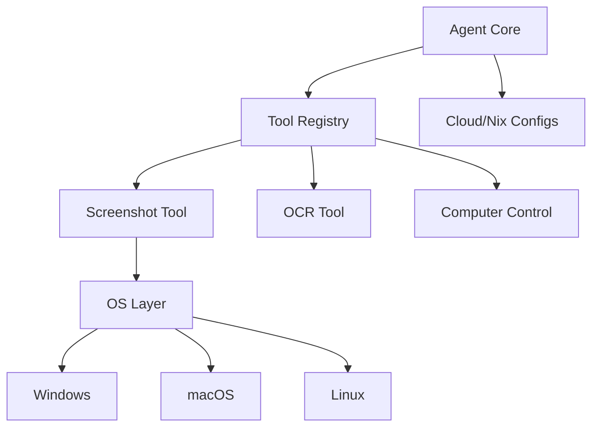

# Subsystems (continued)

This section details the peripheral subsystems responsible for tool execution, environment automation, and cloud deployment configurations. Developers should review these modules when extending the agent's capabilities to new platforms or modifying the infrastructure deployment pipeline to ensure consistent behavior across environments.

## Tool Implementations & Cloud Deployment (12 modules)

The following modules define the operational boundaries for the agent, ranging from low-level system interaction to high-level infrastructure provisioning.

- **src/tools/screenshot-tool** (rank: 0.006, 20 functions)
- **src/deploy/cloud-configs** (rank: 0.005, 10 functions)
- **src/browser-automation/index** (rank: 0.004, 0 functions)
- **src/desktop-automation/index** (rank: 0.003, 0 functions)
- **src/tools/ocr-tool** (rank: 0.003, 12 functions)
- **src/agent/middleware/auto-observation** (rank: 0.003, 6 functions)
- **src/deploy/nix-config** (rank: 0.003, 3 functions)
- **src/tools/computer-control-tool** (rank: 0.003, 78 functions)
- **src/tools/deploy-tool** (rank: 0.003, 8 functions)
- **src/tools/registry/misc-tools** (rank: 0.002, 51 functions)
- ... and 2 more

### Screenshot Tooling
The `src/tools/screenshot-tool` module provides a unified interface for visual data acquisition across heterogeneous operating systems. It abstracts platform-specific implementation details, allowing the agent to request a capture without needing to know the underlying host environment.

> **Key concept:** The `ScreenshotTool` abstracts platform-specific capture logic, allowing the agent to maintain a unified interface across macOS, Linux, and Windows environments, significantly reducing conditional logic in the agent core.

The primary entry point is `ScreenshotTool.capture`, which orchestrates the capture process. Depending on the host OS, the module delegates to `ScreenshotTool.captureMacOS`, `ScreenshotTool.captureLinux`, or `ScreenshotTool.captureWindows`. The module also includes utility methods such as `ScreenshotTool.execSync` for shell execution and `ScreenshotTool.isWSL` to detect Windows Subsystem for Linux environments. Promise resolution and rejection are handled via `ScreenshotTool.resolve` and `ScreenshotTool.reject`.

While the tool registry manages the lifecycle of available capabilities, the deployment configurations listed above ensure these tools are provisioned correctly in production environments. These configurations bridge the gap between local development and cloud-based execution.

---

**See also:** [Architecture](./2-architecture.md) · [Subsystems](./3a-core-agent-system-cli-and-slash-commands.md) · [Tool System](./5-tools.md) · [Configuration](./8-configuration.md)