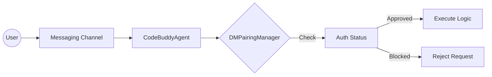

# Messaging Channel Integrations

This documentation outlines the messaging channel architecture that allows Code Buddy to interface with diverse external communication platforms. Developers and system integrators should read this to understand how the agent bridges the gap between internal logic and external user interfaces, ensuring consistent behavior regardless of the transport layer.

The following list details the currently supported messaging modules, each serving as a gateway for the agent to receive inputs and dispatch responses.

- **src/channels/discord/index** (rank: 0.002, 0 functions)
- **src/channels/imessage/index** (rank: 0.002, 20 functions)
- **src/channels/line/index** (rank: 0.002, 11 functions)
- **src/channels/mattermost/index** (rank: 0.002, 10 functions)
- **src/channels/nextcloud-talk/index** (rank: 0.002, 11 functions)
- **src/channels/nostr/index** (rank: 0.002, 20 functions)
- **src/channels/slack/index** (rank: 0.002, 0 functions)
- **src/channels/telegram/index** (rank: 0.002, 0 functions)
- **src/channels/twilio-voice/index** (rank: 0.002, 12 functions)
- **src/channels/zalo/index** (rank: 0.002, 10 functions)
- ... and 1 more

Beyond the mere existence of these modules, the system relies on a robust security handshake to manage trust between the agent and the user. Because these channels operate in public or semi-public environments, the agent cannot blindly process every incoming request.

When a message arrives from an external source, the agent must verify the sender's identity and authorization status before executing any logic. This verification process is governed by the `DMPairingManager`, which acts as the gatekeeper for all direct messaging interactions.

To maintain security, the agent invokes `DMPairingManager.requiresPairing()` to determine if the incoming channel or user requires an explicit handshake. If the sender is unknown, the agent utilizes `DMPairingManager.getPairingMessage()` to initiate the authorization flow. Only after `DMPairingManager.approve()` or `DMPairingManager.approveDirectly()` is called does the agent proceed with standard processing.

> **Key concept:** The `DMPairingManager` acts as a mandatory security middleware. By decoupling the authentication logic from the channel implementation, the system ensures that security policies are applied uniformly, whether the user is on Slack, Discord, or Nostr.

Furthermore, developers must be aware of the state of the sender. Before processing, the system calls `DMPairingManager.checkSender()` to validate the user's credentials and `DMPairingManager.isBlocked()` to ensure the user has not been blacklisted. This prevents malicious actors from flooding the agent with requests through unverified channels.

> **Developer tip:** When implementing a new channel integration, always ensure that the entry point calls `DMPairingManager.requiresPairing()` before passing the message payload to the agent's core logic. Failing to do so may expose the agent to unauthorized command execution.

---

**See also:** [Subsystems](./3a-core-agent-system-cli-and-slash-commands.md)

--- END ---