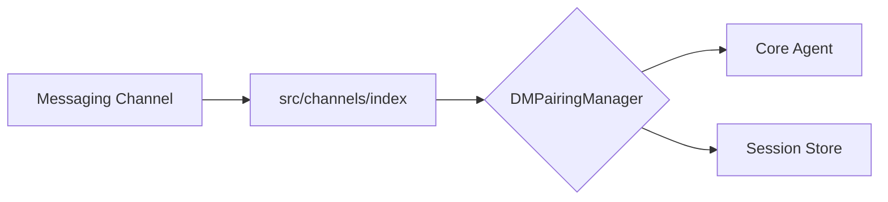

# Subsystems (continued)

This section details the messaging channel integration layer, which abstracts communication protocols across various platforms to provide a unified interface for the agent. Developers should reference these modules when implementing new channel support or modifying existing message routing logic to ensure compatibility with the core agent architecture and security policies.

## Messaging Channel Integrations (11 modules)

The system utilizes a modular adapter pattern to handle diverse messaging APIs. Each channel module must interface with the `DMPairingManager` to handle authentication and message routing. Before a message is processed by the agent, the channel integration must verify the sender's status using `DMPairingManager.checkSender()` and ensure the connection is authorized via `DMPairingManager.isApproved()`.

> **Key concept:** The `DMPairingManager` acts as a gatekeeper for all incoming channel traffic. By invoking `DMPairingManager.requiresPairing()`, the system prevents unauthorized message injection before the agent processes the payload, ensuring that only paired and approved channels can trigger agent execution.

The following modules represent the current messaging channel implementations:

- **src/channels/discord/index** (rank: 0.002, 0 functions)
- **src/channels/imessage/index** (rank: 0.002, 20 functions)
- **src/channels/line/index** (rank: 0.002, 11 functions)
- **src/channels/mattermost/index** (rank: 0.002, 10 functions)
- **src/channels/nextcloud-talk/index** (rank: 0.002, 11 functions)
- **src/channels/nostr/index** (rank: 0.002, 20 functions)
- **src/channels/slack/index** (rank: 0.002, 0 functions)
- **src/channels/telegram/index** (rank: 0.002, 0 functions)
- **src/channels/twilio-voice/index** (rank: 0.002, 12 functions)
- **src/channels/zalo/index** (rank: 0.002, 10 functions)
- ... and 1 more

These integrations rely on the centralized `src/channels/index` to register handlers and manage lifecycle events. For deeper integration with the agent's state, developers should also review the session persistence layer to ensure that channel-specific metadata is correctly mapped to the session store.

---

**See also:** [Subsystems](./3a-core-agent-system-cli-and-slash-commands.md)

--- END ---