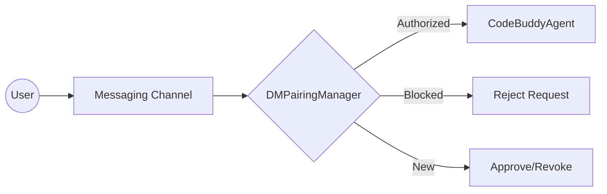

# Messaging Channel Integrations

This section documents the architectural framework governing how the agent interfaces with external messaging platforms. Understanding these integrations is essential for developers tasked with extending the agent's reach to new communication channels or maintaining the security protocols that govern direct interactions.

## The DM Pairing Protocol

Before the agent can engage in a private conversation, it must establish trust. This is handled by the `src/channels/dm-pairing` module, which acts as a gatekeeper for all incoming direct messages. When a user initiates contact, the system doesn't immediately process the request; instead, it invokes `DMPairingManager.requiresPairing` to determine if the sender has already been vetted.

> **Key concept:** The DM Pairing system ensures that only authorized users can trigger agent actions, preventing unauthorized command execution in public or private channels. By decoupling the authentication handshake from the message processing logic, the system maintains a clean separation of concerns.

When the agent encounters a new sender, it relies on `DMPairingManager.checkSender` to validate the user's identity against the current session state. If the user is unknown, the system halts execution until `DMPairingManager.approve` or `DMPairingManager.approveDirectly` is called, effectively creating a "human-in-the-loop" security barrier.

> **Developer tip:** Always verify the sender's status using `DMPairingManager.isBlocked` before invoking `DMPairingManager.approve` to prevent race conditions during the handshake process.

Now that we understand how the agent validates incoming traffic through the pairing layer, we can examine the specific channel implementations that facilitate these connections.

## Supported Messaging Channels

The following modules represent the current landscape of supported messaging platforms, each encapsulating the specific API requirements for that provider. These modules are responsible for normalizing incoming webhooks into the standard format expected by the core agent.

- **src/channels/dm-pairing** (rank: 0.019, 19 functions)
- **src/channels/google-chat/index** (rank: 0.002, 16 functions)
- **src/channels/matrix/index** (rank: 0.002, 23 functions)
- **src/channels/signal/index** (rank: 0.002, 19 functions)
- **src/channels/teams/index** (rank: 0.002, 18 functions)
- **src/channels/webchat/index** (rank: 0.002, 21 functions)
- **src/channels/whatsapp/index** (rank: 0.002, 20 functions)
- **src/channels/discord/client** (rank: 0.002, 35 functions)
- **src/channels/slack/client** (rank: 0.002, 31 functions)
- **src/channels/telegram/client** (rank: 0.002, 37 functions)

Having reviewed the channel infrastructure, we can now transition to the core agent system, which consumes these normalized messages to perform reasoning and tool execution.

---

**See also:** [Subsystems](./3a-core-agent-system-cli-and-slash-commands.md)