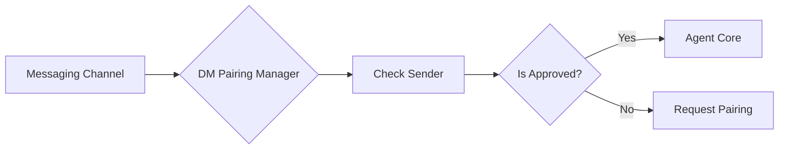

# Subsystems (continued)

This section details the messaging channel integration layer, which abstracts communication protocols across various platforms including Discord, Slack, and Matrix. Developers working on cross-platform connectivity or adding new messaging providers should consult this documentation to understand the standardized interface requirements and security gatekeeping mechanisms.

The system relies on a unified interface for channel communication, with specific modules handling the complexities of individual platform APIs. The `src/channels/dm-pairing` module is the critical security component for all incoming channel traffic, ensuring that only authorized senders can trigger agent actions.

## Messaging Channel Integrations — Discord (10 modules)

The `src/channels/dm-pairing` module utilizes `DMPairingManager.checkSender()` to validate incoming requests and `DMPairingManager.requiresPairing()` to enforce authentication flows before message processing begins.

> **Key concept:** The `dm-pairing` module acts as a security middleware, preventing unauthorized message injection by requiring explicit approval via `DMPairingManager.approve()` or `DMPairingManager.approveDirectly()` before the agent processes incoming requests.

When a user attempts to interact with the agent, the system checks status via `DMPairingManager.isApproved()`. If the sender is not yet authorized, the system may trigger `DMPairingManager.getPairingMessage()` to initiate the handshake. Administrators can manage access control using `DMPairingManager.approve()` or `DMPairingManager.revoke()` to handle session permissions dynamically, while `DMPairingManager.isBlocked()` provides a fast-path check for rejected entities.

- **src/channels/dm-pairing** (rank: 0.019, 19 functions)
- **src/channels/google-chat/index** (rank: 0.002, 16 functions)
- **src/channels/matrix/index** (rank: 0.002, 23 functions)
- **src/channels/signal/index** (rank: 0.002, 19 functions)
- **src/channels/teams/index** (rank: 0.002, 18 functions)
- **src/channels/webchat/index** (rank: 0.002, 21 functions)
- **src/channels/whatsapp/index** (rank: 0.002, 20 functions)
- **src/channels/discord/client** (rank: 0.002, 35 functions)
- **src/channels/slack/client** (rank: 0.002, 31 functions)
- **src/channels/telegram/client** (rank: 0.002, 37 functions)

These channel integrations are tightly coupled with the core agent system, which handles the actual execution of tasks once the channel connection is validated.

---

**See also:** [Subsystems](./3a-core-agent-system-cli-and-slash-commands.md)

--- END ---