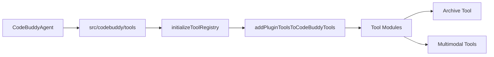

# Subsystems: Tool Implementations

This section catalogs the specialized tool implementations that extend the core agent's capabilities beyond basic code manipulation. Developers and system integrators should review this documentation to understand how to leverage multimodal and utility tools within the CodeBuddy ecosystem, ensuring they can effectively extend the agent's reach into file management, media processing, and system interaction.

When CodeBuddy needs to perform actions outside of its primary code-generation scope, it relies on a modular tool architecture. Rather than baking every possible capability into the core agent, the system uses a registry pattern managed by `src/codebuddy/tools`. This approach ensures that the agent remains lightweight, loading only the necessary logic for specific tasks—such as archiving files or processing video—when requested.

To ensure the agent can dynamically discover and execute these capabilities, the system relies on a standardized conversion process. When a new tool is introduced, the `convertPluginToolToCodeBuddyTool` function maps the external interface to the internal execution context, allowing the agent to treat disparate utilities as first-class citizens.

> **Key concept:** The tool registry pattern allows the agent to dynamically load capabilities without bloating the main binary, keeping the memory footprint stable even as the feature set grows.

Now that we understand how the agent orchestrates tool registration and discovery, we can examine the specific tool modules available in the current distribution.

## Archive tool and utility modules

The following modules represent the current suite of specialized tools available for integration. Each module is designed to be self-contained, providing specific functionality that the agent can invoke via the `src/codebuddy/tools` registry.

- **src/tools/archive-tool** (rank: 0.002, 21 functions)
- **src/tools/audio-tool** (rank: 0.002, 12 functions)
- **src/tools/clipboard-tool** (rank: 0.002, 6 functions)
- **src/tools/diagram-tool** (rank: 0.002, 11 functions)
- **src/tools/document-tool** (rank: 0.002, 19 functions)
- **src/tools/export-tool** (rank: 0.002, 14 functions)
- **src/tools/pdf-tool** (rank: 0.002, 11 functions)
- **src/tools/qr-tool** (rank: 0.002, 14 functions)
- **src/tools/video-tool** (rank: 0.002, 15 functions)
- **src/tools/registry/multimodal-tools** (rank: 0.002, 59 functions)

Managing these tools effectively requires careful attention to the initialization sequence. The `initializeToolRegistry` function is responsible for aggregating these modules, while `addPluginToolsToCodeBuddyTools` ensures that any third-party or marketplace extensions are correctly merged into the active toolset.

> **Developer tip:** When implementing a new tool, ensure it is compatible with the `convertPluginToolToCodeBuddyTool` interface; otherwise, the registry will fail to initialize the tool during the startup sequence.

By maintaining this strict separation between the core agent logic and the tool implementations, the project ensures that adding new capabilities—such as a new `ScreenshotTool` or an expanded `ArchiveTool`—does not introduce regressions into the primary agent loop. This modularity is essential for scaling the project to support diverse developer workflows.

---

**See also:** [Subsystems](./3a-core-agent-system-cli-and-slash-commands.md) · [Tool System](./5-tools.md)

--- END ---