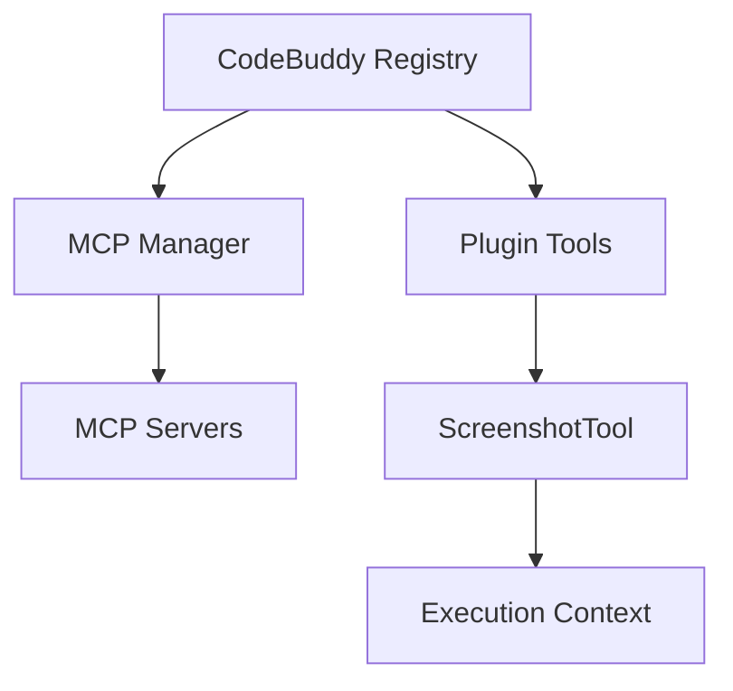

# Subsystems (continued)

This section details the specialized tool implementations available within the agent ecosystem, ranging from multimodal processing to document management. These modules extend the core agent capabilities, allowing for complex interactions with local files, media, and external data formats.

The following modules represent the specialized toolset integrated into the agent's runtime environment. These tools are managed through a centralized registry system that handles lifecycle, discovery, and execution context.

## Tool Implementations — Archive tool (10 modules)

- **src/tools/archive-tool** (rank: 0.002, 21 functions)
- **src/tools/audio-tool** (rank: 0.002, 12 functions)
- **src/tools/clipboard-tool** (rank: 0.002, 6 functions)
- **src/tools/diagram-tool** (rank: 0.002, 11 functions)
- **src/tools/document-tool** (rank: 0.002, 19 functions)
- **src/tools/export-tool** (rank: 0.002, 14 functions)
- **src/tools/pdf-tool** (rank: 0.002, 11 functions)
- **src/tools/qr-tool** (rank: 0.002, 14 functions)
- **src/tools/video-tool** (rank: 0.002, 15 functions)
- **src/tools/registry/multimodal-tools** (rank: 0.002, 59 functions)

To maintain consistency across these diverse implementations, the system utilizes a unified registration process. This ensures that disparate tool types—whether they are local plugins or remote MCP servers—are normalized into a format the agent can execute reliably.

> **Key concept:** The tool registry abstracts the complexity of different tool sources (MCP, plugins, marketplace) into a unified interface, allowing the agent to invoke tools without needing to know their underlying implementation details.

The registration process is orchestrated by `initializeToolRegistry()`, which coordinates with `getMCPManager()` to prepare the environment. For MCP-based tools, the system invokes `initializeMCPServers()` and subsequently uses `addMCPToolsToCodeBuddyTools()` to expose them to the agent. Similarly, for plugin-based architectures, the system relies on `convertPluginToolToCodeBuddyTool()` and `addPluginToolsToCodeBuddyTools()` to ensure compatibility.

When executing specific tasks, such as visual capture, the system leverages specialized classes like `ScreenshotTool`. For example, `ScreenshotTool.capture()` is used to interface with the host OS, demonstrating how these registered tools bridge the gap between the agent's logic and the physical device environment.

---

**See also:** [Subsystems](./3a-core-agent-system-cli-and-slash-commands.md) · [Tool System](./5-tools.md)

--- END ---