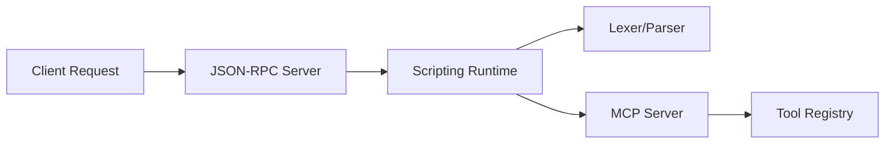

# Subsystems (continued)

This section details the scripting engine and external service integration layers, which facilitate communication between the core agent and external environments. These modules are critical for developers extending the agent's capabilities via JSON-RPC or the Model Context Protocol (MCP) and for those maintaining the custom scripting runtime.

## Scripting & External Service Integrations (7 modules)

The modules listed below define the boundaries of the agent's execution environment and its ability to interface with external services. The scripting runtime processes incoming commands, while the integration servers handle protocol-specific communication.

- **src/codebuddy/index** (rank: 0.003, 0 functions)
- **src/scripting/index** (rank: 0.003, 16 functions)
- **src/scripting/lexer** (rank: 0.003, 23 functions)
- **src/scripting/parser** (rank: 0.003, 12 functions)
- **src/scripting/runtime** (rank: 0.003, 37 functions)
- **src/integrations/json-rpc/server** (rank: 0.002, 26 functions)
- **src/integrations/mcp/mcp-server** (rank: 0.002, 26 functions)

The integration layer is designed to be modular, allowing the agent to dynamically load capabilities. By separating the lexer and parser from the runtime, the system ensures that command interpretation remains decoupled from execution logic.

> **Key concept:** The integration layer relies on the tool registry to manage external capabilities. Specifically, `initializeToolRegistry()` and `initializeMCPServers()` are invoked during the startup sequence to bridge the gap between the agent's internal toolset and external MCP-compliant services.

These components work in tandem to ensure that external requests are validated and routed correctly before reaching the core agent logic. Developers modifying these modules should ensure that any changes to the `src/integrations/mcp/mcp-server` interface maintain compatibility with the existing tool registry patterns.

---

**See also:** [Subsystems](./3a-core-agent-system-cli-and-slash-commands.md)

--- END ---