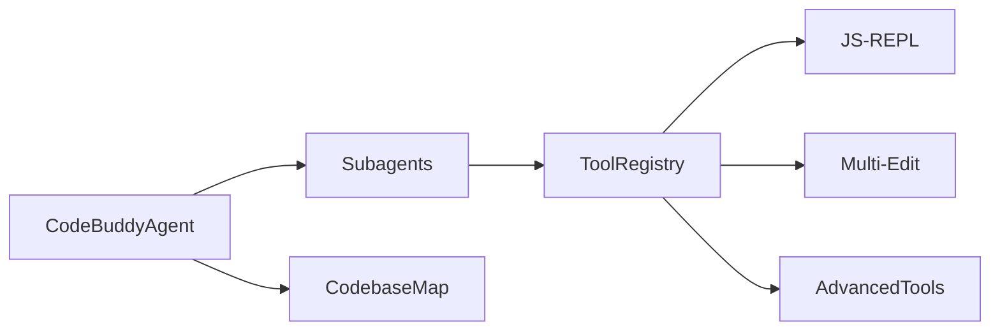

# Subsystems (continued)

## Tool Implementations & Core Agent System

This section serves as the operational blueprint for the Code Buddy agent's functional capabilities. Developers and system architects should consult this documentation to understand how the agent orchestrates specialized sub-tasks and interacts with the local environment through its toolset.

### The Agentic Architecture

The agent does not operate as a monolith; instead, it delegates complex reasoning to specialized subagents. When `CodeBuddyAgent.initializeSkills()` is invoked, the system prepares these sub-modules to handle specific domains, ensuring that the primary agent remains focused on high-level orchestration rather than getting bogged down in implementation details. This modularity allows the system to maintain a clean separation between the decision-making logic and the execution environment.

To maintain awareness of the project structure, the agent relies on the `src/context/codebase-map` module. By building a semantic understanding of the file system, the agent can navigate large repositories without needing to read every file, which significantly reduces token consumption. This map is persisted via `src/knowledge/code-graph-persistence`, ensuring that the agent retains context across different sessions.

> **Key concept:** The codebase map acts as a semantic index, allowing the agent to perform targeted lookups rather than exhaustive scans, which is critical for performance in large repositories.

Now that we understand how the agent organizes its internal knowledge and delegates tasks to subagents, we must examine the execution layer that allows it to interact with the host environment.

### Tool Execution and Registry

Once the agent has mapped the codebase, it requires the ability to manipulate it. This is where the tool registry comes into play. By utilizing `initializeToolRegistry()`, the system dynamically loads capabilities like the JS-REPL and Multi-Edit, allowing the agent to execute code or perform batch file modifications safely. The registry acts as a gatekeeper, ensuring that only validated tools are exposed to the agent's decision-making loop.

When the agent decides to perform an action, it doesn't call the tool directly; it requests execution through the registry. This abstraction is vital because it allows the system to perform pre-flight checks, such as `CodeBuddyClient.probeToolSupport()`, to verify that the current model and environment can actually support the requested operation. This prevents the agent from attempting to use tools that are unavailable or unsupported in the current context.

> **Developer tip:** When implementing new tools, ensure they are compatible with the `CodeBuddyClient.probeToolSupport()` check to avoid runtime errors during agent initialization.

The following modules represent the core components of the agent's functional toolkit and internal system structure:

- **src/agent/subagents** (rank: 0.002, 20 functions)
- **src/context/codebase-map** (rank: 0.002, 12 functions)
- **src/knowledge/code-graph-persistence** (rank: 0.002, 3 functions)
- **src/tools/js-repl** (rank: 0.002, 12 functions)
- **src/tools/multi-edit** (rank: 0.002, 4 functions)
- **src/tools/registry/advanced-tools** (rank: 0.002, 33 functions)

---

**See also:** [Architecture](./2-architecture.md) · [Subsystems](./3a-core-agent-system-cli-and-slash-commands.md) · [Tool System](./5-tools.md) · [Context & Memory](./7-context-memory.md)