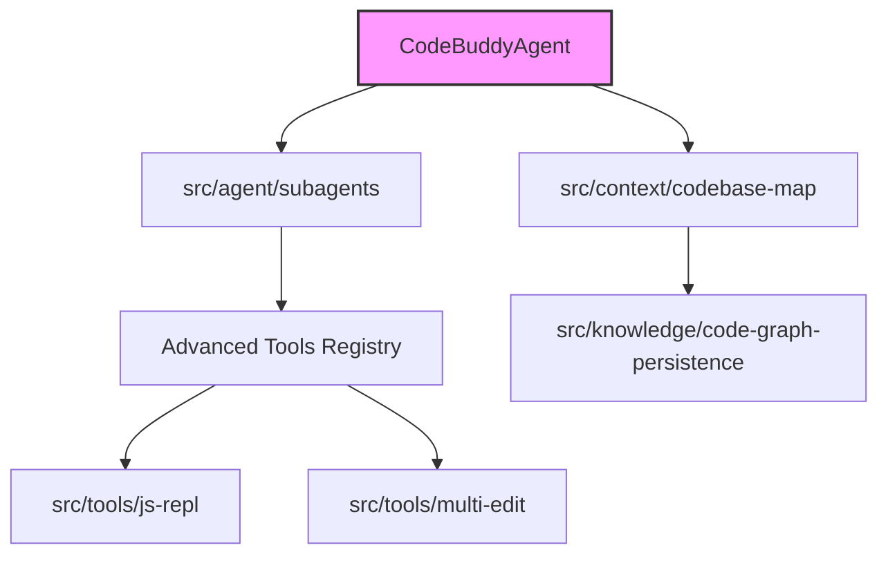

# Subsystems (continued)

This section details the specialized subsystems responsible for advanced tool execution, codebase mapping, and persistent knowledge management. These modules are critical for developers extending the agent's capabilities or modifying how the system interacts with external environments and local codebases.

The modules listed below represent the operational backbone for specialized agent tasks and environment interaction. They are orchestrated by the core agent system, which utilizes `CodeBuddyAgent.initializeSkills` to register these capabilities during the startup sequence.

## Tool Implementations & Core Agent System (6 modules)

- **src/agent/subagents** (rank: 0.002, 20 functions)
- **src/context/codebase-map** (rank: 0.002, 12 functions)
- **src/knowledge/code-graph-persistence** (rank: 0.002, 3 functions)
- **src/tools/js-repl** (rank: 0.002, 12 functions)
- **src/tools/multi-edit** (rank: 0.002, 4 functions)
- **src/tools/registry/advanced-tools** (rank: 0.002, 33 functions)

> **Key concept:** The advanced tool registry decouples tool execution logic from the core agent loop, allowing for hot-swapping of capabilities like multi-edit and JS-REPL without restarting the agent process.

These modules work in tandem with the profiling systems to maintain an accurate representation of the workspace. For instance, the codebase mapping logic relies on data structures similar to those generated by `RepoProfiler.loadCodeGraph`, ensuring that the agent has a consistent view of the project structure when executing complex multi-file edits or REPL commands.

---

**See also:** [Architecture](./2-architecture.md) · [Subsystems](./3a-core-agent-system-cli-and-slash-commands.md) · [Tool System](./5-tools.md) · [Context & Memory](./7-context-memory.md)

--- END ---