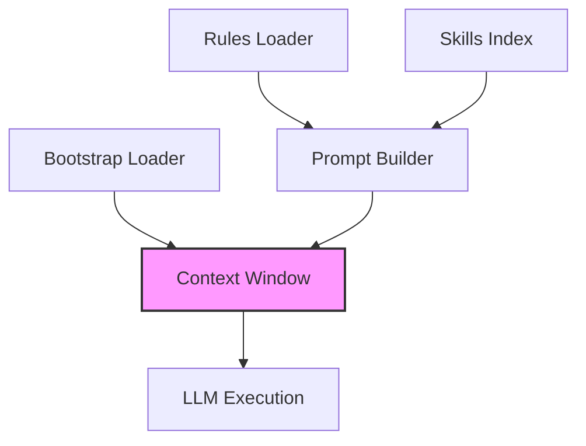

# Subsystems (continued)

This section details the subsystems responsible for prompt engineering, context window optimization, and rule enforcement. These modules are critical for maintaining LLM coherence and ensuring that the agent adheres to user-defined constraints while maximizing token efficiency.

## Prompts & Context Window Management (6 modules)

The following modules manage the lifecycle of prompts, from initial bootstrapping to the injection of dynamic workflow rules. By centralizing these operations, the system ensures that `CodeBuddyAgent.initializeAgentSystemPrompt()` receives a consistent and optimized context, regardless of the specific task or tool being executed.

- **src/context/bootstrap-loader** (rank: 0.002, 7 functions)
- **src/prompts/variation-injector** (rank: 0.002, 4 functions)
- **src/prompts/workflow-rules** (rank: 0.002, 1 functions)
- **src/rules/rules-loader** (rank: 0.002, 10 functions)
- **src/skills/index** (rank: 0.002, 8 functions)
- **src/services/prompt-builder** (rank: 0.002, 2 functions)

> **Key concept:** Context window management is a balancing act between providing sufficient historical data and minimizing token consumption. By utilizing `EnhancedMemory.loadMemories()` alongside the prompt builder, the system dynamically prunes irrelevant context, ensuring that the LLM remains focused on the current task without exceeding model constraints.

These components work in tandem with memory management systems to ensure that the context window remains relevant and within operational limits. For a deeper understanding of how these prompts interact with the broader agent architecture, refer to the core system documentation.

---

**See also:** [Architecture](./2-architecture.md) · [Subsystems](./3a-core-agent-system-cli-and-slash-commands.md) · [Context & Memory](./7-context-memory.md)