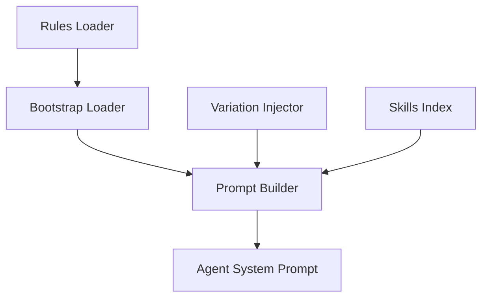

# Subsystems: Prompts and Context Management

This section details the orchestration layer responsible for transforming raw user intent into structured, actionable instructions for the LLM. Developers working on agent behavior, prompt engineering, or rule enforcement should read this to understand how the system maintains consistency across sessions and ensures the agent adheres to defined operational constraints.

When the agent initializes, it does not simply start listening for input; it must first establish the "ground truth" of the current environment. This process relies on a modular pipeline that aggregates system rules, user-defined preferences, and task-specific skills. By centralizing this logic, the system ensures that `CodeBuddyAgent.initializeAgentSystemPrompt()` receives a coherent, deterministic instruction set regardless of the complexity of the underlying codebase.

With the foundational prompt structure defined, we must examine the specific modules that govern how these instructions are assembled and injected into the agent's memory. The following modules form the core of this pipeline:

- **src/context/bootstrap-loader** (rank: 0.002, 7 functions)
- **src/prompts/variation-injector** (rank: 0.002, 4 functions)
- **src/prompts/workflow-rules** (rank: 0.002, 1 functions)
- **src/rules/rules-loader** (rank: 0.002, 10 functions)
- **src/skills/index** (rank: 0.002, 8 functions)
- **src/services/prompt-builder** (rank: 0.002, 2 functions)

> **Key concept:** The prompt pipeline uses a layered injection strategy. By separating `rules-loader` from `prompt-builder`, the system ensures that core behavioral constraints remain immutable while task-specific instructions remain flexible, significantly reducing the risk of prompt injection attacks.

Because the agent needs to adapt to different scenarios—such as switching between coding tasks and architectural analysis—the `variation-injector` allows the system to modify the system prompt dynamically. This ensures that the agent's persona remains consistent while its focus shifts according to the current `CodeBuddyAgent` state.

> **Developer tip:** When modifying `rules-loader`, always verify that the resulting prompt length does not exceed the context window of the target model, as excessive rule injection can lead to truncated instructions and degraded agent performance.

Now that we understand how the agent constructs its internal instructions, we must look at how it manages the persistence of these contexts across different sessions. The interaction between the `prompt-builder` and the session storage layer is critical for maintaining long-term continuity in complex development workflows.

---

**See also:** [Architecture](./2-architecture.md) · [Subsystems](./3a-core-agent-system-cli-and-slash-commands.md) · [Context & Memory](./7-context-memory.md)