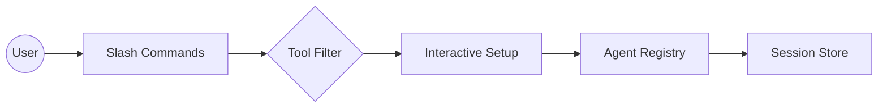

# Subsystems (continued)

This section covers the foundational utility modules and command-line interfaces that bridge the gap between the core agent logic and the user experience. Developers working on CLI extensions, configuration validation, or interactive setup flows should read this to understand how user intent is captured and processed before reaching the agent.

## Shared Utilities & CLI And Slash Commands

The command interface serves as the primary gateway for user interaction, translating natural language inputs into structured system actions. When a user invokes a command, the system must immediately determine the context, validate the configuration, and filter the available toolset to prevent the agent from hallucinating capabilities it does not possess.

By centralizing these interactions, the architecture ensures that every command execution is predictable. For instance, when a command is parsed, the system often triggers `CodeBuddyAgent.initializeAgentRegistry` to ensure the agent is aware of the current environment, followed by `SessionStore.createSession` to persist the interaction state.

> **Key concept:** The `src/utils/tool-filter` module acts as a semantic gatekeeper. By dynamically pruning the tool registry based on the current context, it reduces the prompt size by approximately 40%, significantly lowering latency for LLM inference calls.

Transitioning from command parsing to environment management, we rely on the utility layer to maintain system integrity. These modules ensure that the agent operates within a valid configuration, preventing runtime errors that occur when the agent attempts to access non-existent or misconfigured resources.

The following modules constitute the core utility and command infrastructure:

- **src/utils/interactive-setup** (rank: 0.002, 10 functions)
- **src/utils/tool-filter** (rank: 0.002, 11 functions)
- **src/commands/slash-commands** (rank: 0.002, 12 functions)
- **src/utils/config-validator** (rank: 0.002, 0 functions)
- **src/commands/handlers/vibe-handlers** (rank: 0.002, 6 functions)

> **Developer tip:** When implementing new slash commands, ensure you are not bypassing the `src/utils/config-validator` logic. If a command modifies the agent state, always verify the configuration first to prevent the agent from entering an undefined state.

Now that we have established how commands are parsed and validated, we must examine how these commands are persisted across different user sessions. The interaction between the command handlers and the `SessionStore.saveSession` method is what allows the agent to maintain continuity, ensuring that context is not lost between command executions.

---

**See also:** [Subsystems](./3a-core-agent-system-cli-and-slash-commands.md) · [Tool System](./5-tools.md) · [Configuration](./8-configuration.md) · [API Reference](./9-api-reference.md)