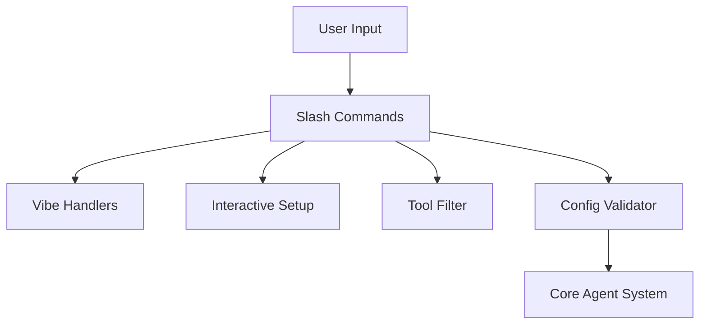

# Subsystems (continued)

This section details the shared utility modules and command-line interface (CLI) infrastructure that support the core agent operations. These modules provide the foundational logic for user interaction, configuration validation, and command execution, ensuring consistent behavior across the application's various entry points.

## Shared Utilities & CLI And Slash Commands (5 modules)

The modules listed below form the interface layer of the application. They are responsible for parsing user intent, validating environment configurations, and managing the lifecycle of interactive sessions. By decoupling these concerns from the core agent logic, the system maintains a clean separation between user-facing commands and backend execution.

> **Key concept:** The utility layer acts as a middleware between raw user input and the agent execution engine, ensuring that all commands are validated and filtered before reaching the core logic.

- **src/utils/interactive-setup** (rank: 0.002, 10 functions)
- **src/utils/tool-filter** (rank: 0.002, 11 functions)
- **src/commands/slash-commands** (rank: 0.002, 12 functions)
- **src/utils/config-validator** (rank: 0.002, 0 functions)
- **src/commands/handlers/vibe-handlers** (rank: 0.002, 6 functions)

These utilities ensure that the agent environment is correctly initialized before any processing begins. Once the configuration is validated and the toolset is filtered, the system transitions control to the primary agent execution flow.

---

**See also:** [Subsystems](./3a-core-agent-system-cli-and-slash-commands.md) · [Tool System](./5-tools.md) · [Configuration](./8-configuration.md) · [API Reference](./9-api-reference.md)

--- END ---