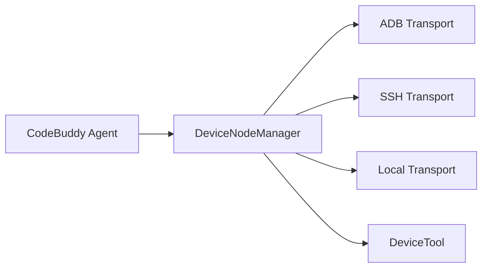

# Subsystems (continued)

This section explores the Multi-Device Management subsystem, the architectural layer responsible for bridging the Code Buddy agent with disparate execution environments. Developers working on cross-platform integration, remote deployment workflows, or hardware-in-the-loop testing should read this to understand how the agent maintains state across physical and virtual devices.

## Multi-Device Management (5 modules)

When the agent needs to interact with an external environment—whether it is a connected Android device via ADB, a remote server via SSH, or the local filesystem—it does not communicate directly with the hardware. Instead, it relies on the `DeviceNodeManager` to abstract the underlying transport layer. By centralizing these connections, the system ensures that the agent's core logic remains agnostic to the specific protocol being used.

The lifecycle of a connection begins when `DeviceNodeManager.getInstance()` is invoked to retrieve the singleton controller. From there, the system uses `DeviceNodeManager.loadDevices()` to populate the registry of available endpoints. If a new connection is required, `DeviceNodeManager.createTransport()` is called to instantiate the appropriate protocol handler, which is then managed through `DeviceNodeManager.getTransport()`.

> **Key concept:** The `DeviceNodeManager` acts as an abstraction layer, decoupling the agent's logic from the specific transport protocol (ADB, SSH, or Local), allowing for seamless device switching without modifying core agent code.

Once a transport is active, the agent can perform operations such as `DeviceNodeManager.pairDevice()` or `DeviceNodeManager.unpairDevice()` to manage the session state. This ensures that even if a connection drops, the `DeviceNodeManager` can gracefully handle the teardown and subsequent reconnection attempts without crashing the main agent loop.

> **Developer tip:** When debugging connection issues, always use `DeviceNodeManager.resetInstance()` before attempting to re-initialize transports to ensure stale socket handles and corrupted state are cleared from the singleton.

The following modules constitute the core of this subsystem:

- **src/nodes/device-node** (rank: 0.006, 21 functions)
- **src/nodes/transports/adb-transport** (rank: 0.004, 10 functions)
- **src/nodes/transports/local-transport** (rank: 0.004, 8 functions)
- **src/nodes/transports/ssh-transport** (rank: 0.004, 13 functions)
- **src/tools/device-tool** (rank: 0.002, 1 functions)

Now that we have established how the agent manages connections to external devices, we can examine how these transport layers are exposed to the agent's decision-making engine through the tool system.

---

**See also:** [Subsystems](./3a-core-agent-system-cli-and-slash-commands.md) · [Tool System](./5-tools.md)