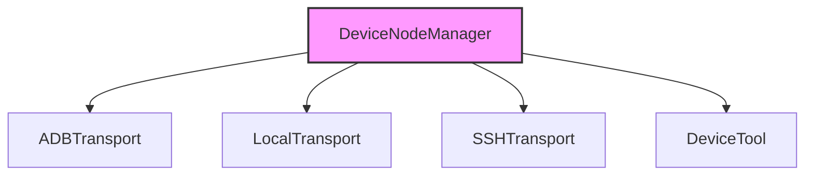

# Multi-Device Management

The Multi-Device Management subsystem provides the abstraction layer necessary for the agent to interface with diverse hardware environments, including local machines, remote SSH hosts, and ADB-enabled devices. This architecture enables seamless command execution and file synchronization across heterogeneous infrastructure, ensuring consistent agent behavior regardless of the underlying transport mechanism.

## Module Overview

The following modules constitute the core infrastructure for device connectivity and transport management:

- **src/nodes/device-node** (rank: 0.006, 21 functions)
- **src/nodes/transports/adb-transport** (rank: 0.004, 10 functions)
- **src/nodes/transports/local-transport** (rank: 0.004, 8 functions)
- **src/nodes/transports/ssh-transport** (rank: 0.004, 13 functions)
- **src/tools/device-tool** (rank: 0.002, 1 functions)

## Core Architecture

The central component of this subsystem is the `DeviceNodeManager`, which acts as a singleton registry for all active device connections. Developers interacting with this module should utilize `DeviceNodeManager.getInstance()` to retrieve the active manager instance before performing operations. To manage device lifecycles, the system relies on `DeviceNodeManager.loadDevices()` and `DeviceNodeManager.saveDevices()` to persist connection states across agent restarts.

> **Key concept:** The transport abstraction layer decouples the agent's logic from physical connectivity, allowing `DeviceNodeManager.createTransport()` to instantiate protocol-specific handlers without requiring changes to the core agent logic.

Once the device registry is initialized, the system delegates specific communication tasks to specialized transport layers. These layers abstract the complexities of the underlying protocol, allowing the agent to treat a remote SSH connection similarly to a local process execution.

## Connectivity and Lifecycle

Security and connectivity are handled through explicit pairing flows managed by the node system. When a new device is introduced, the system invokes `DeviceNodeManager.pairDevice()` to establish the initial handshake and authentication. Conversely, `DeviceNodeManager.unpairDevice()` ensures that credentials and session data are purged from the registry, maintaining a clean state for future connections.

If a specific transport is required for a task, the system calls `DeviceNodeManager.getTransport()` to retrieve the appropriate interface, ensuring that the agent always interacts with the correct protocol implementation.

---

**See also:** [Subsystems](./3a-core-agent-system-cli-and-slash-commands.md) · [Tool System](./5-tools.md)