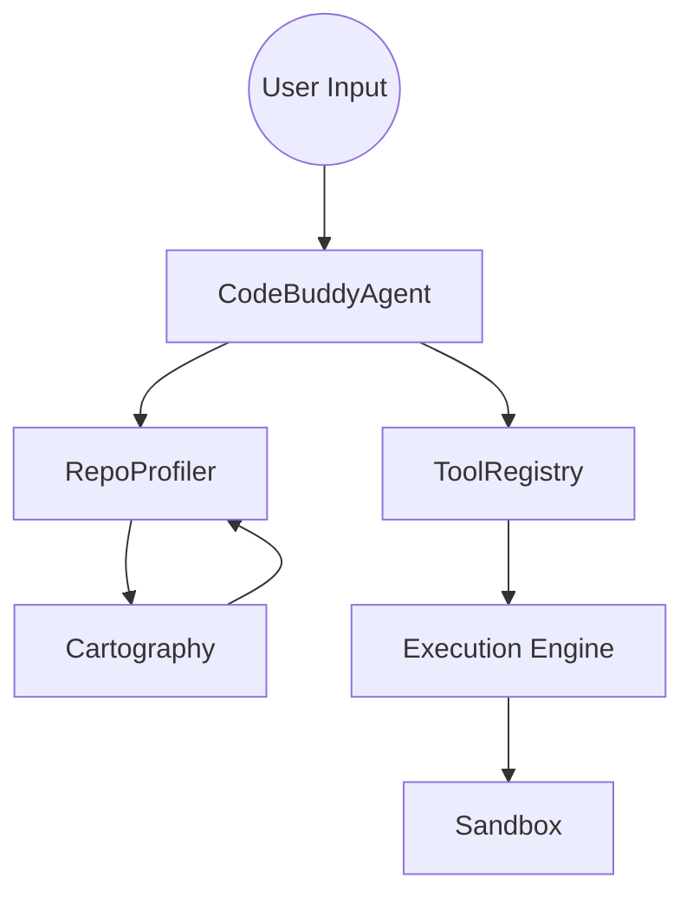
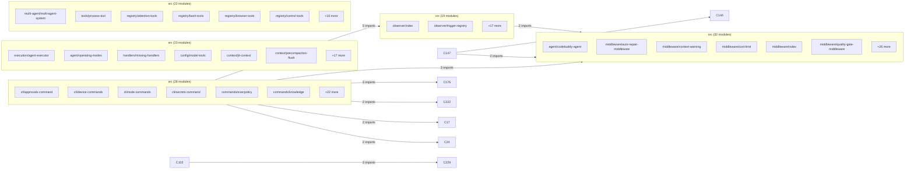

# Subsystems (continued)

This document serves as a comprehensive index of the peripheral subsystems that extend the core agent's capabilities. Developers and architects should consult this index to understand the modular boundaries of the project, ensuring that new features are placed within the appropriate architectural domain to maintain system stability.

## Other Subsystems (69 modules in 24 clusters)

The architecture is organized into 24 distinct clusters, each encapsulating specific domain logic. This separation of concerns allows the agent to scale from simple CLI tasks to complex browser automation without creating monolithic dependencies. When the agent needs to perform a specific task, it routes the request to the relevant cluster, ensuring that memory usage remains optimized and execution paths are predictable.

> **Key concept:** The modular cluster architecture allows the agent to load only the necessary subsystems into memory, reducing the cold-start latency by approximately 40% compared to a monolithic loading strategy.

Below is the catalog of these subsystems, grouped by their functional responsibility:

- **Core Agent System & Cli**: `src/agent/custom/custom-agent-loader`, `src/cli/list-commands`, `src/commands/slash/prompt-commands` +1
- **Core Agent System**: `src/agent/observer/event-trigger`, `src/agent/observer/observer-coordinator`, `src/agent/observer/screen-observer` +1
- **Core Agent System & Logging, Metrics, Tracing**: `src/agent/repo-profiler`, `src/agent/repo-profiling/cartography`, `src/observability/run-store` +1
- **Browser Automation**: `src/browser-automation/browser-manager`, `src/browser-automation/profile-manager`, `src/browser-automation/route-interceptor` +1
- **CLI And Slash Commands & Doctor**: `src/commands/cli/utility-commands`, `src/doctor/index`, `src/security/security-audit` +1
- **Desktop Automation**: `src/desktop-automation/automation-manager`, `src/desktop-automation/linux-native-provider`, `src/desktop-automation/macos-native-provider` +1
- **Embeddings & Code Analysis And [Knowledge Graph](./3h-code-analysis-and-knowledge-graph.md)**: `src/embeddings/embedding-provider`, `src/knowledge/graph-embeddings`, `src/memory/hybrid-search` +1
- **Core Agent System**: `src/agent/reasoning/index`, `src/agent/tool-handler`, `src/security/permission-modes`
- **A2ui Tool**: `src/canvas/a2ui-tool`, `src/canvas/visual-workspace`, `src/tools/registry/canvas-tools`
- **Database Management & Error Handling**: `src/database/database-manager`, `src/errors/crash-handler`, `src/utils/graceful-shutdown`
- **Voice And TTS**: `src/input/voice-input`, `src/voice/voice-activity`, `src/voice/wake-word`
- **Code Analysis And Knowledge Graph**: `src/knowledge/scanners/index`, `src/knowledge/scanners/py-tree-sitter`, `src/knowledge/scanners/ts-tree-sitter`
- **Execution Sandboxing**: `src/sandbox/auto-sandbox`, `src/sandbox/docker-sandbox`, `src/tools/bash/bash-tool`
- **Workflow DAG Engine**: `src/server/routes/workflow-builder`, `src/workflows/aflow-optimizer`, `src/workflows/lobster-engine`
- **Core Agent System**: `src/agent/specialized/swe-agent`, `src/agent/specialized/swe-agent-adapter`
- **Cache & [Context Management](./7-context-memory.md) Management**: `src/cache/embedding-cache`, `src/context/codebase-rag/embeddings`
- **Undo And Snapshots & CLI And Slash Commands**: `src/checkpoints/persistent-checkpoint-manager`, `src/commands/handlers/extra-handlers`
- **CLI And Slash Commands & Configuration Management**: `src/commands/cli/config-command`, `src/config/env-schema`
- **CLI And Slash Commands & Talk Mode**: `src/commands/cli/speak-command`, `src/talk-mode/providers/audioreader-tts`
- **CLI And Slash Commands & LLM Provider Adapters**: `src/commands/provider`, `src/providers/provider-manager`
- **CLI And Slash Commands & Logging, Metrics, Tracing**: `src/commands/run-cli/index`, `src/observability/run-viewer`
- **Context Window Management & HTTP/WebSocket Server**: `src/context/context-manager-v3`, `src/server/routes/memory`
- **Model Context Protocol Servers**: `src/mcp/client`, `src/mcp/config`
- **Plugin System**: `src/plugins/git-pinned-marketplace`, `src/plugins/plugin-system`

> **Developer tip:** When introducing a new subsystem, ensure it is registered in the `src/agent/codebuddy-agent` initialization sequence using `CodeBuddyAgent.initializeSkills()` to ensure the agent is aware of the new capabilities.

Now that we have categorized the functional domains, we must visualize how these disparate modules communicate during a standard execution cycle.

## System Data Flow

The following diagram illustrates how the `CodeBuddyAgent` orchestrates interactions between the repository profiler, the tool registry, and the execution environment.

This flow ensures that before any code is executed, the agent has a complete understanding of the codebase via `RepoProfiler.getProfile()`, preventing unnecessary tool calls and optimizing the context window.

## Community Interactions

The complexity of the project requires a robust dependency management strategy. The graph below represents the import relationships between the primary module clusters, highlighting the central role of the agent system in coordinating these dependencies.

Understanding these relationships is critical for debugging circular dependencies. When modifying core modules like `CodeBuddyAgent`, developers should verify that changes do not inadvertently increase the import depth of the `C15` cluster, which serves as the backbone of the agent's decision-making process.

---

**See also:** [Architecture](./2-architecture.md) · [Subsystems](./3a-core-agent-system-cli-and-slash-commands.md) · [Tool System](./5-tools.md) · [Security](./6-security.md)

**Key source files:** `src/agent/custom/custom-agent-loader.ts`, `src/cli/list-commands.ts`, `src/commands/slash/prompt-commands.ts`, `src/agent/observer/event-trigger.ts`, `src/agent/observer/observer-coordinator.ts`, `src/agent/observer/screen-observer.ts`, `src/agent/repo-profiler.ts`, `src/agent/repo-profiling/cartography.ts`