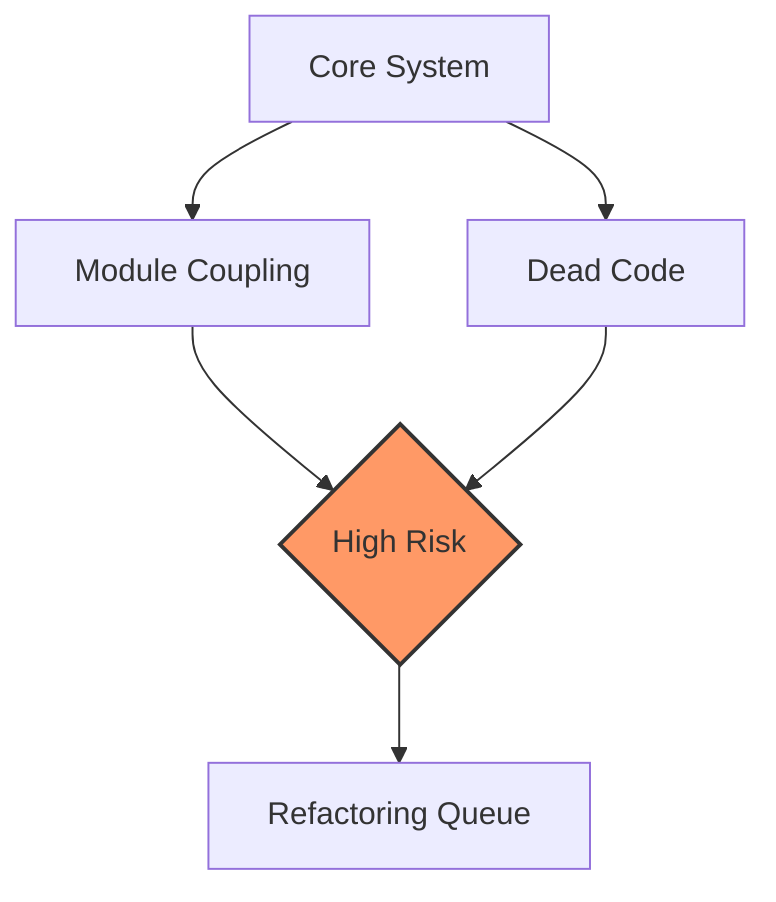

# Code Quality Metrics

This document provides a comprehensive health assessment of the codebase, quantifying technical debt and architectural stability. It is designed for maintainers and system architects who need to prioritize refactoring efforts, identify high-risk dependencies, and ensure the long-term maintainability of the project.

## Code Health: 65/100 (Fair)

At 12,714 entities and 49,126 relationships, each module is connected to an average of 4 others — a loosely coupled architecture. While this indicates a generally healthy distribution of responsibilities, the score of 65/100 suggests that there are significant pockets of technical debt that, if left unaddressed, could impede development velocity.

Score breakdown:
- Dead code: -20 (3100 high-confidence)
- High coupling: -15 (20 pairs)

> **Developer tip:** Before attempting any major refactoring, use `RepoProfiler.computeProfile` to generate a fresh dependency graph. This ensures your refactoring plan is based on the current state of the codebase, not stale metadata.

Now that we have established the baseline health of the system, we must isolate the "ghost" code—the functions and modules that persist in the repository but no longer serve a functional purpose.

## Dead Code Analysis

Dead code acts as a tax on developer cognitive load; it forces maintainers to read, understand, and test code that is never actually executed. By identifying and removing these candidates, we can reduce the surface area for bugs and simplify the codebase.

| Confidence | Count |
|---|---|
| High | 3100 |
| Medium | 0 |
| Low | 1910 |
| **Total** | **5246** |

### Top Dead Code Candidates

*Note: Exported API methods and dynamic dispatch targets are excluded.*

- `A2UIManager.cb` (high confidence)
- `A2UIManager.handleUserAction` (high confidence)
- `A2UIManager.renderToHTML` (high confidence)
- `A2UIManager.renderToTerminal` (high confidence)
- `A2UIManager.sendCanvasEvent` (high confidence)
- `A2UIManager.shutdown` (high confidence)
- `A2UITool.getManager` (high confidence)
- `ACPRouter.clearLog` (high confidence)
- `ACPRouter.findByCapability` (high confidence)
- `ACPRouter.getAgent` (high confidence)
- `ACPRouter.getAgents` (high confidence)
- `ACPRouter.getLog` (high confidence)
- `ACPRouter.register` (high confidence)
- `ACPRouter.reject` (high confidence)
- `ACPRouter.request` (high confidence)

> **Key concept:** Dead code is not merely unused; it is a liability. High-confidence dead code candidates should be prioritized for removal during sprint maintenance to reduce the binary size and improve IDE indexing performance.

With the dead code identified, we must now turn our attention to the active, yet overly entangled, parts of the system.

## Module Coupling

Coupling measures the degree of interdependence between software modules. When modules are tightly coupled, a change in one often necessitates a change in another, creating a "ripple effect" that makes the system fragile. The table below highlights the most significant coupling pairs currently present in the architecture.

| Module A | Module B | Calls | Imports | Total |
|---|---|---|---|---|
| src/browser-automation/browser-tool | src/tools/browser-tool | 29 | 0 | 29 |
| src/tools/browser-tool | src/tools/browser/playwright-tool | 20 | 0 | 20 |
| src/middleware/middlewares | src/middleware/types | 19 | 0 | 19 |
| src/agent/repo-profiling/infrastructure/index | src/agent/repo-profiling/infrastructure/project-meta | 15 | 0 | 15 |
| src/docs/docs-generator | src/tools/doc-generator | 13 | 0 | 13 |
| src/errors/index | src/tools/git-tool | 13 | 0 | 13 |
| src/cache/cache-manager | src/utils/cache | 10 | 0 | 10 |
| src/tools/docker-tool | src/utils/confirmation-service | 10 | 0 | 10 |
| src/tools/kubernetes-tool | src/utils/confirmation-service | 10 | 0 | 10 |
| src/commands/handlers/debug-handlers | src/utils/debug-logger | 9 | 0 | 9 |
| src/themes/theme-manager | src/ui/context/theme-context | 9 | 0 | 9 |
| src/agent/parallel/parallel-executor | src/optimization/parallel-executor | 8 | 0 | 8 |
| src/commands/handlers/branch-handlers | src/persistence/conversation-branches | 8 | 0 | 8 |
| src/commands/handlers/core-handlers | src/utils/autonomy-manager | 8 | 0 | 8 |
| src/context/pruning/index | src/context/pruning/ttl-manager | 8 | 0 | 8 |

Most dependent module: `src/utils/validators`
Most depended-upon: `src/utils/validators`

> **Developer tip:** When investigating high-coupling modules, check if the dependency is logical or physical. If you find a module like `DMPairingManager.isBlocked` being called across unrelated domains, consider moving that logic to a shared utility or service layer to decouple the modules.

While coupling is inevitable in a complex system, it must be managed. When specific functions become the nexus of too many dependencies, they become single points of failure that require immediate refactoring.

## Refactoring Suggestions

The following functions have been identified as high-priority candidates for refactoring. These functions exhibit high PageRank scores, meaning they are central to the system's operation. Modifying these functions carries a high risk of regression, so they are prime candidates for interface extraction or service-based decoupling.

- **getErrorMessage**: Called by 155 functions — high coupling, consider interface extraction (PageRank: 1.000, 155 callers)
- **isExpired**: Called by 10 functions — high coupling, consider interface extraction (PageRank: 0.627, 10 callers)
- **send**: Called by 41 functions — high coupling, consider interface extraction (PageRank: 0.547, 41 callers)
- **SubagentManager.spawn**: Called by 96 functions — high coupling, consider interface extraction (PageRank: 0.444, 96 callers)
- **generateId**: Called by 17 functions — high coupling, consider interface extraction (PageRank: 0.429, 17 callers)
- **createId**: Called by 27 functions — high coupling, consider interface extraction (PageRank: 0.427, 27 callers)
- **DesktopAutomationManager.ensureProvider**: Called by 30 functions — high coupling, consider interface extraction (PageRank: 0.363, 30 callers)
- **tokenize**: Called by 20 functions — high coupling, consider interface extraction (PageRank: 0.345, 20 callers)
- **BrowserManager.getCurrentPage**: Called by 35 functions — high coupling, consider interface extraction (PageRank: 0.336, 35 callers)
- **formatSize**: Called by 20 functions — high coupling, consider interface extraction (PageRank: 0.301, 20 callers)

> **Key concept:** The PageRank algorithm applied here identifies "architectural gravity." Functions with high PageRank scores are the pillars of the system; modifying them requires rigorous regression testing because they are the most heavily relied upon by other modules.

> **Developer tip:** Before refactoring, ensure your implementation adheres to the project's standards by using `CodeBuddyClient.validateModel` to verify that your changes won't break existing model-specific logic or tool support.

---

**See also:** [Overview](./1-overview.md) · [Architecture](./2-architecture.md) · [Subsystems](./3a-core-agent-system-cli-and-slash-commands.md) · [Tool System](./5-tools.md)

**Key source files:** `src/utils/validators.ts`