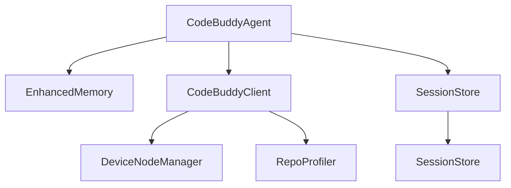

# Code Quality Metrics

This section provides an overview of the current codebase health, identifying areas of technical debt, high coupling, and dead code. These metrics are used by the engineering team to prioritize refactoring efforts and ensure the long-term maintainability and performance of the core system.

## Code Health: 65/100 (Fair)

The current health score of 65/100 indicates significant opportunities for optimization, particularly regarding the removal of unused code paths and the reduction of inter-module dependencies. Addressing these issues is critical for improving build times and reducing the cognitive load for new contributors.

Score breakdown:
- Dead code: -20 (3099 high-confidence)
- High coupling: -15 (20 pairs)

### System Architecture Overview

The following diagram illustrates the core interaction flow between the primary system components. Understanding these relationships is vital when refactoring, as changes to central modules like `CodeBuddyAgent` or `SessionStore` will propagate across the dependency graph.

## Dead Code Analysis

> **Key concept:** Dead code analysis uses static analysis to identify unreachable branches. While high-confidence candidates are safe to remove, dynamic dispatch targets—such as those managed by `DMPairingManager.approve` or `DeviceNodeManager.pairDevice`—must be verified against the runtime registry before deletion to prevent breaking core functionality.

| Confidence | Count |
|---|---|
| High | 3099 |
| Medium | 0 |
| Low | 1910 |
| **Total** | **5245** |

### Top Dead Code Candidates

*Note: Exported API methods and dynamic dispatch targets are excluded.*

- `A2UIManager.cb` (high confidence)
- `A2UIManager.handleUserAction` (high confidence)
- `A2UIManager.renderToHTML` (high confidence)
- `A2UIManager.renderToTerminal` (high confidence)
- `A2UIManager.sendCanvasEvent` (high confidence)
- `A2UIManager.shutdown` (high confidence)
- `A2UITool.getManager` (high confidence)
- `ACPRouter.clearLog` (high confidence)
- `ACPRouter.findByCapability` (high confidence)
- `ACPRouter.getAgent` (high confidence)
- `ACPRouter.getAgents` (high confidence)
- `ACPRouter.getLog` (high confidence)
- `ACPRouter.register` (high confidence)
- `ACPRouter.reject` (high confidence)
- `ACPRouter.request` (high confidence)

## Module Coupling

High coupling often indicates that modules are violating the single responsibility principle, making the system brittle to changes. The following table highlights the most tightly coupled modules that require architectural review to decouple dependencies.

| Module A | Module B | Calls | Imports | Total |
|---|---|---|---|---|
| src/browser-automation/browser-tool | src/tools/browser-tool | 29 | 0 | 29 |
| src/tools/browser-tool | src/tools/browser/playwright-tool | 20 | 0 | 20 |
| src/middleware/middlewares | src/middleware/types | 19 | 0 | 19 |
| src/agent/repo-profiling/infrastructure/index | src/agent/repo-profiling/infrastructure/project-meta | 15 | 0 | 15 |
| src/errors/index | src/tools/git-tool | 13 | 0 | 13 |
| src/docs/docs-generator | src/tools/doc-generator | 12 | 0 | 12 |
| src/cache/cache-manager | src/utils/cache | 10 | 0 | 10 |
| src/tools/docker-tool | src/utils/confirmation-service | 10 | 0 | 10 |
| src/tools/kubernetes-tool | src/utils/confirmation-service | 10 | 0 | 10 |
| src/commands/handlers/debug-handlers | src/utils/debug-logger | 9 | 0 | 9 |
| src/themes/theme-manager | src/ui/context/theme-context | 9 | 0 | 9 |
| src/agent/parallel/parallel-executor | src/optimization/parallel-executor | 8 | 0 | 8 |
| src/commands/handlers/branch-handlers | src/persistence/conversation-branches | 8 | 0 | 8 |
| src/commands/handlers/core-handlers | src/utils/autonomy-manager | 8 | 0 | 8 |
| src/context/pruning/index | src/context/pruning/ttl-manager | 8 | 0 | 8 |

Most dependent module: `src/utils/validators`
Most depended-upon: `src/utils/validators`

## Refactoring Suggestions

The following functions exhibit high PageRank scores, indicating they are central to the system's operation. Refactoring these into interfaces or extracting them into dedicated services—such as moving logic into `CodeBuddyAgent.initializeMemory` or `SessionStore.saveSession`—will improve testability and modularity.

- **getErrorMessage**: Called by 155 functions — high coupling, consider interface extraction (PageRank: 1.000, 155 callers)
- **isExpired**: Called by 10 functions — high coupling, consider interface extraction (PageRank: 0.627, 10 callers)
- **send**: Called by 41 functions — high coupling, consider interface extraction (PageRank: 0.547, 41 callers)
- **SubagentManager.spawn**: Called by 96 functions — high coupling, consider interface extraction (PageRank: 0.444, 96 callers)
- **generateId**: Called by 17 functions — high coupling, consider interface extraction (PageRank: 0.429, 17 callers)
- **createId**: Called by 27 functions — high coupling, consider interface extraction (PageRank: 0.427, 27 callers)
- **DesktopAutomationManager.ensureProvider**: Called by 30 functions — high coupling, consider interface extraction (PageRank: 0.363, 30 callers)
- **tokenize**: Called by 20 functions — high coupling, consider interface extraction (PageRank: 0.345, 20 callers)
- **BrowserManager.getCurrentPage**: Called by 35 functions — high coupling, consider interface extraction (PageRank: 0.336, 35 callers)
- **formatSize**: Called by 20 functions — high coupling, consider interface extraction (PageRank: 0.301, 20 callers)

---

**See also:** [Overview](./1-overview.md) · [Architecture](./2-architecture.md) · [Subsystems](./3a-core-agent-system-cli-and-slash-commands.md) · [Tool System](./5-tools.md)

**Key source files:** `src/utils/validators.ts`