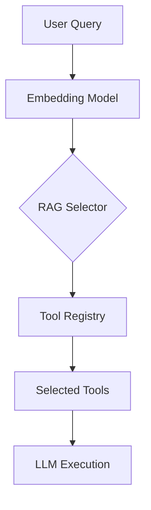

# Tool System

The Tool System serves as the operational interface between the Code Buddy agent and the host environment, abstracting complex system interactions into a standardized, discoverable registry. By decoupling tool definitions from the core agent logic, the system allows for modular expansion, enabling the agent to perform actions ranging from file manipulation to web navigation without bloating the primary codebase. This documentation is intended for developers extending the agent's capabilities or debugging tool execution flows.

## Tool Registry

Central to the agent's extensibility is the tool ecosystem, which currently contains **117** tool modules organized within `src/tools/` and `src/tools/registry/`. Rather than hardcoding every capability into the agent, the system utilizes a dynamic registration pattern.

When the application boots, the system invokes `initializeToolRegistry()` to scan these directories and build an in-memory map of available functions. This approach ensures that the agent only loads the necessary logic, keeping the memory footprint lean while maintaining a massive library of potential actions.

> **Developer tip:** When adding a new tool, always ensure it is registered in the registry index; calling `initializeToolRegistry()` without proper export mapping in `src/tools/registry/` will result in the tool being invisible to the agent's RAG selector.

Now that we understand how the registry provides a centralized catalog of capabilities, we must examine how these tools are grouped to facilitate efficient discovery and logical organization.

## Tool Categories

Categorization serves as the primary mechanism for routing user intent to the correct toolset. By grouping tools into functional domains, the system can apply specific constraints or permissions to entire classes of operations, such as restricting `file_write` operations to specific directories while allowing `web` operations globally.

| Category | Tools | Count |
|----------|-------|-------|
| system | `bash`, `process`, `js_repl`, `docker` +2 | 6 |
| file_search | `search`, `find_symbols`, `find_references`, `find_definition` +1 | 5 |
| file_write | `create_file`, `str_replace_editor`, `edit_file`, `multi_edit` | 4 |
| web | `web_search`, `web_fetch`, `browser` | 3 |
| planning | `create_todo_list`, `get_todo_list`, `update_todo_list` | 3 |
| codebase | `codebase_map`, `code_graph`, `spawn_subagent` | 3 |
| file_read | `view_file`, `list_directory` | 2 |
| git | `git` | 1 |

Having categorized our toolset, we must address the challenge of scale: how does the agent decide which tools to expose without overwhelming the context window?

## RAG-Based Tool Selection

Providing the LLM with 117+ tool definitions in every prompt would exhaust the context window and degrade reasoning performance. To solve this, the system implements a Retrieval-Augmented Generation (RAG) selector that dynamically filters the registry based on the user's current query.

When the agent encounters a user request, it performs the following steps:

1. **Query embedding** — The user message is converted into a vector representation.
2. **Similarity scoring** — Each tool's metadata is scored against the query vector (0-1).
3. **Top-K selection** — The system selects the ~15-20 most relevant tools.
4. **Token savings** — The prompt is populated only with the selected subset, drastically reducing overhead.

> **Key concept:** The RAG tool selector reduces prompt size from 110+ tools to ~15, saving approximately 8,000 tokens per LLM call.

Tools are assigned priority (3-10), keywords, and category metadata, which the RAG engine uses to ensure that high-priority tools—like `edit_file` or `bash`—are favored when the context is ambiguous.

## Registered Tools

The following list represents the 27 primary tools currently registered in the metadata. These tools are managed via `src/codebuddy/tools`, which handles the conversion of various formats (MCP, plugins, marketplace) into the internal Code Buddy format using functions like `addMCPToolsToCodeBuddyTools()` and `convertPluginToolToCodeBuddyTool()`.

- **bash**: bash
- **browser**: browser
- **code**: code_graph
- **codebase**: codebase_map
- **computer**: computer_control
- **create**: create_file, create_todo_list
- **docker**: docker
- **edit**: edit_file
- **find**: find_symbols, find_references, find_definition
- **get**: get_todo_list
- **git**: git
- **js**: js_repl
- **kubernetes**: kubernetes
- **list**: list_directory
- **multi**: multi_edit
- **process**: process
- **search**: search, search_multi
- **spawn**: spawn_subagent
- **str**: str_replace_editor
- **update**: update_todo_list
- **view**: view_file
- **web**: web_search, web_fetch

---

**See also:** [Overview](./1-overview.md) · [Architecture](./2-architecture.md) · [Subsystems](./3a-core-agent-system-cli-and-slash-commands.md) · [Context & Memory](./7-context-memory.md)

**Key source files:** `src/tools/.ts`, `src/tools/registry/.ts`