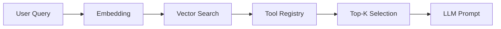

# Tool System

The Tool System provides the interface layer between the LLM and the host environment, enabling agentic capabilities through a modular registry. This section details the architecture of tool selection, categorization, and the RAG-based filtering mechanism used to maintain context window efficiency.

## Tool Registry

The tool ecosystem contains **117** tool modules organized in `src/tools/` and `src/tools/registry/`. The registry is initialized via `initializeToolRegistry()`, which coordinates with `getMCPManager()` to load external capabilities and manage the lifecycle of available functions.

The registry acts as the central authority for tool discovery and initialization, ensuring that external capabilities are correctly mapped to agent-executable functions.

## Tool Categories

| Category | Tools | Count |
|----------|-------|-------|
| system | `bash`, `process`, `js_repl`, `docker` +2 | 6 |
| file_search | `search`, `find_symbols`, `find_references`, `find_definition` +1 | 5 |
| file_write | `create_file`, `str_replace_editor`, `edit_file`, `multi_edit` | 4 |
| web | `web_search`, `web_fetch`, `browser` | 3 |
| planning | `create_todo_list`, `get_todo_list`, `update_todo_list` | 3 |
| codebase | `codebase_map`, `code_graph`, `spawn_subagent` | 3 |
| file_read | `view_file`, `list_directory` | 2 |
| git | `git` | 1 |

Categorization allows the system to group related operations, facilitating efficient retrieval and logical organization within the agent's available skill set.

## RAG-Based Tool Selection

Each user query triggers a semantic similarity search over tool metadata:

1. **Query embedding** — User message converted to vector
2. **Similarity scoring** — Each tool scored against query (0-1)
3. **Top-K selection** — ~15-20 most relevant tools selected
4. **Token savings** — Reduces prompt from 110+ tools to ~15-20

Tools have priority (3-10), keywords, and category metadata used for matching.

> **Key concept:** The RAG tool selector reduces prompt size from 110+ tools to ~15, saving approximately 8,000 tokens per LLM call.

By dynamically filtering the toolset, the system minimizes token overhead while maximizing the relevance of available tools for the current task.

## Registered Tools

27 tools registered in metadata:

- **bash**: bash
- **browser**: browser
- **code**: code_graph
- **codebase**: codebase_map
- **computer**: computer_control
- **create**: create_file, create_todo_list
- **docker**: docker
- **edit**: edit_file
- **find**: find_symbols, find_references, find_definition
- **get**: get_todo_list
- **git**: git
- **js**: js_repl
- **kubernetes**: kubernetes
- **list**: list_directory
- **multi**: multi_edit
- **process**: process
- **search**: search, search_multi
- **spawn**: spawn_subagent
- **str**: str_replace_editor
- **update**: update_todo_list
- **view**: view_file
- **web**: web_search, web_fetch

The system integrates these tools using `addMCPToolsToCodeBuddyTools()` and `addPluginToolsToCodeBuddyTools()` to ensure compatibility across different execution environments. Additionally, `initializeMCPServers()` is invoked to prepare the server-side infrastructure required for remote tool execution.

---

**See also:** [Overview](./1-overview.md) · [Architecture](./2-architecture.md) · [Subsystems](./3a-core-agent-system-cli-and-slash-commands.md) · [Context & Memory](./7-context-memory.md)

**Key source files:** `src/tools/.ts`, `src/tools/registry/.ts`

--- END ---